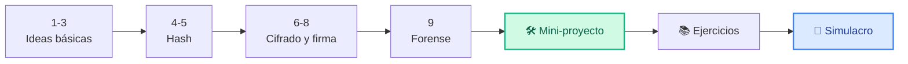
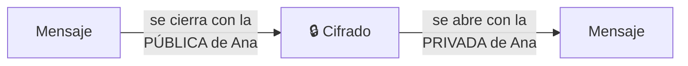
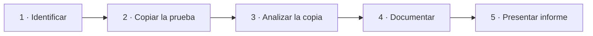

# Unidad 1 · Misión 1: que nadie toque tus datos

| | |
|---|---|
| **Resultado de aprendizaje** | RA1 · Principios de seguridad, criptografía y forense |
| **Trimestre** | 1.º — se evalúa con **examen tipo test** |
| **Duración / peso** | 20 horas · 15 % del módulo |
| **Necesitas** | Python 3 y la librería `cryptography` |

!!! quote "Lunes, 9:00. Tu primer día."
    Acabas de entrar como becario/a en **CiberSegura S.L.**, una pequeña empresa que protege los ordenadores y servidores de sus clientes. Tu jefa, Marta, te recibe con un café y un problema:

    *"Un cliente jura que alguien ha cambiado un fichero de su servidor, pero no sabe cuál. ¿Serías capaz de averiguarlo?"*

    Hoy no. Pero al acabar esta unidad **sí**: construirás un programa que detecta si alguien ha tocado un fichero. Por el camino aprenderás las ideas sobre las que se apoya toda la ciberseguridad — y que vas a usar en cualquier aplicación que programes en DAW o DAM.

## Cómo vas a trabajar

Cada concepto sigue **siempre** los mismos 4 pasos. No hay sorpresas:

| Paso | Qué haces | Tiempo |
|---|---|---|
| 💡 **La idea** | Lees una explicación corta y un ejemplo de la vida real | 5 min |
| 🐍 **En Python** | Copias el código, lo ejecutas y compruebas que te sale lo mismo | 5 min |
| 🧪 **Pruébalo tú** | Haces el mini-ejercicio: el enunciado te dice qué debe salir | 10 min |
| ✅ **Checkpoint** | Marcas la casilla si sabes explicarlo con tus palabras | 1 min |



Al final de la unidad tienes **todos los ejercicios con solución** y un **simulacro de 30 preguntas** igual que el examen.

!!! danger "Una norma antes de empezar"
    Todo lo que aprendas aquí se usa **solo** en tu ordenador o en el laboratorio de clase. Entrar o modificar sistemas ajenos sin permiso es delito (arts. 197 y 264 del Código Penal), aunque "solo estuvieras probando". Más en [Uso ético y legal](../recursos/uso-etico.md).

## 0 · Prepara tu entorno (5 minutos)

Abre una terminal en tu carpeta de trabajo y ejecuta:

```bash title="Una sola vez"
python -m venv .venv
source .venv/bin/activate          # En Windows: .venv\Scripts\activate
pip install cryptography
```

!!! tip "Cómo leer los ejemplos de esta unidad"
    Cada bloque de código tiene un nombre (por ejemplo `pilares.py`). Cópialo en un fichero con ese nombre y ejecútalo con `python pilares.py`. Justo debajo verás un recuadro **Salida**: es lo que te tiene que aparecer. Si te sale otra cosa, compara línea a línea.

## 1 · Los 3 pilares de la seguridad: C·I·D

**💡 La idea.** Proteger información es garantizar tres cosas:

- **C**onfidencialidad: solo la ve quien debe.
- **I**ntegridad: nadie la cambia sin permiso.
- **D**isponibilidad: está ahí cuando hace falta.

**Ejemplos de tu día a día:**

| Pilar | Ejemplo | Se rompe cuando… |
|---|---|---|
| Confidencialidad | Tus mensajes de WhatsApp | Alguien lee tus conversaciones |
| Integridad | Tu nota en la plataforma del instituto | Alguien cambia tu 4 por un 9 |
| Disponibilidad | La web de matrícula | Se cae justo el último día de plazo |

A estos tres se suman dos más: **autenticidad** (el mensaje viene de quien dice venir) y **trazabilidad** (queda registro de quién hizo qué).

**🐍 En Python.** Un diccionario para los pilares y una lista de incidentes:

```python title="pilares.py"
PILARES = {"C": "Confidencialidad", "I": "Integridad", "D": "Disponibilidad"}

incidentes = [
    ("Alguien lee los correos del director", "C"),
    ("Cambian el IBAN de una factura", "I"),
    ("La web se cae el día de matrícula", "D"),
]

for descripcion, letra in incidentes:
    print(f"{descripcion} -> rompe la {PILARES[letra]}")
```

```text title="Salida"
Alguien lee los correos del director -> rompe la Confidencialidad
Cambian el IBAN de una factura -> rompe la Integridad
La web se cae el día de matrícula -> rompe la Disponibilidad
```

**🧪 Pruébalo tú.** Añade a la lista `incidentes` estos dos casos, cada uno con su letra, y vuelve a ejecutar:

1. *"Un empleado se lleva la lista de clientes en un USB"*
2. *"Un virus deja el servidor bloqueado"*

Tienen que aparecer dos líneas nuevas al final:

```text title="Salida esperada (las dos últimas líneas)"
Un empleado se lleva la lista de clientes en un USB -> rompe la Confidencialidad
Un virus deja el servidor bloqueado -> rompe la Disponibilidad
```

<details class="sol"><summary>Solución</summary>

```python
incidentes = [
    ("Alguien lee los correos del director", "C"),
    ("Cambian el IBAN de una factura", "I"),
    ("La web se cae el día de matrícula", "D"),
    ("Un empleado se lleva la lista de clientes en un USB", "C"),
    ("Un virus deja el servidor bloqueado", "D"),
]
```
</details>

**✅ Checkpoint**

- [ ] Sé explicar C, I y D con un ejemplo de mi móvil.

## 2 · Amenaza, vulnerabilidad y riesgo

**💡 La idea.** Piensa en tu casa:

| Concepto | En tu casa | En un servidor |
|---|---|---|
| **Amenaza** — lo que puede pasar | Un ladrón | Un atacante, un incendio |
| **Vulnerabilidad** — el punto débil | La ventana abierta | Un programa sin actualizar |
| **Riesgo** — cuánto te juegas | Probabilidad de que entre × lo que se lleva | Probabilidad × impacto |

La amenaza no la controlas; la vulnerabilidad **sí** (cierras la ventana). Por eso el trabajo de seguridad consiste en reducir vulnerabilidades.

**🐍 En Python.** El riesgo como número: probabilidad (de 0 a 1) por impacto (de 1 a 10).

```python title="riesgo.py"
def riesgo(probabilidad: float, impacto: int) -> float:
    return round(probabilidad * impacto, 1)

print(riesgo(0.8, 9))   # servidor sin actualizar con datos de clientes
print(riesgo(0.1, 3))   # impresora antigua sin datos importantes
```

```text title="Salida"
7.2
0.3
```

**🧪 Pruébalo tú.** Escribe una función `nivel(r)` que traduzca el número a palabras: `"ALTO"` si es 5 o más, `"MEDIO"` si es 2 o más, y `"BAJO"` en otro caso. Pruébala así:

```python
print(nivel(riesgo(0.8, 9)), nivel(riesgo(0.5, 6)), nivel(riesgo(0.1, 3)))
```

```text title="Salida esperada"
ALTO MEDIO BAJO
```

<details class="sol"><summary>Solución</summary>

```python
def nivel(r: float) -> str:
    if r >= 5:
        return "ALTO"
    if r >= 2:
        return "MEDIO"
    return "BAJO"
```
</details>

**✅ Checkpoint**

- [ ] Sé distinguir amenaza, vulnerabilidad y riesgo con el ejemplo de la casa.

## 3 · Seguridad física, ambiental, lógica… y copias

**💡 La idea.** No todo es software: si alguien entra en la sala de servidores, no necesita saber programar.

| Tipo | Protege frente a | Ejemplos |
|---|---|---|
| **Física** | Personas que entran donde no deben | Cerraduras, tarjetas de acceso, cámaras |
| **Ambiental** | Problemas del entorno | SAI (batería), aire acondicionado, detector de incendios |
| **Lógica** | Mal uso del sistema | Contraseñas, permisos, cifrado, cortafuegos |

Y la última defensa cuando todo falla: las **copias de seguridad**, con la **regla 3-2-1**:

- **3** copias de los datos,
- en **2** soportes distintos (disco, NAS, nube…),
- con **1** fuera de la oficina.

Y una copia que nunca has probado a restaurar **no cuenta**.

**🐍 En Python.** Cada copia es un diccionario; la función comprueba las tres condiciones:

```python title="copias.py"
def cumple_321(copias: list[dict]) -> bool:
    hay_3 = len(copias) >= 3
    hay_2_soportes = len({c["soporte"] for c in copias}) >= 2   # (1)!
    hay_1_fuera = any(c["lugar"] == "fuera" for c in copias)     # (2)!
    return hay_3 and hay_2_soportes and hay_1_fuera

copias = [
    {"soporte": "disco", "lugar": "oficina"},
    {"soporte": "nas", "lugar": "oficina"},
]
print(cumple_321(copias))
```

1.  Las llaves `{...}` crean un **conjunto**: guarda cada soporte **una sola vez**, así contamos soportes distintos.
2.  `any(...)` es `True` si **al menos una** copia cumple la condición.

```text title="Salida"
False
```

**🧪 Pruébalo tú.** Añade a la lista una copia `{"soporte": "nube", "lugar": "fuera"}`. ¿Qué imprime ahora? ¿Qué dos condiciones arregla esa copia ella sola?

```text title="Salida esperada"
True
```

<details class="sol"><summary>Solución</summary>

La copia en la nube arregla **dos** condiciones a la vez: ya hay 3 copias y una está fuera. La de los soportes ya se cumplía (disco y NAS son distintos).

```python
copias.append({"soporte": "nube", "lugar": "fuera"})
print(cumple_321(copias))   # True
```
</details>

**✅ Checkpoint**

- [ ] Sé poner un ejemplo de seguridad física, ambiental y lógica.
- [ ] Sé explicar la regla 3-2-1.

## 4 · El hash: la huella digital de los datos

**💡 La idea.** Una **función hash** convierte cualquier dato (una palabra, una foto, una película entera) en una "huella" de longitud fija. Como tu huella dactilar: te identifica, pero a partir de ella nadie puede reconstruirte.

| Propiedad | Qué significa |
|---|---|
| **Siempre igual** | El mismo dato da **siempre** la misma huella |
| **Efecto avalancha** | Cambias una letra y la huella cambia **entera** |
| **Solo de ida** | A partir de la huella **no** se puede sacar el dato original |

**🐍 En Python.** El módulo `hashlib` viene con Python:

```python title="huella.py"
import hashlib

def huella(texto: str) -> str:
    return hashlib.sha256(texto.encode()).hexdigest()   # (1)!

print(huella("hola"))
print(huella("hola"))
print(huella("Hola"))
```

1.  `.encode()` convierte el texto en **bytes**, que es lo que entiende `hashlib`. Si lo olvidas verás el error `Strings must be encoded before hashing`.

```text title="Salida"
b221d9dbb083a7f33428d7c2a3c3198ae925614d70210e28716ccaa7cd4ddb79
b221d9dbb083a7f33428d7c2a3c3198ae925614d70210e28716ccaa7cd4ddb79
e633f4fc79badea1dc5db970cf397c8248bac47cc3acf9915ba60b5d76b0e88f
```

Fíjate: las dos primeras son **idénticas** (mismo dato) y la tercera **no se parece en nada**, aunque solo cambia la `h` por `H`. Siempre salen 64 caracteres.

**¿Qué algoritmo uso?**

| Algoritmo | ¿Se puede usar hoy? |
|---|---|
| MD5, SHA-1 | ❌ No: están **rotos** (se han encontrado dos datos distintos con la misma huella) |
| SHA-256 | ✅ Sí: el estándar |
| SHA-3, BLAKE2 | ✅ Sí: alternativas modernas |

!!! example "¿Por qué te importa como programador/a?"
    Cuando programes el *login* de una web en DAW o de una app en DAM, **nunca** guardarás las contraseñas tal cual en la base de datos: guardarás su huella. Si alguien roba la base de datos, solo verá huellas.

**🧪 Pruébalo tú.** Simula un *login*. En la base de datos está guardada la huella de la contraseña de Ana:

```python
GUARDADA = "b7588c7796997f1fc2115555b483ad990738db432ec4be3f5f2fa7ccfd57903b"
```

Escribe `login_ok(escrita: str) -> bool` que devuelva `True` si la huella de lo que escribe el usuario coincide con `GUARDADA`. La contraseña correcta es `Secreta123`.

```python
print(login_ok("Secreta123"), login_ok("secreta123"))
```

```text title="Salida esperada"
True False
```

<details class="sol"><summary>Solución</summary>

```python
import hashlib

GUARDADA = "b7588c7796997f1fc2115555b483ad990738db432ec4be3f5f2fa7ccfd57903b"

def login_ok(escrita: str) -> bool:
    return hashlib.sha256(escrita.encode()).hexdigest() == GUARDADA
```

En la UD4 verás que, en una aplicación real, además se añade una **sal** y se usan algoritmos lentos (bcrypt, Argon2). Pero la idea es exactamente esta.
</details>

**✅ Checkpoint**

- [ ] Sé explicar las 3 propiedades del hash.
- [ ] Sé por qué no se usa MD5.

## 5 · Hash de ficheros: ¿alguien ha tocado esto?

**💡 La idea.** Si guardas hoy la huella de un fichero y mañana la vuelves a calcular, sabrás si alguien lo ha modificado: basta con que cambie **un byte** para que la huella sea distinta. Así comprueban los programas de descarga que el fichero ha llegado bien.

**🐍 En Python.**

```python title="vigilar.py"
import hashlib
from pathlib import Path

def huella_fichero(ruta: str) -> str:
    return hashlib.sha256(Path(ruta).read_bytes()).hexdigest()

Path("config.txt").write_text("puerto=8080")
antes = huella_fichero("config.txt")

Path("config.txt").write_text("puerto=9090")      # alguien lo cambia...
despues = huella_fichero("config.txt")

print("¿Ha cambiado?", antes != despues)
```

```text title="Salida"
¿Ha cambiado? True
```

Dos detalles que usan los programas profesionales (y que salen en el test):

```python title="version_pro.py"
import hashlib, hmac

def huella_por_trozos(ruta: str) -> str:
    h = hashlib.sha256()
    with open(ruta, "rb") as f:
        for trozo in iter(lambda: f.read(8192), b""):   # (1)!
            h.update(trozo)
    return h.hexdigest()

def iguales(a: str, b: str) -> bool:
    return hmac.compare_digest(a, b)                     # (2)!
```

1.  Lee el fichero **a trozos** de 8 KB: funciona igual con 1 KB que con 10 GB sin llenar la memoria. El resultado es **el mismo** que leerlo entero.
2.  Compara siempre en el mismo tiempo. Con `==`, la comparación se para en el primer carácter distinto, y un atacante que mida tiempos podría ir adivinando.

**🧪 Pruébalo tú.** Crea los ficheros `a.txt` (con el texto `uno`) y `b.txt` (con `dos`), guarda sus huellas en un diccionario, modifica solo `b.txt` y muestra qué ficheros han cambiado.

```text title="Salida esperada"
b.txt ha cambiado
```

<details class="sol"><summary>Solución</summary>

```python
from pathlib import Path

Path("a.txt").write_text("uno")
Path("b.txt").write_text("dos")
guardadas = {n: huella_fichero(n) for n in ["a.txt", "b.txt"]}

Path("b.txt").write_text("DOS")

for nombre, huella_antigua in guardadas.items():
    if huella_fichero(nombre) != huella_antigua:
        print(f"{nombre} ha cambiado")
```
</details>

**✅ Checkpoint**

- [ ] Sé detectar si un fichero ha cambiado comparando huellas.

## 6 · Cifrado simétrico: una sola llave

**💡 La idea.** El hash no se puede deshacer. Pero a veces **sí** necesitas recuperar el dato (un número de cuenta, un documento). Para eso se **cifra**. En el cifrado **simétrico** hay **una sola clave** que sirve para cerrar y para abrir, como la llave de una caja fuerte.

**🐍 En Python.** `Fernet` (de la librería `cryptography`) usa por debajo AES, el estándar mundial:

```python title="simetrico.py"
from cryptography.fernet import Fernet, InvalidToken

clave = Fernet.generate_key()         # la llave: guárdala en secreto
caja = Fernet(clave)

cifrado = caja.encrypt(b"IBAN: ES12 3456 7890")
print(cifrado[:20], "...")             # ilegible
print(caja.decrypt(cifrado))           # con la clave, vuelve a ser legible

try:
    caja.decrypt(cifrado[:-1] + b"X")  # alguien cambia un byte del mensaje cifrado
except InvalidToken:
    print("Mensaje manipulado: rechazado")
```

```text title="Salida (la primera línea cambia cada vez)"
b'gAAAAABqvXjjNVxUdBqM' ...
b'IBAN: ES12 3456 7890'
Mensaje manipulado: rechazado
```

Fernet no solo cifra: también **detecta** si alguien ha tocado el mensaje cifrado.

**🧪 Pruébalo tú.** Genera **dos** claves distintas. Cifra un texto con la primera e intenta descifrarlo con la segunda. ¿Qué pasa?

```text title="Salida esperada"
Clave equivocada: no se puede descifrar
```

<details class="sol"><summary>Solución</summary>

```python
from cryptography.fernet import Fernet, InvalidToken

caja_a = Fernet(Fernet.generate_key())
caja_b = Fernet(Fernet.generate_key())

cifrado = caja_a.encrypt(b"secreto")
try:
    caja_b.decrypt(cifrado)
except InvalidToken:
    print("Clave equivocada: no se puede descifrar")
```
</details>

**✅ Checkpoint**

- [ ] Sé la diferencia entre hash (no se deshace) y cifrado (sí se deshace, con la clave).

## 7 · Cifrado asimétrico: candado y llave

**💡 La idea.** El problema del simétrico: ¿cómo le das la clave a alguien que está en otro país sin que nadie la intercepte? Solución: **dos** claves.

- La **pública** es como un **candado abierto**: puedes regalar copias a todo el mundo.
- La **privada** es la **única llave** que abre ese candado: no se la das a nadie.

Si Ana quiere recibir mensajes secretos, reparte su candado (clave pública). Cualquiera cierra con él; solo Ana abre.



**🐍 En Python.**

```python title="asimetrico.py"
from cryptography.hazmat.primitives.asymmetric import rsa, padding
from cryptography.hazmat.primitives import hashes

privada_ana = rsa.generate_private_key(public_exponent=65537, key_size=2048)
publica_ana = privada_ana.public_key()

relleno = padding.OAEP(mgf=padding.MGF1(hashes.SHA256()), algorithm=hashes.SHA256(), label=None)

cifrado = publica_ana.encrypt(b"Nos vemos a las 5", relleno)   # cualquiera puede
print(privada_ana.decrypt(cifrado, relleno))                  # solo Ana puede
```

```text title="Salida"
b'Nos vemos a las 5'
```

| | Simétrico | Asimétrico |
|---|---|---|
| Claves | 1 compartida | 2: pública y privada |
| Velocidad | Muy rápido | Lento |
| Ejemplos | AES (Fernet) | RSA |

En la práctica se **combinan** (cifrado **híbrido**): con RSA se envía una clave simétrica, y con esa clave se cifra todo lo demás. Es lo que hace tu navegador cada vez que ves el candado de **HTTPS**.

**🧪 Pruébalo tú.** Completa el hueco para que **solo Luis** pueda leer el mensaje:

```python
privada_luis = rsa.generate_private_key(public_exponent=65537, key_size=2048)
publica_luis = privada_luis.public_key()

cifrado = ____.encrypt(b"Examen el martes", relleno)
print(privada_luis.decrypt(cifrado, relleno))
```

```text title="Salida esperada"
b'Examen el martes'
```

<details class="sol"><summary>Solución</summary>

El hueco es `publica_luis`: se cifra con la **pública del destinatario**, y solo su privada abre.
</details>

**✅ Checkpoint**

- [ ] Sé con qué clave se cifra para enviarle algo secreto a alguien.

## 8 · Firma digital y certificados

**💡 La idea.** Ahora al revés: no quieres ocultar un documento, quieres **demostrar que es tuyo** y que nadie lo ha cambiado. Para **firmar**, usas tu clave **privada** (solo tú la tienes). Cualquiera **comprueba** la firma con tu **pública**.

Una firma digital garantiza tres cosas: **quién** lo firmó (autenticidad), que **no ha cambiado** (integridad) y que el firmante **no puede negarlo** (no repudio).

**🐍 En Python.** Firmamos un fichero, guardamos la firma aparte y la comprobamos:

```python title="firma.py"
from pathlib import Path
from cryptography.hazmat.primitives.asymmetric import rsa, padding
from cryptography.hazmat.primitives import hashes
from cryptography.exceptions import InvalidSignature

privada = rsa.generate_private_key(public_exponent=65537, key_size=2048)
publica = privada.public_key()
pss = padding.PSS(mgf=padding.MGF1(hashes.SHA256()), salt_length=padding.PSS.MAX_LENGTH)

Path("contrato.txt").write_text("Pago de 100 euros")
firma = privada.sign(Path("contrato.txt").read_bytes(), pss, hashes.SHA256())
Path("contrato.txt.sig").write_bytes(firma)
print("Firma de", len(firma), "bytes")

def firma_valida(fichero: str, fichero_firma: str) -> bool:
    try:
        publica.verify(Path(fichero_firma).read_bytes(), Path(fichero).read_bytes(), pss, hashes.SHA256())
        return True
    except InvalidSignature:
        return False

print("¿Válida?", firma_valida("contrato.txt", "contrato.txt.sig"))
```

```text title="Salida"
Firma de 256 bytes
¿Válida? True
```

La firma mide siempre **256 bytes** con una clave de 2048 bits (2048 ÷ 8), da igual si firmas una línea o un vídeo entero.

**¿Y los certificados?** ¿Cómo sabes que una clave pública es de verdad de tu banco y no de un impostor? Porque viene dentro de un **certificado digital**: un documento que dice *"esta clave pública pertenece a banco.es"*, firmado por una **Autoridad de Certificación (CA)** en la que tu navegador ya confía. Es el **DNI de una web**.

```python title="certificado.py"
import datetime
from pathlib import Path
from cryptography import x509
from cryptography.x509.oid import NameOID
from cryptography.hazmat.primitives import hashes, serialization
from cryptography.hazmat.primitives.asymmetric import rsa

clave = rsa.generate_private_key(public_exponent=65537, key_size=2048)
nombre = x509.Name([x509.NameAttribute(NameOID.COMMON_NAME, "miweb.local")])
hoy = datetime.datetime.now(datetime.timezone.utc)

cert = (x509.CertificateBuilder()
        .subject_name(nombre).issuer_name(nombre)          # emisor = sujeto
        .public_key(clave.public_key())
        .serial_number(x509.random_serial_number())
        .not_valid_before(hoy).not_valid_after(hoy + datetime.timedelta(days=365))
        .sign(clave, hashes.SHA256()))

Path("cert.pem").write_bytes(cert.public_bytes(serialization.Encoding.PEM))
print("Guardado en cert.pem · autofirmado:", cert.subject == cert.issuer)
```

```text title="Salida"
Guardado en cert.pem · autofirmado: True
```

Este certificado es **autofirmado**: se firma a sí mismo (emisor = sujeto). Sirve para practicar, pero un navegador desconfiará de él porque ninguna CA lo avala.

**🧪 Pruébalo tú.** Con el código de `firma.py` ya ejecutado, cambia **una letra** de `contrato.txt` (por ejemplo `100` por `900`) y vuelve a comprobar la firma **sin firmar de nuevo**.

```text title="Salida esperada"
¿Válida? False
```

<details class="sol"><summary>Solución</summary>

```python
Path("contrato.txt").write_text("Pago de 900 euros")
print("¿Válida?", firma_valida("contrato.txt", "contrato.txt.sig"))
```

La firma se calculó sobre el texto original: cualquier cambio la invalida.
</details>

**✅ Checkpoint**

- [ ] Sé con qué clave se firma y con cuál se verifica.
- [ ] Sé qué es un certificado y qué es una CA.

## 9 · Análisis forense y cadena de custodia

**💡 La idea.** Tras un incidente, un **perito forense** investiga qué pasó, cómo y cuándo. Su trabajo solo vale en un juicio si demuestra que **no ha alterado las pruebas**. Por eso:

1. Calcula la huella del disco original **antes** de tocar nada.
2. Trabaja **siempre sobre una copia**, nunca sobre el original.
3. Anota quién tuvo la prueba y cuándo: la **cadena de custodia**.



**🐍 En Python.** Tu huella es el **precinto** de la prueba:

```python title="custodia.py"
import hashlib, shutil
from pathlib import Path

def huella_fichero(ruta: str) -> str:
    return hashlib.sha256(Path(ruta).read_bytes()).hexdigest()

Path("evidencia.log").write_text("10:03 acceso root desde 10.0.0.7")
precinto = huella_fichero("evidencia.log")           # 1. huella ANTES de nada

shutil.copy("evidencia.log", "copia_trabajo.log")     # 2. trabajamos sobre una copia
estado = "ÍNTEGRA" if huella_fichero("copia_trabajo.log") == precinto else "ALTERADA"
print("Copia:", estado)
```

```text title="Salida"
Copia: ÍNTEGRA
```

**🧪 Pruébalo tú.** Crea una lista `custodia` con tuplas `(persona, acción)` para: el agente López *recoge el disco*, la perito García *hace la copia* y *analiza la copia*. Muéstrala numerada.

```text title="Salida esperada"
1. López: recoge el disco
2. García: hace la copia
3. García: analiza la copia
```

<details class="sol"><summary>Solución</summary>

```python
custodia = [("López", "recoge el disco"), ("García", "hace la copia"), ("García", "analiza la copia")]
for i, (persona, accion) in enumerate(custodia, start=1):
    print(f"{i}. {persona}: {accion}")
```
</details>

**✅ Checkpoint**

- [ ] Sé por qué se calcula la huella antes de analizar y por qué se trabaja sobre una copia.

## 🧾 Chuleta para el test

| Si te preguntan por… | Recuerda |
|---|---|
| C·I·D | Confidencialidad (solo quien debe) · Integridad (sin cambios) · Disponibilidad (cuando hace falta) |
| Amenaza / vulnerabilidad | Ladrón / ventana abierta. La vulnerabilidad sí la controlas |
| Riesgo | Probabilidad × impacto |
| Regla 3-2-1 | 3 copias · 2 soportes · 1 fuera |
| Hash | Siempre igual · avalancha · solo de ida · SHA-256 sí, MD5 no |
| `.encode()` | Pasa texto a bytes antes de hashear o cifrar |
| `compare_digest` | Compara en tiempo constante (evita ataques de tiempo) |
| Simétrico | 1 clave · rápido · AES / Fernet |
| Asimétrico | Pública (candado) + privada (llave) · RSA |
| Cifrar para Ana | Con la **pública de Ana** |
| Firmar | Con **tu privada**; se verifica con tu pública |
| Firma RSA 2048 | Siempre 256 bytes |
| Certificado | Clave pública + identidad, firmado por una **CA** |
| Autofirmado | Emisor = sujeto; el navegador no se fía |
| Forense | Huella antes de tocar · trabajar sobre copia · cadena de custodia |

## 🛠️ Mini-proyecto guiado: el verificador de integridad

Vuelves a la mesa de Marta con la solución a su problema: un programa que hace **una foto** de las huellas de todos los ficheros de una carpeta (el *manifiesto*) y, más tarde, las **compara** para decir qué ha cambiado. Es lo mismo que hacen herramientas profesionales como AIDE o Tripwire.

El programa se construye en 4 pasos, marcados en el código:

1. **Huella de un fichero**, leyendo a trozos (concepto 5).
2. **Manifiesto**: un diccionario `{nombre_fichero: huella}` de toda la carpeta.
3. **Auditar**: comparar el manifiesto guardado con el actual → `OK`, `MODIFICADO`, `NUEVO` o `AUSENTE`.
4. **Órdenes** desde la terminal con `argparse`: `generar` y `auditar`.

```python title="verificador.py"
import argparse, hashlib, hmac, json
from pathlib import Path

# PASO 1 · Huella de un fichero (a trozos)
def hash_fichero(ruta: Path, algoritmo: str = "sha256") -> str:
    h = hashlib.new(algoritmo)
    with open(ruta, "rb") as f:
        for bloque in iter(lambda: f.read(8192), b""):
            h.update(bloque)
    return h.hexdigest()

# PASO 2 · Manifiesto de la carpeta
def generar_manifiesto(carpeta: Path, algoritmo: str = "sha256") -> dict[str, str]:
    m: dict[str, str] = {}
    for ruta in sorted(carpeta.rglob("*")):
        if ruta.is_file() and ruta.name != "MANIFEST.json":
            m[str(ruta.relative_to(carpeta))] = hash_fichero(ruta, algoritmo)
    return m

# PASO 3 · Comparar lo guardado con lo actual
def auditar(previo: dict[str, str], actual: dict[str, str]) -> dict[str, str]:
    r: dict[str, str] = {}
    for n, h in previo.items():
        if n not in actual:
            r[n] = "AUSENTE"
        elif hmac.compare_digest(h, actual[n]):
            r[n] = "OK"
        else:
            r[n] = "MODIFICADO"
    for n in actual:
        if n not in previo:
            r[n] = "NUEVO"
    return r

# PASO 4 · Órdenes desde la terminal
def main() -> None:
    ap = argparse.ArgumentParser(prog="verificador", description="Detecta ficheros modificados")
    ap.add_argument("accion", choices=["generar", "auditar"])
    ap.add_argument("carpeta", type=Path)
    ap.add_argument("--algoritmo", default="sha256", choices=["sha256", "sha3_256", "blake2b"])
    args = ap.parse_args()
    ruta_man = args.carpeta / "MANIFEST.json"
    if args.accion == "generar":
        ruta_man.write_text(json.dumps(generar_manifiesto(args.carpeta, args.algoritmo), indent=2))
        print(f"Manifiesto creado en {ruta_man}")
    else:
        previo = json.loads(ruta_man.read_text())
        actual = generar_manifiesto(args.carpeta, args.algoritmo)
        for n, estado in sorted(auditar(previo, actual).items()):
            print(f"[{estado:10}] {n}")

if __name__ == "__main__":
    main()
```

**Pruébalo de principio a fin** en la terminal:

```bash title="Terminal"
mkdir servidor
echo "binario" > servidor/app.bin
echo "puerto=8080" > servidor/app.conf
python verificador.py generar servidor

echo "puerto=6666" > servidor/app.conf      # alguien cambia la configuración
echo "malware" > servidor/intruso.sh        # y deja un fichero nuevo
python verificador.py auditar servidor
```

```text title="Salida"
Manifiesto creado en servidor/MANIFEST.json
[OK        ] app.bin
[MODIFICADO] app.conf
[NUEVO     ] intruso.sh
```

!!! success "🏅 Misión 1 cumplida"
    Marta pasa tu programa por el servidor del cliente y en dos segundos aparece el fichero modificado. *"Bienvenido/a al equipo"*, te dice. Ahora repasa con los ejercicios y haz el simulacro: es tu entrenamiento para el test.

## 📚 Todos los ejercicios con solución

> Ordenados de fácil a difícil: 🟢 empieza aquí · 🟡 ya vas cogiendo soltura · 🟠 piensa un poco · 🔴 reto. Intenta cada uno **antes** de abrir la solución, y ejecútalo para comprobarlo.

**1 · 🟢 Verificar una descarga** — acabas de descargar un fichero y la web publica su SHA-256. `descarga_integra(contenido: str, hash_publicado: str) -> bool`: ¿coincide de verdad?
<details class="sol"><summary>Solución</summary>

```python
import hashlib, hmac
def descarga_integra(contenido: str, hash_publicado: str) -> bool:
    hash_real = hashlib.sha256(contenido.encode("utf-8")).hexdigest()
    return hmac.compare_digest(hash_real, hash_publicado.strip().lower())
```
</details>

**2 · 🟢 ¿Ha cambiado el fichero?** — guardaste el hash de un `config.ini` la semana pasada. `ha_cambiado(hash_guardado: str, contenido_actual: str) -> bool`: ¿es distinto ahora? (este es, en miniatura, exactamente lo que hace `auditar()` en el reto de esta unidad).
<details class="sol"><summary>Solución</summary>

```python
import hashlib, hmac
def ha_cambiado(hash_guardado: str, contenido_actual: str) -> bool:
    hash_actual = hashlib.sha256(contenido_actual.encode("utf-8")).hexdigest()
    return not hmac.compare_digest(hash_actual, hash_guardado.strip().lower())
```
</details>

**3 · 🟢 Clasificar incidente** — `pilar(x)` para `"filtracion"/"alteracion"/"caida"` → `"C"`/`"I"`/`"D"`.
<details class="sol"><summary>Solución</summary>

```python
def pilar(x: str) -> str:
    return {"filtracion": "C", "alteracion": "I", "caida": "D"}.get(x, "?")
```
</details>

**4 · 🟢 ¿Formato de hash válido?** — `es_sha256(cadena: str) -> bool` con una expresión regular (64 hex).
<details class="sol"><summary>Solución</summary>

```python
import re
def es_sha256(cadena: str) -> bool:
    return bool(re.fullmatch(r"[0-9a-f]{64}", cadena.strip().lower()))
```
</details>

**5 · 🟡 Hash de bytes por bloques** — `hash_bloques(datos: bytes, n: int = 1024) -> str`.
<details class="sol"><summary>Solución</summary>

```python
import hashlib
def hash_bloques(datos: bytes, n: int = 1024) -> str:
    h = hashlib.sha256()
    for i in range(0, len(datos), n):
        h.update(datos[i:i + n])
    return h.hexdigest()
```
</details>

**6 · 🟡 Contar cambios (avalancha)** — `avalancha(a: str, b: str) -> int`: caracteres hex distintos entre sus SHA-256.
<details class="sol"><summary>Solución</summary>

```python
import hashlib
def avalancha(a: str, b: str) -> int:
    ha = hashlib.sha256(a.encode()).hexdigest()
    hb = hashlib.sha256(b.encode()).hexdigest()
    return sum(1 for x, y in zip(ha, hb) if x != y)
```
</details>

**7 · 🟡 Sal aleatoria** — `con_sal(pwd: str) -> tuple[str, str]` con `secrets` (no `random`).
<details class="sol"><summary>Solución</summary>

```python
import hashlib, secrets
def con_sal(pwd: str) -> tuple[str, str]:
    sal = secrets.token_hex(16)
    return sal, hashlib.sha256((sal + pwd).encode()).hexdigest()
```
</details>

**8 · 🟡 Detectar el algoritmo por longitud** — `adivina(hash_hex: str) -> str`: `"md5"` (32), `"sha1"` (40), `"sha256"` (64) o `"desconocido"`.
<details class="sol"><summary>Solución</summary>

```python
def adivina(hash_hex: str) -> str:
    return {32: "md5", 40: "sha1", 64: "sha256"}.get(len(hash_hex.strip()), "desconocido")
```
</details>

**9 · 🟠 Manifiesto: ficheros alterados** — `alterados(esperados, actuales) -> list[str]`.
<details class="sol"><summary>Solución</summary>

```python
def alterados(esperados: dict[str, str], actuales: dict[str, str]) -> list[str]:
    return [f for f, h in esperados.items() if actuales.get(f) != h]
```
</details>

**10 · 🟠 Auditoría completa** — `audita(man, ahora) -> dict[str,str]` con estados `OK`/`MODIFICADO`/`NUEVO`/`AUSENTE`.
<details class="sol"><summary>Solución</summary>

```python
def audita(man: dict[str, str], ahora: dict[str, str]) -> dict[str, str]:
    r: dict[str, str] = {}
    for f, h in man.items():
        r[f] = "AUSENTE" if f not in ahora else ("OK" if ahora[f] == h else "MODIFICADO")
    for f in ahora:
        if f not in man:
            r[f] = "NUEVO"
    return r
```
</details>

**11 · 🟠 Detectar ficheros duplicados** — `duplicados(archivos: dict[str,str]) -> dict[str, list[str]]`: agrupa nombres que comparten el mismo hash.
<details class="sol"><summary>Solución</summary>

```python
from collections import defaultdict
def duplicados(archivos: dict[str, str]) -> dict[str, list[str]]:
    por_hash: dict[str, list[str]] = defaultdict(list)
    for nombre, h in archivos.items():
        por_hash[h].append(nombre)
    return {h: n for h, n in por_hash.items() if len(n) > 1}
```
</details>

**12 · 🔴 Autenticar un mensaje (HMAC)** — `firma(clave, msg) -> str` y `valida(clave, msg, f) -> bool`. Así se firman webhooks y APIs reales.
<details class="sol"><summary>Solución</summary>

```python
import hmac, hashlib
def firma(clave: str, msg: str) -> str:
    return hmac.new(clave.encode(), msg.encode(), hashlib.sha256).hexdigest()
def valida(clave: str, msg: str, f: str) -> bool:
    return hmac.compare_digest(firma(clave, msg), f)
```
</details>

**13 · 🔴 Cadena de hashes (mini-blockchain)** — `cadena(bloques: list[str]) -> list[str]`: cada hash depende del anterior; `cadena_valida(bloques, hashes) -> bool` detecta si algo se alteró.
<details class="sol"><summary>Solución</summary>

```python
import hashlib
def cadena(bloques: list[str]) -> list[str]:
    hashes, anterior = [], "0" * 64
    for b in bloques:
        h = hashlib.sha256((anterior + b).encode()).hexdigest()
        hashes.append(h)
        anterior = h
    return hashes

def cadena_valida(bloques: list[str], hashes: list[str]) -> bool:
    return cadena(bloques) == hashes
```
</details>

**14 · 🔴 Firma RSA con `cryptography`** — dados `privada`/`publica`, `firma_rsa(privada, doc: bytes) -> bytes` y `verifica_rsa(publica, doc, firma) -> bool`.
<details class="sol"><summary>Solución</summary>

```python
from cryptography.hazmat.primitives.asymmetric import padding
from cryptography.hazmat.primitives import hashes
from cryptography.exceptions import InvalidSignature
_PSS = padding.PSS(mgf=padding.MGF1(hashes.SHA256()), salt_length=padding.PSS.MAX_LENGTH)

def firma_rsa(privada, doc: bytes) -> bytes:
    return privada.sign(doc, _PSS, hashes.SHA256())

def verifica_rsa(publica, doc: bytes, firma: bytes) -> bool:
    try:
        publica.verify(firma, doc, _PSS, hashes.SHA256()); return True
    except InvalidSignature:
        return False
```
</details>

**15 · 🔴 ¿Cuánto le queda al certificado?** — `dias_restantes(fecha_expiracion: datetime) -> int`, usando `datetime.now(timezone.utc)`.
<details class="sol"><summary>Solución</summary>

```python
from datetime import datetime, timezone

def dias_restantes(fecha_expiracion: datetime) -> int:
    return (fecha_expiracion - datetime.now(timezone.utc)).days
```
</details>

**16 · 🔴 Manifiesto en dos formatos** — `a_texto(man: dict[str,str]) -> str` en formato `sha256sum` (`hash  nombre` por línea) y `de_texto(s: str) -> dict[str,str]` que lo lee de vuelta.
<details class="sol"><summary>Solución</summary>

```python
def a_texto(man: dict[str, str]) -> str:
    return "\n".join(f"{h}  {n}" for n, h in man.items())

def de_texto(s: str) -> dict[str, str]:
    m: dict[str, str] = {}
    for ln in s.splitlines():
        if ln.strip():
            h, _, n = ln.partition("  ")
            m[n.strip()] = h.strip().lower()
    return m
```
</details>

## 📝 Simulacro de test (30 preguntas)

> Así será el examen del 1.er trimestre. Hazlo como si fuera de verdad: sin mirar apuntes, y al final corrige.

**1.** ¿Qué imprime este código?

```python
import hashlib
def h(t): return hashlib.sha256(t.encode()).hexdigest()

print(h("clave123") == h("clave123"))
print(h("clave123") == h("Clave123"))
```

A) `True` y `True`
B) `True` y `False`
C) `False` y `False`
D) `False` y `True`

<details class="sol"><summary>Ver respuesta</summary><b>Correcta: B.</b> El hash es determinista (mismo texto exacto → mismo resultado), pero es sensible a mayúsculas: <code>"clave123"</code> y <code>"Clave123"</code> son cadenas distintas, así que sus hashes también lo son.</details>

**2.** ¿Qué imprime este código?

```python
import hashlib
def h(t): return hashlib.sha256(t.encode()).hexdigest()

a, b = h("1234"), h("1235")
iguales = sum(1 for x, y in zip(a, b) if x == y)
print(iguales < 20)
```

A) `True`
B) `False`
C) Lanza una excepción, `zip` no funciona con cadenas
D) Depende de la máquina donde se ejecute

<details class="sol"><summary>Ver respuesta</summary><b>Correcta: A.</b> Es el efecto avalancha: cambiar un solo carácter de la entrada altera la mayoría del hash, así que muy pocos de los 64 caracteres siguen coincidiendo entre los dos hashes.</details>

**3.** Tienes estas dos funciones para comparar dos cadenas secretas:

```python
import hmac

def comparar_lento(a: str, b: str) -> bool:
    return a == b

def comparar_seguro(a: str, b: str) -> bool:
    return hmac.compare_digest(a, b)
```

¿Cuál de las dos es vulnerable a un ataque de temporización, y por qué?

A) `comparar_seguro`, porque `hmac` es más lento
B) `comparar_lento`, porque `==` se detiene en el primer carácter distinto y el tiempo de respuesta varía según cuántos caracteres coincidan
C) Ninguna, ambas tardan exactamente lo mismo siempre
D) `comparar_lento`, porque Python no permite comparar cadenas con `==`

<details class="sol"><summary>Ver respuesta</summary><b>Correcta: B.</b> <code>==</code> compara carácter a carácter y se detiene en el primer fallo; ese tiempo variable puede filtrar información a un atacante. <code>compare_digest</code> siempre tarda lo mismo, sin importar dónde esté la diferencia.</details>

**4.** ¿Qué imprime este código?

```python
import hashlib

def hash_bloques(datos: bytes, n: int = 4) -> str:
    h = hashlib.sha256()
    for i in range(0, len(datos), n):
        h.update(datos[i:i + n])
    return h.hexdigest()

print(hash_bloques(b"holamundo", 4) == hashlib.sha256(b"holamundo").hexdigest())
```

A) `True`
B) `False`
C) Lanza `TypeError`
D) Depende del valor de `n`

<details class="sol"><summary>Ver respuesta</summary><b>Correcta: A.</b> Hashear un dato entero de una vez o alimentarlo por trozos con <code>update()</code> produce exactamente el mismo resultado — es lo que permite hashear ficheros enormes sin cargarlos enteros en memoria.</details>

**5.** ¿Qué imprime este código?

```python
from cryptography.fernet import Fernet, InvalidToken

clave = Fernet.generate_key()
f = Fernet(clave)
token = f.encrypt(b"mensaje")
alterado = token[:-1] + b"X"      # se cambia el último byte

try:
    f.decrypt(alterado)
    resultado = "descifrado sin problema"
except InvalidToken:
    resultado = "rechazado"

print(resultado)
```

A) `descifrado sin problema`, porque Fernet ignora bytes sueltos manipulados
B) `rechazado`, porque Fernet detecta que el texto cifrado fue alterado
C) El programa se cuelga esperando una respuesta
D) Lanza `KeyError`, no `InvalidToken`

<details class="sol"><summary>Ver respuesta</summary><b>Correcta: B.</b> Fernet es cifrado autenticado: verifica la integridad del texto cifrado antes de descifrar, y si detecta manipulación lanza <code>InvalidToken</code> en vez de devolver datos corruptos.</details>

**6.** Ana tiene un par de claves (`privada_ana`, `publica_ana`). Quieres enviarle un mensaje que **solo ella** pueda leer:

```python
oaep = padding.OAEP(mgf=padding.MGF1(hashes.SHA256()), algorithm=hashes.SHA256(), label=None)
mensaje_cifrado = ____.encrypt(b"secreto", oaep)
```

¿Qué clave va en el hueco?

A) `privada_ana`
B) `publica_ana`
C) Tu propia clave privada
D) Cualquiera de las dos, da igual

<details class="sol"><summary>Ver respuesta</summary><b>Correcta: B.</b> Se cifra con la clave <b>pública</b> del destinatario; solo su clave privada (que nadie más tiene) puede descifrarlo después.</details>

**7.** ¿Qué imprime este código?

```python
firma = privada.sign(documento, pss, hashes.SHA256())

def verifica(doc: bytes) -> bool:
    try:
        publica.verify(firma, doc, pss, hashes.SHA256())
        return True
    except InvalidSignature:
        return False

print(verifica(documento))
print(verifica(documento + b"!"))
```

A) `True` y `True`
B) `True` y `False`
C) `False` y `True`
D) `False` y `False`

<details class="sol"><summary>Ver respuesta</summary><b>Correcta: B.</b> La firma se calculó sobre <code>documento</code> exacto; verificar ese mismo documento da <code>True</code>, pero cambiar un solo carácter (<code>documento + b"!"</code>) hace que la verificación falle.</details>

**8.** Generas un certificado así:

```python
certificado = (
    x509.CertificateBuilder()
    .subject_name(nombre)
    .issuer_name(nombre)          # mismo valor que subject_name
    .public_key(clave.public_key())
    .sign(clave, hashes.SHA256())
)
print(certificado.subject == certificado.issuer)
```

¿Qué imprime, y qué tipo de certificado es?

A) `False`; es un certificado firmado por una CA
B) `True`; es un certificado autofirmado
C) Lanza una excepción, `subject` e `issuer` no se pueden comparar
D) `True`; es un certificado revocado

<details class="sol"><summary>Ver respuesta</summary><b>Correcta: B.</b> Como <code>issuer_name</code> recibe el mismo <code>nombre</code> que <code>subject_name</code>, el certificado se firma a sí mismo — por definición, un certificado autofirmado.</details>

**9.** ¿Qué imprime este código, sabiendo que `privada` es una clave RSA de 2048 bits?

```python
contenido = b"informe confidencial de la empresa"
firma = privada.sign(contenido, pss, hashes.SHA256())
print(len(firma))
```

A) `19`, la longitud del texto en bytes
B) `32`, el tamaño de un hash SHA-256 en bytes
C) `256`, el tamaño fijo que da una clave RSA de 2048 bits (2048 ÷ 8)
D) Depende de la longitud de `contenido`

<details class="sol"><summary>Ver respuesta</summary><b>Correcta: C.</b> El tamaño de una firma RSA lo determina el tamaño de la <b>clave</b>, no el del documento firmado — por eso firmar un byte o firmar un fichero de 10 GB da siempre 256 bytes con esta clave.</details>

**10.** Tienes esta función de auditoría:

```python
def auditar(previo: dict, actual: dict) -> dict:
    r = {}
    for n, h in previo.items():
        if n not in actual:
            r[n] = "AUSENTE"
        elif h == actual[n]:
            r[n] = "OK"
        else:
            r[n] = "MODIFICADO"
    for n in actual:
        if n not in previo:
            r[n] = "NUEVO"
    return r

print(auditar({"a": "x", "b": "y"}, {"a": "x", "c": "z"}))
```

¿Qué imprime?

A) `{'a': 'OK', 'b': 'AUSENTE', 'c': 'NUEVO'}`
B) `{'a': 'OK', 'b': 'MODIFICADO'}`
C) `{'a': 'OK', 'b': 'OK', 'c': 'OK'}`
D) `{'a': 'OK'}`

<details class="sol"><summary>Ver respuesta</summary><b>Correcta: A.</b> <code>"a"</code> tiene el mismo hash en ambos → <code>OK</code>. <code>"b"</code> estaba en <code>previo</code> pero ya no está en <code>actual</code> → <code>AUSENTE</code>. <code>"c"</code> no estaba en <code>previo</code> → <code>NUEVO</code>.</details>

**11.** Tienes esta cadena de hashes (cada uno depende del anterior):

```python
def cadena(bloques: list[str]) -> list[str]:
    hashes_, anterior = [], "0" * 64
    for b in bloques:
        h = hashlib.sha256((anterior + b).encode()).hexdigest()
        hashes_.append(h)
        anterior = h
    return hashes_

c1 = cadena(["a", "b", "c"])
c2 = cadena(["a", "X", "c"])     # se altera el bloque del medio
print(c1[0] == c2[0], c1[1] == c2[1], c1[2] == c2[2])
```

¿Qué imprime?

A) `True True True`
B) `False False False`
C) `True False False`
D) `True True False`

<details class="sol"><summary>Ver respuesta</summary><b>Correcta: C.</b> El primer bloque no depende del alterado, así que su hash no cambia. Pero a partir de ahí, cada hash incorpora el anterior — alterar el bloque 2 cambia su hash y, en cascada, también el del bloque 3.</details>

**12.** ¿Qué imprime este código?

```python
from dataclasses import dataclass

@dataclass
class Copia:
    soporte: str
    ubicacion: str

def cumple_321(copias: list[Copia]) -> tuple[bool, list[str]]:
    fallos = []
    if len(copias) < 3:
        fallos.append("num")
    if len({c.soporte for c in copias}) < 2:
        fallos.append("soporte")
    if not any(c.ubicacion == "externo" for c in copias):
        fallos.append("externo")
    return (not fallos, fallos)

copias = [Copia("disco_local", "sitio"), Copia("disco_local", "sitio"), Copia("nas", "externo")]
print(cumple_321(copias))
```

A) `(True, [])`
B) `(False, ['num'])`
C) `(False, ['soporte'])`
D) `(False, ['num', 'soporte'])`

<details class="sol"><summary>Ver respuesta</summary><b>Correcta: A.</b> Hay 3 copias (cumple), dos soportes distintos (<code>disco_local</code> y <code>nas</code>, cumple) y una está en <code>"externo"</code> (cumple) — las tres condiciones se satisfacen.</details>

**13.** ¿Qué imprime este código?

```python
from enum import Enum

class Pilar(Enum):
    CONFIDENCIALIDAD = "C"
    INTEGRIDAD = "I"
    DISPONIBILIDAD = "D"

def describe(p: Pilar) -> str:
    return f"Rompe: {p.name}"

incidente = Pilar.DISPONIBILIDAD
print(describe(incidente))
```

A) `Rompe: D`
B) `Rompe: DISPONIBILIDAD`
C) `Rompe: Pilar.DISPONIBILIDAD`
D) Lanza `AttributeError`, `Enum` no tiene atributo `name`

<details class="sol"><summary>Ver respuesta</summary><b>Correcta: B.</b> <code>.name</code> devuelve el nombre del miembro del <code>Enum</code> (<code>"DISPONIBILIDAD"</code>), no su valor (<code>.value</code> daría <code>"D"</code>).</details>

**14.** ¿Qué imprime este código?

```python
def riesgo(probabilidad: float, impacto: float) -> float:
    return round(probabilidad * impacto, 2)

print(riesgo(probabilidad=0.9, impacto=6))
```

A) `5.4`
B) `6.9`
C) `0.9`
D) `54.0`

<details class="sol"><summary>Ver respuesta</summary><b>Correcta: A.</b> <code>0.9 × 6 = 5.4</code>, redondeado a 2 decimales sigue siendo <code>5.4</code>.</details>

**15.** *(Sobre el reto de la unidad)* Un fichero de configuración cambia de valor, y aparece un fichero nuevo. Con las funciones del verificador de integridad:

```python
manifiesto = {"app.conf": "hash_de_puerto=8080", "app.bin": "hash_binario"}
actual =     {"app.conf": "hash_de_puerto=9090", "app.bin": "hash_binario", "nuevo.txt": "hash_x"}

print(auditar(manifiesto, actual))
```

(`auditar` es la misma función de la pregunta 10.) ¿Qué imprime?

A) `{'app.conf': 'OK', 'app.bin': 'OK', 'nuevo.txt': 'NUEVO'}`
B) `{'app.conf': 'MODIFICADO', 'app.bin': 'OK', 'nuevo.txt': 'NUEVO'}`
C) `{'app.conf': 'AUSENTE', 'app.bin': 'OK'}`
D) `{'app.conf': 'MODIFICADO', 'app.bin': 'MODIFICADO', 'nuevo.txt': 'NUEVO'}`

<details class="sol"><summary>Ver respuesta</summary><b>Correcta: B.</b> <code>app.conf</code> cambió de valor (hash distinto) → <code>MODIFICADO</code>. <code>app.bin</code> sigue igual → <code>OK</code>. <code>nuevo.txt</code> no estaba en el manifiesto original → <code>NUEVO</code>. Es exactamente el mecanismo que usa tu <code>verificador.py</code> para detectar manipulaciones.</details>

**16.** *(Sobre el reto de la unidad)* ¿Qué ocurre al ejecutar este código?

```python
import argparse

ap = argparse.ArgumentParser()
ap.add_argument("accion", choices=["generar", "auditar"])
ap.add_argument("--algoritmo", default="sha256", choices=["sha256", "sha3_256", "blake2b"])

args = ap.parse_args(["generar", "--algoritmo", "md5"])
print(args.algoritmo)
```

A) Imprime `"md5"` sin problema
B) `argparse` rechaza la ejecución, porque `"md5"` no está entre los `choices` permitidos
C) Imprime `"sha256"`, ignorando el valor inválido
D) Lanza `TypeError` en tiempo de ejecución

<details class="sol"><summary>Ver respuesta</summary><b>Correcta: B.</b> Al declarar <code>choices=[...]</code>, <code>argparse</code> valida el valor <b>antes</b> de que tu código lo use, y termina el programa con un mensaje de error si no está en la lista — así el <code>verificador.py</code> nunca llega a intentar hashear con un algoritmo roto como MD5.</details>

**17.** Alguien entra en la plataforma del instituto y cambia tu nota de un 4 a un 9. ¿Qué pilar de la seguridad se ha roto?

A) Confidencialidad
B) Integridad
C) Disponibilidad
D) Ninguno, porque la nota ha subido

<details class="sol"><summary>Ver respuesta</summary><b>Correcta: B.</b> Se ha modificado información sin permiso: eso es romper la integridad, suba o baje la nota.</details>

**18.** En la analogía de la casa, *"la ventana que te has dejado abierta"* representa…

A) La amenaza
B) La vulnerabilidad
C) El riesgo
D) El impacto

<details class="sol"><summary>Ver respuesta</summary><b>Correcta: B.</b> Es el punto débil que permite que la amenaza (el ladrón) tenga éxito. Y es lo que tú sí puedes controlar.</details>

**19.** En la regla de copias **3-2-1**, ¿qué significa el **1**?

A) Una copia al día
B) Un único soporte para todas las copias
C) Al menos una copia fuera de la oficina
D) Una sola persona responsable de las copias

<details class="sol"><summary>Ver respuesta</summary><b>Correcta: C.</b> Si hay un incendio o un robo en la oficina, la copia de fuera se salva.</details>

**20.** Un **SAI** (batería que mantiene los equipos encendidos si se va la luz) es una medida de seguridad…

A) Lógica
B) Ambiental
C) Criptográfica
D) Forense

<details class="sol"><summary>Ver respuesta</summary><b>Correcta: B.</b> Protege frente a problemas del entorno (cortes de luz), igual que el aire acondicionado o los detectores de incendio.</details>

**21.** ¿Cuál de estos algoritmos **no** deberías usar hoy para comprobar la integridad de un fichero?

A) SHA-256
B) SHA-3
C) BLAKE2
D) MD5

<details class="sol"><summary>Ver respuesta</summary><b>Correcta: D.</b> MD5 está roto: se conocen formas de fabricar dos ficheros distintos con la misma huella.</details>

**22.** ¿Qué imprime este código?

```python
import hashlib
print(len(hashlib.sha256(b"cualquier cosa, por larga que sea").hexdigest()))
```

A) La longitud del texto original
B) `32`
C) `64`
D) `256`

<details class="sol"><summary>Ver respuesta</summary><b>Correcta: C.</b> La huella SHA-256 en hexadecimal siempre tiene 64 caracteres (256 bits), sea cual sea el tamaño del dato.</details>

**23.** Tienes la huella SHA-256 de una contraseña. ¿Puedes calcular la contraseña original a partir de ella?

A) Sí, con la función inversa `hashlib.unsha256`
B) Sí, si conoces la clave
C) No: la función hash es solo de ida
D) Solo si la contraseña tiene menos de 8 caracteres

<details class="sol"><summary>Ver respuesta</summary><b>Correcta: C.</b> No existe "deshash". Lo único que puede hacer un atacante es probar contraseñas y comparar huellas, por eso las contraseñas débiles son peligrosas.</details>

**24.** ¿Qué imprime este código?

```python
import hashlib
def huella(t): return hashlib.sha256(t.encode()).hexdigest()

print(huella("hola") == huella("hola "))    # la segunda lleva un espacio al final
```

A) `True`, porque el espacio no cuenta
B) `False`, porque cualquier cambio (incluido un espacio) cambia la huella
C) Lanza un error por el espacio
D) Depende del sistema operativo

<details class="sol"><summary>Ver respuesta</summary><b>Correcta: B.</b> Para el hash un espacio es un carácter más. Es un error típico al comparar huellas copiadas de una web: un espacio o un salto de línea de más.</details>

**25.** ¿Qué ocurre al ejecutar este código?

```python
from cryptography.fernet import Fernet, InvalidToken

caja_a = Fernet(Fernet.generate_key())
caja_b = Fernet(Fernet.generate_key())
cifrado = caja_a.encrypt(b"secreto")

try:
    print(caja_b.decrypt(cifrado))
except InvalidToken:
    print("rechazado")
```

A) Imprime `b'secreto'`
B) Imprime texto sin sentido
C) Imprime `rechazado`
D) Imprime `None`

<details class="sol"><summary>Ver respuesta</summary><b>Correcta: C.</b> En el cifrado simétrico solo la <b>misma</b> clave que cifró puede descifrar. Con otra clave, Fernet lo rechaza.</details>

**26.** Estás programando una web. Tienes que guardar **(1)** las contraseñas de los usuarios y **(2)** su número de cuenta para mostrárselo luego en su perfil. ¿Qué usas en cada caso?

A) (1) cifrado y (2) hash
B) (1) hash y (2) cifrado
C) Hash en los dos casos
D) Nada: la base de datos ya es segura

<details class="sol"><summary>Ver respuesta</summary><b>Correcta: B.</b> La contraseña no hace falta recuperarla, solo comprobarla → hash. El número de cuenta sí hay que volver a mostrarlo → cifrado, que se puede deshacer con la clave.</details>

**27.** Cuando ves el candado de **HTTPS** en el navegador, ¿qué tipo de cifrado se está usando?

A) Solo simétrico
B) Solo asimétrico
C) Híbrido: asimétrico para acordar una clave, simétrico para todo lo demás
D) Ninguno, solo un hash

<details class="sol"><summary>Ver respuesta</summary><b>Correcta: C.</b> Se aprovecha lo mejor de cada uno: el asimétrico resuelve el reparto de la clave y el simétrico es rápido para los datos.</details>

**28.** ¿Quién firma el certificado de una web en la que tu navegador confía?

A) El propio navegador
B) Una Autoridad de Certificación (CA)
C) El usuario que visita la web
D) Nadie: los certificados no se firman

<details class="sol"><summary>Ver respuesta</summary><b>Correcta: B.</b> Tu navegador trae una lista de CA de confianza; si una de ellas avala el certificado, se muestra el candado.</details>

**29.** ¿Cuál de estas cosas **no** garantiza una firma digital por sí sola?

A) Quién firmó el documento (autenticidad)
B) Que el documento no ha cambiado (integridad)
C) Que el firmante no puede negar haberlo firmado (no repudio)
D) Que nadie más pueda leer el documento (confidencialidad)

<details class="sol"><summary>Ver respuesta</summary><b>Correcta: D.</b> Firmar no oculta nada: el documento sigue siendo legible. Para ocultarlo, además hay que cifrarlo.</details>

**30.** En este código de un perito forense, ¿por qué la línea marcada va **antes** de la copia?

```python
precinto = huella_fichero("disco_original.img")    # ← esta línea
shutil.copy("disco_original.img", "copia.img")
# ... análisis sobre copia.img ...
```

A) Porque así el programa es más rápido
B) Para poder demostrar después que la prueba original no se alteró durante el trabajo
C) Porque `shutil.copy` borra el original
D) Es indiferente el orden

<details class="sol"><summary>Ver respuesta</summary><b>Correcta: B.</b> La huella inicial es el precinto de la prueba: si al final coincide, queda demostrado que nadie la tocó. Es la base de la cadena de custodia.</details>

## Cómo se evalúa esta unidad

La UD1 y la UD2 forman el **1.er trimestre** y se evalúan con un **examen tipo test** (preguntas de 4 opciones como las del simulacro: conceptos y fragmentos de código).

!!! tip "La nota, sin sorpresas"
    **Nota = (aciertos ÷ número de preguntas) × 10.** Los fallos no restan. Se aprueba con un 5.

Si haces el simulacro sin mirar las soluciones y sacas más de 21 de 30, vas bien.
