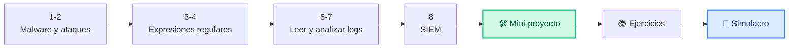
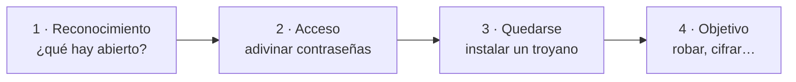
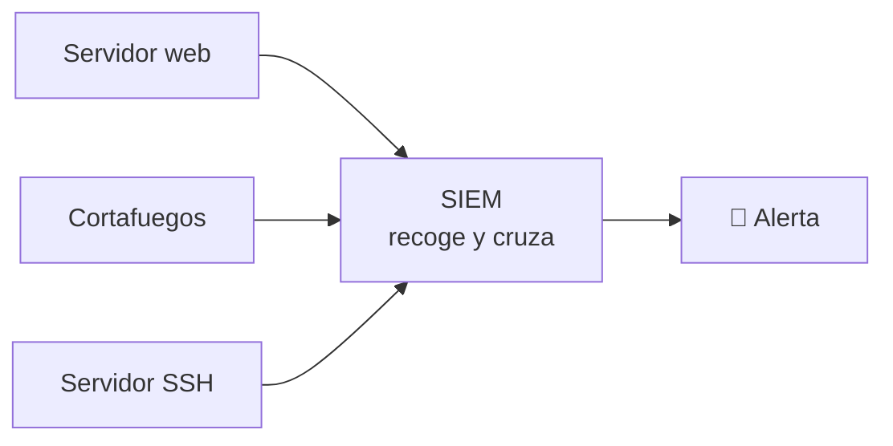

# Unidad 2 · Misión 2: caza al intruso

| | |
|---|---|
| **Resultado de aprendizaje** | RA2 · Seguridad activa, malware y ataques de red |
| **Trimestre** | 1.º — se evalúa con **examen tipo test** |
| **Duración / peso** | 16 horas · 20 % del módulo |
| **Necesitas** | Python 3 (todo lo que usamos viene incluido) |

!!! quote "Martes, 8:45. Suena el teléfono."
    Es un cliente de CiberSegura, una clínica dental: *"Nuestro servidor va lentísimo desde anoche y el registro de accesos tiene miles de líneas. ¿Nos está atacando alguien?"*

    Marta te pasa el fichero: 5.000 líneas de texto. Leerlas a mano es imposible. Pero con unas pocas líneas de Python puedes leerlas **todas** en un segundo y encontrar a quien está intentando entrar.

    Esa es tu misión: construir un **detector de ataques de fuerza bruta**. Por el camino aprenderás qué tipos de ataques existen y la herramienta que usan todos los analistas para leer registros: las **expresiones regulares**.

## Cómo vas a trabajar

Igual que en la UD1, cada concepto tiene 4 pasos: 💡 **La idea** → 🐍 **En Python** → 🧪 **Pruébalo tú** → ✅ **Checkpoint**. Al final: mini-proyecto, todos los ejercicios con solución y un simulacro de 30 preguntas.



!!! danger "Recuerda la norma"
    Analizamos registros para **defendernos**, con datos de clase o propios. Nunca contra sistemas ajenos. Ver [Uso ético y legal](../recursos/uso-etico.md).

## 1 · Malware: conoce al enemigo

**💡 La idea.** *Malware* es cualquier programa hecho para hacer daño: robar, espiar, bloquear o tomar el control. Hay varias familias, y se distinguen por **cómo actúan**:

| Tipo | Cómo actúa | Ejemplo |
|---|---|---|
| **Virus** | Se pega a otro fichero (un ejecutable) y se propaga cuando lo abres | Un `.exe` infectado en un USB |
| **Gusano** | Se copia **solo** por la red, sin que nadie abra nada | Infecta todos los PCs de una oficina en minutos |
| **Troyano** | Se disfraza de programa útil | Un "crack" de un juego que abre una puerta trasera |
| **Ransomware** | Cifra tus ficheros y pide un rescate | "Paga 2 bitcoins o pierdes tus fotos" |
| **Spyware** | Espía en silencio | Graba lo que tecleas y roba contraseñas |

**🐍 En Python.** Un diccionario que traduce comportamiento → tipo:

```python title="malware.py"
TIPOS = {
    "se_copia_solo_por_red": "gusano",
    "necesita_fichero_hospedador": "virus",
    "cifra_y_pide_rescate": "ransomware",
    "roba_datos_en_silencio": "spyware",
}

def clasifica(comportamiento: str) -> str:
    return TIPOS.get(comportamiento, "desconocido")   # (1)!

print(clasifica("cifra_y_pide_rescate"))
print(clasifica("algo_raro"))
```

1.  `.get(clave, por_defecto)` devuelve el valor si la clave existe, y `"desconocido"` si no, **sin dar error**.

```text title="Salida"
ransomware
desconocido
```

**🧪 Pruébalo tú.** Falta el troyano. Añádelo al diccionario con la clave `"se_disfraza_de_programa_util"` y comprueba:

```python
print(clasifica("se_disfraza_de_programa_util"))
```

```text title="Salida esperada"
troyano
```

<details class="sol"><summary>Solución</summary>

```python
TIPOS["se_disfraza_de_programa_util"] = "troyano"
```
</details>

**✅ Checkpoint**

- [ ] Sé diferenciar virus, gusano, troyano, ransomware y spyware.

## 2 · Ataques de red: qué huella dejan

**💡 La idea.** Un ataque casi nunca es un único golpe: sigue unas **fases**. Y cada tipo de ataque deja una **pista** distinta en los registros (logs). Aprender a reconocer esas pistas es el trabajo del equipo de defensa.



| Ataque | Qué hace | Pista típica en el log |
|---|---|---|
| **Fuerza bruta** | Prueba contraseñas una tras otra | Muchos `FALLO` seguidos desde la misma IP |
| **Password spraying** | Prueba la misma contraseña con muchos usuarios | Una IP falla con muchos usuarios **distintos** |
| **Escaneo de puertos** | Busca qué servicios están abiertos | Una IP toca muchos puertos en poco tiempo |
| **DoS / DDoS** | Satura el servidor para tumbarlo | Un pico enorme de peticiones |
| **Phishing** | Engaña para que des tus credenciales | No aparece en el servidor: ocurre en el correo |

**🐍 En Python.** Contar fallos por IP con un diccionario normal:

```python title="pistas.py"
intentos = [("10.0.0.5", "FALLO"), ("10.0.0.5", "FALLO"), ("10.0.0.9", "OK"), ("10.0.0.5", "FALLO")]

fallos: dict[str, int] = {}
for ip, estado in intentos:
    if estado == "FALLO":
        fallos[ip] = fallos.get(ip, 0) + 1

print(fallos)
```

```text title="Salida"
{'10.0.0.5': 3}
```

**🧪 Pruébalo tú.** Con el diccionario `fallos` de arriba, muestra un aviso para cada IP con **3 fallos o más**:

```text title="Salida esperada"
⚠️ Posible fuerza bruta desde 10.0.0.5
```

<details class="sol"><summary>Solución</summary>

```python
for ip, n in fallos.items():
    if n >= 3:
        print(f"⚠️ Posible fuerza bruta desde {ip}")
```
</details>

**✅ Checkpoint**

- [ ] Sé qué pista deja en un log la fuerza bruta y en qué se diferencia del *password spraying*.

## 3 · Expresiones regulares: buscar patrones en texto

**💡 La idea.** Un log es texto. Para sacar de él lo que te interesa (IPs, usuarios, puertos) no buscas un texto concreto, sino un **patrón**: "cuatro grupos de números separados por puntos" es una IP. Eso es una **expresión regular** (*regex*), y en Python se usan con el módulo `re`.

Los símbolos que más vas a usar:

| Símbolo | Significa | Ejemplo |
|---|---|---|
| `\d` | un dígito | `\d\d` encaja con `42` |
| `+` | uno o más del anterior | `\d+` encaja con `8080` |
| `\S` | un carácter que no es espacio | `\S+` encaja con `root` |
| `\s` | un espacio | |
| `( )` | un grupo: la parte que quieres **extraer** | `puerto (\d+)` extrae `22` |

Y las tres funciones básicas:

| Función | Qué hace |
|---|---|
| `re.search(patrón, texto)` | Busca la **primera** coincidencia en cualquier parte. Si no hay, devuelve `None` |
| `re.findall(patrón, texto)` | Devuelve una **lista** con todas las coincidencias |
| `re.sub(patrón, nuevo, texto)` | **Sustituye** las coincidencias por otro texto |

**🐍 En Python.**

```python title="regex_basico.py"
import re

texto = "Conexión desde 10.0.20.5 al puerto 22"

m = re.search(r"\d+\.\d+\.\d+\.\d+", texto)          # una IP
print(m.group() if m else "no encontrada")

print(re.findall(r"puerto (\d+)", texto))              # solo lo que va entre ( )

print(re.sub(r"\d+\.\d+\.\d+\.\d+", "[IP]", texto))   # ocultar la IP
```

```text title="Salida"
10.0.20.5
['22']
Conexión desde [IP] al puerto 22
```

!!! warning "El error número 1 con `re`"
    Si `re.search` no encuentra nada devuelve `None`, y hacer `None.group()` rompe el programa. Comprueba **siempre** con `if m:` antes de usar el resultado.

!!! tip "`search` o `match`"
    `re.match` solo mira **al principio** del texto; `re.search` busca en **cualquier parte**. Con logs casi siempre quieres `search`, porque las líneas suelen empezar por la fecha.

**🧪 Pruébalo tú.** De esta línea de un servidor web, extrae con `findall` **todos** los códigos de 3 cifras que van detrás de `estado=`:

```python
linea = "GET /index estado=200 · GET /admin estado=403 · GET /login estado=200"
```

```text title="Salida esperada"
['200', '403', '200']
```

<details class="sol"><summary>Solución</summary>

```python
print(re.findall(r"estado=(\d+)", linea))
```
</details>

**✅ Checkpoint**

- [ ] Sé qué hacen `search`, `findall` y `sub`, y por qué hay que comprobar `if m:`.

## 4 · Grupos con nombre: el truco de los analistas

**💡 La idea.** Cuando extraes varios datos de una línea, recordar que "la IP es el grupo 2" es un lío. Con los **grupos con nombre** `(?P<nombre>...)` le pones etiqueta a cada trozo y lo pides por su nombre.

**🐍 En Python.** Así son las líneas del log de la clínica:

```python title="grupos.py"
import re

PATRON = re.compile(r"usuario=(?P<usuario>\S+)\s+ip=(?P<ip>\S+)\s+estado=(?P<estado>OK|FALLO)")

linea = "2026-05-01 10:00:01 sshd usuario=root ip=10.0.20.5 estado=FALLO"
m = PATRON.search(linea)
if m:
    print(m["usuario"], m["ip"], m["estado"])
    print(m.groupdict())                       # (1)!
```

1.  `groupdict()` te da **todos** los grupos de golpe en un diccionario. Muy cómodo.

```text title="Salida"
root 10.0.20.5 FALLO
{'usuario': 'root', 'ip': '10.0.20.5', 'estado': 'FALLO'}
```

Fíjate en `(?P<estado>OK|FALLO)`: la barra `|` significa **"o"**: solo acepta `OK` o `FALLO`.

**🧪 Pruébalo tú.** Escribe un patrón con dos grupos con nombre, `usuario` y `puerto`, para esta línea, e imprime ambos:

```python
linea = "login usuario=marta puerto=2222"
```

```text title="Salida esperada"
marta 2222
```

<details class="sol"><summary>Solución</summary>

```python
m = re.search(r"usuario=(?P<usuario>\S+)\s+puerto=(?P<puerto>\d+)", linea)
if m:
    print(m["usuario"], m["puerto"])
```
</details>

**✅ Checkpoint**

- [ ] Sé escribir un grupo con nombre y leerlo con `m["nombre"]`.

## 5 · Leer un log entero (sin que se rompa)

**💡 La idea.** Un log real tiene miles de líneas… y algunas estarán rotas o tendrán otro formato. Tu programa tiene que **saltarse** las que no entiende en vez de romperse.

**🐍 En Python.** Una función para una línea y otra para el log completo:

```python title="leer_log.py"
import re

PATRON = re.compile(r"usuario=(?P<usuario>\S+)\s+ip=(?P<ip>\S+)\s+estado=(?P<estado>OK|FALLO)")

def parsear_evento(linea: str) -> dict | None:
    m = PATRON.search(linea)
    return m.groupdict() if m else None        # None si la línea no encaja

def parsear_log(texto: str) -> list[dict]:
    eventos = []
    for linea in texto.splitlines():
        evento = parsear_evento(linea)
        if evento is not None:                 # se salta las líneas rotas
            eventos.append(evento)
    return eventos

LOG = """2026-05-01 sshd usuario=root ip=10.0.20.5 estado=FALLO
esta línea está rota
2026-05-01 sshd usuario=ana ip=10.0.20.9 estado=OK"""

eventos = parsear_log(LOG)
print(len(eventos), "eventos válidos")
print(eventos[0])
```

```text title="Salida"
2 eventos válidos
{'usuario': 'root', 'ip': '10.0.20.5', 'estado': 'FALLO'}
```

**🧪 Pruébalo tú.** Usando `eventos`, muestra **solo** los usuarios cuyo estado es `OK`.

```text title="Salida esperada"
ana
```

<details class="sol"><summary>Solución</summary>

```python
for e in eventos:
    if e["estado"] == "OK":
        print(e["usuario"])
```
</details>

**✅ Checkpoint**

- [ ] Sé por qué el parser debe saltarse las líneas que no entiende.

## 6 · Contar como un profesional: `Counter`

**💡 La idea.** Contar cosas es lo más habitual al analizar un log: fallos por IP, peticiones por página… `collections.Counter` hace en una línea lo que en el concepto 2 hicimos con un bucle.

**🐍 En Python.**

```python title="contar.py"
from collections import Counter

eventos = [
    {"ip": "10.0.20.5", "estado": "FALLO"}, {"ip": "10.0.20.5", "estado": "FALLO"},
    {"ip": "10.0.20.5", "estado": "FALLO"}, {"ip": "10.0.20.7", "estado": "FALLO"},
    {"ip": "10.0.20.9", "estado": "OK"},
]

fallos = Counter(e["ip"] for e in eventos if e["estado"] == "FALLO")   # (1)!
print(fallos)
print(fallos.most_common(1))                                            # (2)!
```

1.  Solo se cuentan los eventos con `FALLO`: el `OK` de `10.0.20.9` ni aparece.
2.  `most_common(n)` devuelve los `n` más repetidos, del mayor al menor.

```text title="Salida"
Counter({'10.0.20.5': 3, '10.0.20.7': 1})
[('10.0.20.5', 3)]
```

**🧪 Pruébalo tú.** Con el `Counter` de arriba, construye la lista de IPs con **2 fallos o más** (el "umbral").

```text title="Salida esperada"
['10.0.20.5']
```

<details class="sol"><summary>Solución</summary>

```python
sospechosas = [ip for ip, n in fallos.items() if n >= 2]
print(sospechosas)
```
</details>

**✅ Checkpoint**

- [ ] Sé contar con `Counter` filtrando solo lo que me interesa.

## 7 · ¿Y si al final entró? IPs de dentro y de fuera

**💡 La idea.** Una IP con 50 fallos es ruido molesto. Una IP con 5 fallos **y después un `OK`** es una alarma roja: **probablemente adivinó la contraseña**. Distinguir las dos cosas es lo que separa un aviso de una emergencia.

Otro dato útil: saber si la IP es **privada** (de la red interna: `10.x.x.x`, `172.16-31.x.x`, `192.168.x.x`) o **pública** (de Internet). El módulo `ipaddress` lo sabe.

**🐍 En Python.**

```python title="alarma.py"
import ipaddress

def hubo_acceso(eventos: list[dict], ip: str) -> bool:
    return any(e["ip"] == ip and e["estado"] == "OK" for e in eventos)

eventos = [
    {"ip": "185.220.101.7", "estado": "FALLO"}, {"ip": "185.220.101.7", "estado": "FALLO"},
    {"ip": "185.220.101.7", "estado": "OK"},          # ¡entró!
]

print("¿Entró?", hubo_acceso(eventos, "185.220.101.7"))
print("¿Es de la red interna?", ipaddress.ip_address("185.220.101.7").is_private)
print("¿Y 192.168.1.20?", ipaddress.ip_address("192.168.1.20").is_private)
```

```text title="Salida"
¿Entró? True
¿Es de la red interna? False
¿Y 192.168.1.20? True
```

**🧪 Pruébalo tú.** Escribe `gravedad(eventos, ip)` que devuelva `"CRÍTICO"` si la IP tuvo fallos y además acceso, y `"aviso"` si solo tuvo fallos.

```python
print(gravedad(eventos, "185.220.101.7"))
print(gravedad([{"ip": "1.2.3.4", "estado": "FALLO"}], "1.2.3.4"))
```

```text title="Salida esperada"
CRÍTICO
aviso
```

<details class="sol"><summary>Solución</summary>

```python
def gravedad(eventos: list[dict], ip: str) -> str:
    return "CRÍTICO" if hubo_acceso(eventos, ip) else "aviso"
```
</details>

**✅ Checkpoint**

- [ ] Sé por qué un `OK` después de muchos fallos es mucho más grave.

## 8 · Vigilancia a gran escala: SIEM y fail2ban

**💡 La idea.** Lo que estás programando a mano (leer logs, contar, detectar un umbral) las empresas lo hacen a lo grande con un **SIEM** (*Security Information and Event Management*): recoge los logs de **todos** sus equipos, los cruza en tiempo real y lanza alertas.



| Herramienta real | Qué hace |
|---|---|
| **Wazuh, Splunk, Elastic** | SIEM: centraliza y correlaciona |
| **fail2ban** | Bloquea una IP tras N fallos: ¡la misma lógica que tu detector! |
| **Suricata** | Detecta ataques mirando el tráfico de red |

**🐍 En Python.** Lo que haría fail2ban, en miniatura:

```python title="mini_fail2ban.py"
from collections import Counter

UMBRAL = 3
fallos = Counter(["10.0.0.5", "10.0.0.5", "10.0.0.5", "10.0.0.8"])
bloqueadas = sorted(ip for ip, n in fallos.items() if n >= UMBRAL)
print("Bloqueo:", bloqueadas)
```

```text title="Salida"
Bloqueo: ['10.0.0.5']
```

**🧪 Pruébalo tú.** Las IPs de la red interna no se deben bloquear nunca (serían tus propios compañeros). Modifica la línea de `bloqueadas` para que **excluya** las IPs privadas, y prueba con este `Counter`:

```python
fallos = Counter(["10.0.0.5"] * 4 + ["185.220.101.9"] * 5)
```

```text title="Salida esperada"
Bloqueo: ['185.220.101.9']
```

<details class="sol"><summary>Solución</summary>

```python
import ipaddress
bloqueadas = sorted(ip for ip, n in fallos.items()
                    if n >= UMBRAL and not ipaddress.ip_address(ip).is_private)
```
</details>

**✅ Checkpoint**

- [ ] Sé qué hace un SIEM y qué hace fail2ban.

## 🧾 Chuleta para el test

| Si te preguntan por… | Recuerda |
|---|---|
| Virus / gusano | El virus necesita un fichero hospedador; el gusano se copia solo por la red |
| Troyano | Se disfraza de programa útil |
| Ransomware / spyware | Cifra y pide rescate / espía en silencio |
| Fuerza bruta | Muchos fallos, **misma IP**, normalmente mismo usuario |
| Password spraying | Una IP, pocos intentos, **muchos usuarios distintos** |
| `\d`, `\S`, `\s`, `+` | Dígito · no-espacio · espacio · uno o más |
| `search` / `match` | En cualquier parte / solo al principio |
| `findall` | Lista con lo que hay entre paréntesis |
| `sub` | Sustituir |
| Sin coincidencia | `re.search` devuelve `None` → comprueba `if m:` |
| `(?P<nombre>...)` | Grupo con nombre → `m["nombre"]` o `m.groupdict()` |
| `dict.get(k, x)` | Si no existe la clave, devuelve `x` sin error |
| `Counter` | Cuenta; `most_common(n)` da los `n` mayores |
| Fallos + `OK` | Alerta **crítica**: probablemente entró |
| `.is_private` | `10.x`, `172.16-31.x`, `192.168.x` son privadas |
| SIEM / fail2ban | Centraliza y correla / bloquea IPs tras N fallos |

## 🛠️ Mini-proyecto guiado: el detector de fuerza bruta

Vuelves con el registro de la clínica. Tu programa tiene que decir **qué IPs están atacando** y **si alguna ha conseguido entrar**. Juntas todo lo aprendido en 4 pasos:

1. **Parsear** cada línea con un patrón con grupos con nombre (conceptos 4 y 5).
2. **Contar** fallos por IP con `Counter` (concepto 6).
3. **Detectar** las IPs que superan el umbral y marcar como **CRÍTICO** las que acabaron entrando (concepto 7).
4. **Órdenes** desde la terminal con `argparse`, con el umbral configurable.

```python title="detector.py"
import argparse, re
from collections import Counter
from pathlib import Path

# PASO 1 · Parsear
PATRON = re.compile(r"usuario=(?P<usuario>\S+)\s+ip=(?P<ip>\S+)\s+estado=(?P<estado>OK|FALLO)")

def parsear_evento(linea: str) -> dict[str, str] | None:
    m = PATRON.search(linea)
    return m.groupdict() if m else None

def parsear_log(texto: str) -> list[dict[str, str]]:
    return [e for ln in texto.splitlines() if (e := parsear_evento(ln)) is not None]

# PASO 2 · Contar
def contar_fallos_por_ip(eventos: list[dict[str, str]]) -> dict[str, int]:
    return dict(Counter(e["ip"] for e in eventos if e["estado"] == "FALLO"))

# PASO 3 · Detectar
def ips_sospechosas(eventos: list[dict[str, str]], umbral: int) -> list[str]:
    fallos = contar_fallos_por_ip(eventos)
    return sorted([ip for ip, n in fallos.items() if n >= umbral], key=lambda ip: -fallos[ip])

def hubo_acceso_correcto(eventos: list[dict[str, str]], ip: str) -> bool:
    return any(e["ip"] == ip and e["estado"] == "OK" for e in eventos)

def generar_informe(eventos: list[dict[str, str]], umbral: int) -> list[str]:
    fallos = contar_fallos_por_ip(eventos)
    out = []
    for ip in ips_sospechosas(eventos, umbral):
        etiqueta = "CRÍTICO (acceso logrado)" if hubo_acceso_correcto(eventos, ip) else "alerta"
        out.append(f"[{etiqueta:24}] {ip}  ({fallos[ip]} fallos)")
    return out

# PASO 4 · Órdenes desde la terminal
def main() -> None:
    ap = argparse.ArgumentParser(prog="detector", description="Detector de fuerza bruta en logs SSH")
    ap.add_argument("log", type=Path)
    ap.add_argument("--umbral", type=int, default=5)
    args = ap.parse_args()
    eventos = parsear_log(args.log.read_text(encoding="utf-8"))
    print(f"{len(eventos)} eventos analizados")
    for linea in generar_informe(eventos, args.umbral):
        print(linea)

if __name__ == "__main__":
    main()
```

**Pruébalo de principio a fin.** Crea un log de prueba y analízalo:

```python title="crear_log.py"
lineas = ["2026-05-01 sshd usuario=root ip=10.0.20.5 estado=FALLO"] * 6
lineas += ["2026-05-01 sshd usuario=root ip=10.0.20.5 estado=OK"]
lineas += ["2026-05-01 sshd usuario=admin ip=10.0.20.8 estado=FALLO"] * 5
lineas += ["2026-05-01 sshd usuario=ana ip=10.0.20.9 estado=OK"]
open("log.txt", "w").write("\n".join(lineas))
```

```bash title="Terminal"
python crear_log.py
python detector.py log.txt --umbral 5
```

```text title="Salida"
13 eventos analizados
[CRÍTICO (acceso logrado)] 10.0.20.5  (6 fallos)
[alerta                  ] 10.0.20.8  (5 fallos)
```

!!! success "🏅 Misión 2 cumplida"
    La IP `10.0.20.5` consiguió entrar tras 6 intentos: la clínica cambia la contraseña de `root` y bloquea esa IP. Has hecho en un minuto el trabajo de un día. Ahora a practicar con los ejercicios y el simulacro.

## 📚 Todos los ejercicios con solución

> Ordenados de fácil a difícil: 🟢 empieza aquí · 🟡 ya vas cogiendo soltura · 🟠 piensa un poco · 🔴 reto. Intenta cada uno **antes** de abrir la solución, y ejecútalo para comprobarlo.

**1 · 🟢 Extraer IPs de un texto** — `ips(texto: str) -> list[str]`.
<details class="sol"><summary>Solución</summary>

```python
import re
def ips(texto: str) -> list[str]:
    return re.findall(r"\b\d{1,3}(?:\.\d{1,3}){3}\b", texto)
```
</details>

**2 · 🟢 ¿Es una IP privada?** — `es_privada(ip: str) -> bool` con `ipaddress`.
<details class="sol"><summary>Solución</summary>

```python
import ipaddress
def es_privada(ip: str) -> bool:
    return ipaddress.ip_address(ip).is_private
```
</details>

**3 · 🟢 Parsear un evento** — `parsear_evento(linea) -> dict[str,str] | None` (usa el patrón de §3.1).
<details class="sol"><summary>Solución</summary>

```python
import re
_P = re.compile(r"usuario=(?P<usuario>\S+)\s+ip=(?P<ip>\S+)\s+estado=(?P<estado>OK|FALLO)")
def parsear_evento(linea: str) -> dict[str, str] | None:
    m = _P.search(linea)
    return m.groupdict() if m else None
```
</details>

**4 · 🟢 Clasificar malware** — `clasifica(comportamiento: str) -> str` (usa el diccionario de §1).
<details class="sol"><summary>Solución</summary>

```python
MAPA = {"autorreplica_por_red": "gusano", "cifra_y_pide_rescate": "ransomware"}
def clasifica(c: str) -> str:
    return MAPA.get(c, "desconocido")
```
</details>

**5 · 🟡 Contar códigos de estado HTTP** — `codigos(lineas: list[str]) -> Counter`.
<details class="sol"><summary>Solución</summary>

```python
import re
from collections import Counter
def codigos(lineas: list[str]) -> "Counter[str]":
    c: Counter[str] = Counter()
    for ln in lineas:
        m = re.search(r'"\s+(\d{3})\b', ln)
        if m:
            c[m.group(1)] += 1
    return c
```
</details>

**6 · 🟡 Parsear el log completo** — `parsear_log(texto: str) -> list[dict[str,str]]`, descartando líneas corruptas.
<details class="sol"><summary>Solución</summary>

```python
def parsear_log(texto: str) -> list[dict[str, str]]:
    eventos = []
    for ln in texto.splitlines():
        e = parsear_evento(ln)
        if e is not None:
            eventos.append(e)
    return eventos
```
</details>

**7 · 🟡 Fallos por IP** — `contar_fallos_por_ip(eventos) -> dict[str,int]`.
<details class="sol"><summary>Solución</summary>

```python
from collections import Counter
def contar_fallos_por_ip(eventos: list[dict[str, str]]) -> dict[str, int]:
    c: Counter[str] = Counter()
    for e in eventos:
        if e["estado"] == "FALLO":
            c[e["ip"]] += 1
    return dict(c)
```
</details>

**8 · 🟡 Top de IPs más ruidosas** — `top_ips(eventos, n=3) -> list[tuple[str,int]]`.
<details class="sol"><summary>Solución</summary>

```python
from collections import Counter
def top_ips(eventos: list[dict[str, str]], n: int = 3) -> list[tuple[str, int]]:
    c: Counter[str] = Counter(e["ip"] for e in eventos if e["estado"] == "FALLO")
    return c.most_common(n)
```
</details>

**9 · 🟠 IPs sospechosas por umbral** — `ips_sospechosas(eventos, umbral=5) -> list[str]`, ordenadas de más a menos fallos.
<details class="sol"><summary>Solución</summary>

```python
def ips_sospechosas(eventos: list[dict[str, str]], umbral: int = 5) -> list[str]:
    fallos = contar_fallos_por_ip(eventos)
    return sorted([ip for ip, n in fallos.items() if n >= umbral], key=lambda ip: -fallos[ip])
```
</details>

**10 · 🟠 ¿Hubo acceso tras los fallos?** — `hubo_acceso_correcto(eventos, ip) -> bool`.
<details class="sol"><summary>Solución</summary>

```python
def hubo_acceso_correcto(eventos: list[dict[str, str]], ip: str) -> bool:
    return any(e["ip"] == ip and e["estado"] == "OK" for e in eventos)
```
</details>

**11 · 🟠 Usuarios objetivo de una IP** — `usuarios_objetivo(eventos, ip) -> set[str]`: qué usuarios ha probado esa IP.
<details class="sol"><summary>Solución</summary>

```python
def usuarios_objetivo(eventos: list[dict[str, str]], ip: str) -> set[str]:
    return {e["usuario"] for e in eventos if e["ip"] == ip}
```
</details>

**12 · 🔴 Password spraying** — `spraying(eventos, min_usuarios=5) -> list[str]`: IPs que prueban **pocas** contraseñas contra **muchos** usuarios distintos (al revés que la fuerza bruta clásica).
<details class="sol"><summary>Solución</summary>

```python
from collections import defaultdict
def spraying(eventos: list[dict[str, str]], min_usuarios: int = 5) -> list[str]:
    usuarios_por_ip: dict[str, set[str]] = defaultdict(set)
    for e in eventos:
        if e["estado"] == "FALLO":
            usuarios_por_ip[e["ip"]].add(e["usuario"])
    return sorted(ip for ip, us in usuarios_por_ip.items() if len(us) >= min_usuarios)
```
</details>

**13 · 🔴 Ventana temporal** — `en_ventana(marcas: list[int], segundos: int) -> int`: el máximo de eventos que caen en cualquier ventana deslizante de `segundos` (marcas ordenadas, en segundos desde el inicio).
<details class="sol"><summary>Solución</summary>

```python
def en_ventana(marcas: list[int], segundos: int) -> int:
    mejor = i = 0
    for j in range(len(marcas)):
        while marcas[j] - marcas[i] > segundos:
            i += 1
        mejor = max(mejor, j - i + 1)
    return mejor
```
</details>

**14 · 🔴 Escaneo de rutas 404** — `escaneo_web(lineas, umbral=10) -> list[str]`: IP que pide muchas rutas **distintas** con 404 (fuzzing de directorios).
<details class="sol"><summary>Solución</summary>

```python
import re
from collections import defaultdict
def escaneo_web(lineas: list[str], umbral: int = 10) -> list[str]:
    rutas: dict[str, set[str]] = defaultdict(set)
    for ln in lineas:
        m = re.search(r'(\d{1,3}(?:\.\d{1,3}){3}).*"(?:GET|POST)\s+(\S+)[^"]*"\s+404', ln)
        if m:
            rutas[m.group(1)].add(m.group(2))
    return sorted(ip for ip, r in rutas.items() if len(r) >= umbral)
```
</details>

**15 · 🔴 Informe final** — `informe(eventos, umbral=5) -> list[str]`: una línea por IP sospechosa con fallos y si hubo acceso, ordenado por gravedad.
<details class="sol"><summary>Solución</summary>

```python
def informe(eventos: list[dict[str, str]], umbral: int = 5) -> list[str]:
    salida = []
    for ip in ips_sospechosas(eventos, umbral):
        fallos = contar_fallos_por_ip(eventos)[ip]
        critico = hubo_acceso_correcto(eventos, ip)
        etiqueta = "CRÍTICO" if critico else "alerta"
        salida.append(f"[{etiqueta}] {ip}: {fallos} fallos" + (" + ACCESO" if critico else ""))
    return sorted(salida, key=lambda s: "CRÍTICO" not in s)
```
</details>

## 📝 Simulacro de test (30 preguntas)

> Así será el examen del 1.er trimestre. Hazlo como si fuera de verdad: sin mirar apuntes, y al final corrige.

**1.** ¿Qué imprime este código?

```python
MAPA = {
    "cifra_y_pide_rescate": "ransomware",
    "autorreplica_por_red": "gusano",
    "roba_datos_en_silencio": "spyware",
}

def clasifica(c: str) -> str:
    return MAPA.get(c, "desconocido")

print(clasifica("roba_datos_en_silencio"))
print(clasifica("ataque_nuevo"))
```

A) `spyware` y `desconocido`
B) `desconocido` y `spyware`
C) `spyware` y `None`
D) Lanza `KeyError` en la segunda llamada

<details class="sol"><summary>Ver respuesta</summary><b>Correcta: A.</b> <code>dict.get(clave, valor_por_defecto)</code> devuelve el valor si la clave existe, y el valor por defecto (<code>"desconocido"</code>) si no — sin lanzar excepción.</details>

**2.** ¿Qué imprime este código?

```python
import re

texto = "El servidor 10.0.5.9 recibió tráfico en el puerto 443 y en el puerto 8080"
print(re.findall(r"puerto (\d+)", texto))
```

A) `['puerto 443', 'puerto 8080']`
B) `['443', '8080']`
C) `['443']`
D) `[]`

<details class="sol"><summary>Ver respuesta</summary><b>Correcta: B.</b> <code>findall</code> devuelve una lista con el contenido de los grupos capturados (lo que hay dentro del paréntesis), no del texto completo que coincide.</details>

**3.** ¿Qué imprime este código?

```python
import re

patron = re.compile(r"usuario=(?P<usuario>\S+)\s+intentos=(?P<intentos>\d+)")
m = patron.search("log: usuario=marta intentos=7 hora=10:00")
print(m["usuario"], m["intentos"])
```

A) `marta 7`
B) `usuario intentos`
C) `None None`
D) Lanza un error porque hay dos grupos con nombre

<details class="sol"><summary>Ver respuesta</summary><b>Correcta: A.</b> Cada grupo con nombre se accede como una clave de diccionario sobre el objeto <code>match</code>.</details>

**4.** ¿Qué ocurre al ejecutar este código?

```python
import re

m = re.search(r"error=(\d+)", "todo correcto, sin fallos")
print(m["error"])
```

A) Imprime una cadena vacía
B) Imprime `None`
C) Lanza `TypeError`, porque `m` es `None` y no se puede indexar
D) Imprime `0`

<details class="sol"><summary>Ver respuesta</summary><b>Correcta: C.</b> Como el patrón no encaja, <code>re.search</code> devuelve <code>None</code>; intentar hacer <code>None["error"]</code> lanza <code>TypeError</code>. Por eso siempre hay que comprobar <code>if m:</code> antes de usar el resultado.</details>

**5.** ¿Qué imprime este código?

```python
import re

PATRON = re.compile(r"usuario=(?P<usuario>\S+)\s+ip=(?P<ip>\S+)\s+estado=(?P<estado>OK|FALLO)")

def parsear_evento(linea: str) -> dict | None:
    m = PATRON.search(linea)
    return m.groupdict() if m else None

def parsear_log(texto: str) -> list[dict]:
    return [e for l in texto.splitlines() if (e := parsear_evento(l)) is not None]

log = "usuario=x ip=1.1.1.1 estado=OK\n####corrupta####\nusuario=y ip=2.2.2.2 estado=FALLO\n"
print(len(parsear_log(log)))
```

A) `3`
B) `2`
C) `1`
D) Lanza una excepción al llegar a la línea corrupta

<details class="sol"><summary>Ver respuesta</summary><b>Correcta: B.</b> La línea corrupta no encaja con el patrón, así que <code>parsear_evento</code> devuelve <code>None</code> y esa línea se descarta silenciosamente — el parser sobrevive.</details>

**6.** ¿Qué imprime este código?

```python
from collections import Counter

eventos = [{"ip": "3.3.3.3", "estado": "FALLO"}] * 4 + [{"ip": "3.3.3.3", "estado": "OK"}] * 10
c = Counter(e["ip"] for e in eventos if e["estado"] == "FALLO")
print(dict(c))
```

A) `{'3.3.3.3': 14}`
B) `{'3.3.3.3': 4}`
C) `{'3.3.3.3': 10}`
D) `{}`

<details class="sol"><summary>Ver respuesta</summary><b>Correcta: B.</b> El generador solo produce las IPs cuyo evento tiene <code>estado == "FALLO"</code>; los 10 eventos <code>"OK"</code> ni se cuentan.</details>

**7.** ¿Qué imprime este código?

```python
def hubo_acceso_correcto(eventos: list[dict], ip: str) -> bool:
    return any(e["ip"] == ip and e["estado"] == "OK" for e in eventos)

eventos = [{"ip": "5.5.5.5", "estado": "FALLO"}] * 20
print(hubo_acceso_correcto(eventos, "5.5.5.5"))
```

A) `True`, porque hay 20 intentos
B) `False`, porque ningún evento tiene `estado == "OK"`
C) Lanza `IndexError`
D) `True`, porque la IP coincide 20 veces

<details class="sol"><summary>Ver respuesta</summary><b>Correcta: B.</b> Por muchos fallos que haya, <code>any(...)</code> solo es <code>True</code> si <b>alguno</b> de los eventos tiene <code>estado == "OK"</code> — y aquí no hay ninguno.</details>

**8.** ¿Qué imprime este código?

```python
import ipaddress

print(ipaddress.ip_address("192.168.50.2").is_private)
print(ipaddress.ip_address("93.184.216.34").is_private)
```

A) `True` y `True`
B) `False` y `False`
C) `True` y `False`
D) `False` y `True`

<details class="sol"><summary>Ver respuesta</summary><b>Correcta: C.</b> <code>192.168.x.x</code> es un rango privado (RFC 1918); <code>93.184.216.34</code> es una IP pública real de Internet.</details>

**9.** Tienes esta función de detección de *password spraying* (pocas contraseñas contra muchos usuarios):

```python
from collections import defaultdict

def spraying(eventos: list[dict], min_usuarios: int = 3) -> list[str]:
    usuarios_por_ip = defaultdict(set)
    for e in eventos:
        if e["estado"] == "FALLO":
            usuarios_por_ip[e["ip"]].add(e["usuario"])
    return sorted(ip for ip, us in usuarios_por_ip.items() if len(us) >= min_usuarios)

eventos = [{"ip": "7.7.7.7", "usuario": f"u{i}", "estado": "FALLO"} for i in range(2)]
print(spraying(eventos, min_usuarios=3))
```

A) `['7.7.7.7']`
B) `[]`
C) `['u0', 'u1']`
D) Lanza `KeyError`

<details class="sol"><summary>Ver respuesta</summary><b>Correcta: B.</b> Solo hay 2 usuarios distintos probados desde <code>7.7.7.7</code>, y el umbral pide al menos 3 — no se marca como spraying.</details>

**10.** ¿Qué imprime este código?

```python
def en_ventana(marcas: list[int], segundos: int) -> int:
    mejor = i = 0
    for j in range(len(marcas)):
        while marcas[j] - marcas[i] > segundos:
            i += 1
        mejor = max(mejor, j - i + 1)
    return mejor

print(en_ventana([1, 2, 3, 20, 21], segundos=5))
```

A) `2`
B) `3`
C) `5`
D) `1`

<details class="sol"><summary>Ver respuesta</summary><b>Correcta: B.</b> Las marcas 1, 2 y 3 caben todas en una ventana de 5 segundos (<code>3-1=2 ≤ 5</code>); al llegar a 20, las anteriores quedan fuera de rango. El máximo es 3.</details>

**11.** ¿Qué imprime este código?

```python
import re
from collections import Counter

def codigos(lineas: list[str]) -> Counter:
    c = Counter()
    for l in lineas:
        m = re.search(r'"\s+(\d{3})\b', l)
        if m:
            c[m.group(1)] += 1
    return c

lineas = ['1.1.1.1 "GET / HTTP/1.1" 200'] * 3 + ['1.1.1.1 "GET /a HTTP/1.1" 500']
print(dict(codigos(lineas)))
```

A) `{'200': 3, '500': 1}`
B) `{'200': 1, '500': 1}`
C) `{'200': 4}`
D) `{}`

<details class="sol"><summary>Ver respuesta</summary><b>Correcta: A.</b> El patrón extrae el código de 3 dígitos al final de cada línea; se cuentan las 3 apariciones de <code>200</code> y la 1 de <code>500</code> por separado.</details>

**12.** ¿Qué diferencia hay en el comportamiento de estas dos líneas con `linea = "sshd usuario=root ip=1.2.3.4"` (que **no** empieza por la fecha, como en un log real)?

```python
resultado_match = re.match(r"ip=", linea)
resultado_search = re.search(r"ip=", linea)
```

A) Ambas dan el mismo resultado, porque el patrón es idéntico
B) `resultado_match` es `None` (el patrón no está al principio); `resultado_search` sí encuentra la coincidencia en cualquier parte
C) `resultado_match` encuentra la coincidencia; `resultado_search` no
D) Las dos lanzan una excepción porque falta `^` en el patrón

<details class="sol"><summary>Ver respuesta</summary><b>Correcta: B.</b> <code>match</code> solo comprueba si el patrón encaja justo al principio de la cadena; como la línea empieza por <code>"sshd..."</code>, no por <code>"ip="</code>, <code>match</code> falla. <code>search</code> sí lo encuentra, esté donde esté.</details>

**13.** *(Sobre el reto de la unidad)* ¿Qué imprime este código?

```python
from collections import Counter

def contar_fallos_por_ip(eventos: list[dict]) -> dict:
    return dict(Counter(e["ip"] for e in eventos if e["estado"] == "FALLO"))

def ips_sospechosas(eventos: list[dict], umbral: int) -> list[str]:
    fallos = contar_fallos_por_ip(eventos)
    return sorted([ip for ip, n in fallos.items() if n >= umbral], key=lambda ip: -fallos[ip])

eventos = [{"ip": "9.9.9.9", "estado": "FALLO"}] * 3 + [{"ip": "8.8.8.8", "estado": "FALLO"}] * 7
print(ips_sospechosas(eventos, umbral=5))
```

A) `['9.9.9.9', '8.8.8.8']`
B) `['8.8.8.8']`
C) `['8.8.8.8', '9.9.9.9']`
D) `[]`

<details class="sol"><summary>Ver respuesta</summary><b>Correcta: B.</b> <code>9.9.9.9</code> solo tiene 3 fallos, por debajo del umbral de 5; <code>8.8.8.8</code> tiene 7, así que supera el umbral y es la única IP sospechosa.</details>

**14.** *(Sobre el reto de la unidad)* Con las funciones `contar_fallos_por_ip`, `ips_sospechosas` y `hubo_acceso_correcto` ya definidas, ¿qué imprime esto?

```python
def generar_informe(eventos: list[dict], umbral: int) -> list[str]:
    fallos = contar_fallos_por_ip(eventos)
    out = []
    for ip in ips_sospechosas(eventos, umbral):
        etiqueta = "CRÍTICO" if hubo_acceso_correcto(eventos, ip) else "alerta"
        out.append(f"[{etiqueta}] {ip} ({fallos[ip]} fallos)")
    return out

eventos = [{"ip": "9.9.9.9", "estado": "FALLO"}] * 6 + [{"ip": "9.9.9.9", "estado": "OK"}]
print(generar_informe(eventos, umbral=5))
```

A) `['[alerta] 9.9.9.9 (6 fallos)']`
B) `['[CRÍTICO] 9.9.9.9 (6 fallos)']`
C) `['[CRÍTICO] 9.9.9.9 (7 fallos)']`
D) `[]`

<details class="sol"><summary>Ver respuesta</summary><b>Correcta: B.</b> <code>9.9.9.9</code> tiene 6 fallos (supera el umbral de 5) <b>y además</b> un <code>OK</code> posterior — <code>hubo_acceso_correcto</code> da <code>True</code>, así que se etiqueta como <code>CRÍTICO</code>, no como una simple alerta.</details>

**15.** *(Sobre el reto de la unidad)* Tienes esta configuración de línea de comandos:

```python
import argparse

ap = argparse.ArgumentParser()
ap.add_argument("log")
ap.add_argument("--umbral", type=int, default=5)
args = ap.parse_args(["log.txt"])   # sin pasar --umbral

print(args.umbral)
```

¿Qué imprime?

A) `None`
B) `5`
C) Lanza un error porque `--umbral` es obligatorio
D) `0`

<details class="sol"><summary>Ver respuesta</summary><b>Correcta: B.</b> Como <code>--umbral</code> no se indicó al llamar al programa, <code>argparse</code> usa el valor <code>default=5</code> definido en el propio <code>add_argument</code>.</details>

**16.** Un programa malicioso infecta todos los ordenadores de una oficina en 10 minutos, sin que nadie abra ningún fichero. ¿Qué es?

A) Un virus
B) Un gusano
C) Un troyano
D) Spyware

<details class="sol"><summary>Ver respuesta</summary><b>Correcta: B.</b> El gusano se copia solo por la red. El virus necesita que alguien ejecute el fichero infectado.</details>

**17.** Descargas un "crack" gratuito de un videojuego. Funciona, pero además abre una puerta trasera en tu ordenador. ¿Qué tipo de malware es?

A) Ransomware
B) Gusano
C) Troyano
D) Ninguno, porque el juego funciona

<details class="sol"><summary>Ver respuesta</summary><b>Correcta: C.</b> Como el caballo de Troya: parece un regalo útil y dentro lleva el ataque.</details>

**18.** En el log ves que la IP `198.51.100.4` ha fallado **una vez** con 40 usuarios **distintos**. ¿Qué ataque es más probable?

A) Fuerza bruta clásica
B) Password spraying
C) DDoS
D) Phishing

<details class="sol"><summary>Ver respuesta</summary><b>Correcta: B.</b> Probar la misma contraseña con muchos usuarios (pocos intentos por usuario) evita los bloqueos por "demasiados fallos". En la fuerza bruta clásica verías muchos fallos contra el mismo usuario.</details>

**19.** ¿Qué imprime este código?

```python
import re
print(re.sub(r"\d+", "#", "puerto 22 y 443"))
```

A) `puerto # y #`
B) `puerto ## y ###`
C) `puerto 22 y 443`
D) `# # # #`

<details class="sol"><summary>Ver respuesta</summary><b>Correcta: A.</b> <code>\d+</code> encaja con cada número <b>completo</b> (uno o más dígitos seguidos), así que cada número se sustituye por un solo <code>#</code>.</details>

**20.** ¿Qué imprime este código?

```python
import re
print(re.findall(r"\d+", "a1b22c333"))
```

A) `['1', '2', '2', '3', '3', '3']`
B) `['1', '22', '333']`
C) `['a', 'b', 'c']`
D) `'122333'`

<details class="sol"><summary>Ver respuesta</summary><b>Correcta: B.</b> Cada grupo de dígitos seguidos es una coincidencia; <code>findall</code> las devuelve todas en una lista de cadenas.</details>

**21.** ¿Qué imprime este código?

```python
import re
print(re.findall(r"\S+", "root  10.0.0.1"))
```

A) `['root', '10.0.0.1']`
B) `['r', 'o', 'o', 't']`
C) `['  ']`
D) `[]`

<details class="sol"><summary>Ver respuesta</summary><b>Correcta: A.</b> <code>\S+</code> es "uno o más caracteres que no son espacio": trocea el texto en palabras, da igual cuántos espacios haya en medio.</details>

**22.** ¿Qué imprime este código?

```python
import re
m = re.search(r"(?P<ip>\d+\.\d+\.\d+\.\d+)", "conexión desde 8.8.8.8 rechazada")
print(m.groupdict())
```

A) `{'ip': '8.8.8.8'}`
B) `['8.8.8.8']`
C) `'8.8.8.8'`
D) `None`

<details class="sol"><summary>Ver respuesta</summary><b>Correcta: A.</b> <code>groupdict()</code> devuelve un diccionario con cada grupo con nombre como clave.</details>

**23.** En el patrón `estado=(?P<estado>OK|FALLO)`, ¿qué significa la barra `|`?

A) Que el estado puede ser `OK` **o** `FALLO`
B) Que el estado debe contener los dos textos
C) Que se separan dos grupos distintos
D) Nada: es un carácter literal que tiene que aparecer en la línea

<details class="sol"><summary>Ver respuesta</summary><b>Correcta: A.</b> La <code>|</code> es la alternativa "o": el grupo solo encaja si el texto es exactamente una de las opciones.</details>

**24.** ¿Qué imprime este código?

```python
fallos = {}
fallos["1.1.1.1"] = fallos.get("1.1.1.1", 0) + 1
print(fallos)
```

A) Lanza `KeyError` porque la clave no existe todavía
B) `{'1.1.1.1': 1}`
C) `{'1.1.1.1': 0}`
D) `{}`

<details class="sol"><summary>Ver respuesta</summary><b>Correcta: B.</b> <code>.get</code> devuelve <code>0</code> si la clave no existe (sin error); <code>0 + 1 = 1</code>. Es el patrón clásico para contar sin <code>Counter</code>.</details>

**25.** ¿Qué imprime este código?

```python
from collections import Counter
print(Counter(["a", "b", "a", "c", "a", "b"]).most_common(2))
```

A) `[('a', 3), ('b', 2)]`
B) `['a', 'b']`
C) `{'a': 3, 'b': 2}`
D) `[('a', 3), ('b', 2), ('c', 1)]`

<details class="sol"><summary>Ver respuesta</summary><b>Correcta: A.</b> <code>most_common(2)</code> devuelve los 2 elementos más repetidos, como lista de tuplas <code>(elemento, veces)</code>, de mayor a menor.</details>

**26.** ¿Qué imprime `ipaddress.ip_address("10.1.2.3").is_private`?

A) `True`
B) `False`
C) Lanza un error: no es una IP válida
D) `None`

<details class="sol"><summary>Ver respuesta</summary><b>Correcta: A.</b> Todo el rango <code>10.x.x.x</code> está reservado para redes internas.</details>

**27.** ¿Qué hace un **SIEM**?

A) Cifra el disco de los servidores
B) Recoge los registros de muchos equipos, los cruza y lanza alertas
C) Sustituye al antivirus
D) Genera contraseñas seguras

<details class="sol"><summary>Ver respuesta</summary><b>Correcta: B.</b> Es el "centro de vigilancia" de una empresa: lo mismo que tu detector, pero con los logs de todos los equipos a la vez.</details>

**28.** ¿Qué herramienta real hace, a gran escala, lo mismo que el mini-proyecto de esta unidad (bloquear una IP tras N fallos)?

A) fail2ban
B) Wireshark
C) Excel
D) Git

<details class="sol"><summary>Ver respuesta</summary><b>Correcta: A.</b> fail2ban lee los logs, cuenta fallos por IP y, al pasar el umbral, la bloquea en el cortafuegos.</details>

**29.** Un ataque **DDoS** tumba la web de una tienda online durante el Black Friday. ¿Qué pilar de la UD1 se rompe?

A) Confidencialidad
B) Integridad
C) Disponibilidad
D) Ninguno, porque no se roban datos

<details class="sol"><summary>Ver respuesta</summary><b>Correcta: C.</b> Los datos siguen a salvo, pero el servicio no está cuando hace falta.</details>

**30.** *(Sobre el mini-proyecto)* ¿Qué devuelve `parsear_evento` con esta línea?

```python
PATRON = re.compile(r"usuario=(?P<usuario>\S+)\s+ip=(?P<ip>\S+)\s+estado=(?P<estado>OK|FALLO)")

def parsear_evento(linea):
    m = PATRON.search(linea)
    return m.groupdict() if m else None

print(parsear_evento("usuario=ana ip=1.1.1.1 estado=ERROR"))
```

A) `{'usuario': 'ana', 'ip': '1.1.1.1', 'estado': 'ERROR'}`
B) `None`
C) `{'usuario': 'ana', 'ip': '1.1.1.1'}`
D) Lanza `TypeError`

<details class="sol"><summary>Ver respuesta</summary><b>Correcta: B.</b> <code>ERROR</code> no es ni <code>OK</code> ni <code>FALLO</code>, así que el patrón completo no encaja, <code>search</code> devuelve <code>None</code> y la función devuelve <code>None</code> sin romperse.</details>

## Cómo se evalúa esta unidad

La UD1 y la UD2 forman el **1.er trimestre** y se evalúan con un **examen tipo test** (preguntas de 4 opciones como las del simulacro: conceptos y fragmentos de código).

!!! tip "La nota, sin sorpresas"
    **Nota = (aciertos ÷ número de preguntas) × 10.** Los fallos no restan. Se aprueba con un 5.

Si haces el simulacro sin mirar las soluciones y sacas más de 21 de 30, vas bien.
