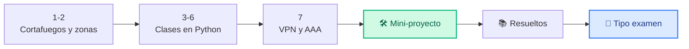
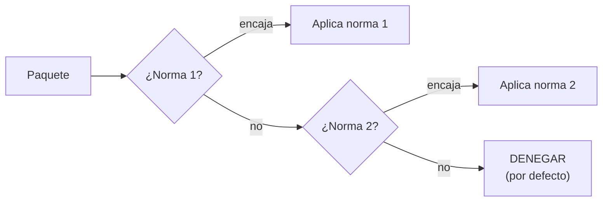
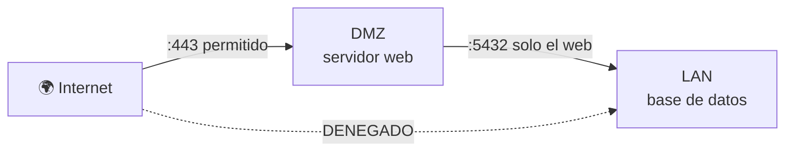
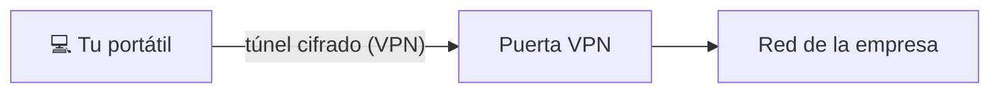

# Unidad 3 · Misión 3: el guardián de la puerta

| | |
|---|---|
| **Resultado de aprendizaje** | RA3 · Seguridad perimetral y acceso remoto |
| **Trimestre** | 2.º — se evalúa con **examen práctico** (programas corregidos con tests) |
| **Duración / peso** | 14 horas · 15 % del módulo |
| **Necesitas** | Python 3 y `pytest` (`pip install pytest`) |

!!! quote "Lunes, 9:10. Un encargo nuevo."
    Una tienda online, cliente de CiberSegura, tiene su web y su base de datos de clientes en la misma red, **sin nada que las separe**. Marta lo tiene claro: *"Si alguien entra por la web, se lleva la base de datos entera. Necesitan un guardián en la puerta."*

    Ese guardián es un **cortafuegos**: un programa que decide, paquete a paquete, qué tráfico entra y cuál no. Tu misión es **programar uno**. Y para hacerlo bien vas a aprender una forma nueva de programar que usarás todo el ciclo: las **clases**.

## Cómo vas a trabajar

Cada concepto: 💡 **La idea** → 🐍 **En Python** → 🧪 **Pruébalo tú** → ✅ **Checkpoint**. Después, un mini-proyecto guiado, ejercicios resueltos y **ejercicios tipo examen** con sus tests, igual que en el examen práctico.



## 1 · El cortafuegos: el portero de la discoteca

**💡 La idea.** Un cortafuegos es como el portero de una discoteca con una **lista de normas**. Para cada persona (cada paquete de red) lee las normas **de arriba abajo** y aplica **la primera que encaja**. Si ninguna encaja, **no entra**.

Esta última regla tiene nombre: **denegar por defecto** (*deny by default*). Un cortafuegos que deja pasar lo que no conoce está mal configurado — y es el error más común del mundo real.



**🐍 En Python.** Las normas como una lista de tuplas `(acción, puerto)`:

```python title="portero.py"
normas = [("PERMITIR", 80), ("PERMITIR", 443)]

def evaluar(puerto: int) -> str:
    for accion, p in normas:
        if p == puerto:
            return accion          # la primera que encaja, gana
    return "DENEGAR"               # denegar por defecto

print(evaluar(443), evaluar(22))
```

```text title="Salida"
PERMITIR DENEGAR
```

**🧪 Pruébalo tú.** Añade una norma para que el puerto `22` quede **denegado explícitamente** y otra que permita el `8080`. Comprueba:

```python
print(evaluar(22), evaluar(8080), evaluar(3306))
```

```text title="Salida esperada"
DENEGAR PERMITIR DENEGAR
```

<details class="sol"><summary>Solución</summary>

```python
normas = [("PERMITIR", 80), ("PERMITIR", 443), ("DENEGAR", 22), ("PERMITIR", 8080)]
```

El `3306` no está en ninguna norma: lo deniega la regla por defecto.
</details>

**✅ Checkpoint**

- [ ] Sé qué significa "la primera norma que encaja gana" y "denegar por defecto".

## 2 · Zonas de red y la DMZ

**💡 La idea.** No todos los equipos de una empresa necesitan el mismo nivel de protección. Se separan en **zonas**:

| Zona | Qué hay | Desde Internet… |
|---|---|---|
| **Externa** | Internet | — |
| **DMZ** (zona desmilitarizada) | Lo que **tiene** que ver el público: la web | Se puede llegar |
| **LAN** (red interna) | Lo valioso: base de datos, ordenadores de la oficina | **Nunca** directamente |



Si un atacante entra en la web, se queda atrapado en la DMZ: todavía tiene que saltar otra puerta para llegar a la base de datos.

**🐍 En Python.** Cada zona es un rango de IPs (en notación CIDR: `10.0.1.0/24` significa "de `10.0.1.0` a `10.0.1.255`"). El módulo `ipaddress` sabe si una IP está dentro:

```python title="zonas.py"
import ipaddress

ZONAS = {"dmz": "10.0.1.0/24", "lan": "10.0.2.0/24"}

def zona(ip: str) -> str:
    for nombre, red in ZONAS.items():
        if ipaddress.ip_address(ip) in ipaddress.ip_network(red):
            return nombre
    return "externa"

print(zona("10.0.1.20"), zona("10.0.2.7"), zona("8.8.8.8"))
```

```text title="Salida"
dmz lan externa
```

**🧪 Pruébalo tú.** La empresa añade una zona `"invitados"` para la wifi de visitas: `10.0.9.0/24`. Añádela y comprueba:

```python
print(zona("10.0.9.44"))
```

```text title="Salida esperada"
invitados
```

<details class="sol"><summary>Solución</summary>

```python
ZONAS["invitados"] = "10.0.9.0/24"
```
</details>

**✅ Checkpoint**

- [ ] Sé qué es la DMZ y por qué Internet nunca llega directamente a la LAN.

## 3 · Tu primera clase: datos + comportamiento juntos

**💡 La idea.** Hasta ahora guardabas datos en tuplas y diccionarios, y las funciones iban aparte. Una **clase** es un **molde** que junta los **datos** (atributos) y lo que se puede **hacer** con ellos (métodos). Cada cosa que fabricas con el molde es un **objeto**.

Piensa en una regla de cortafuegos: *tiene* una acción y un puerto, y *sabe* decir si deja pasar un paquete. Encaja perfecto.

**🐍 En Python.**

```python title="clase_regla.py"
class Regla:
    def __init__(self, accion: str, puerto: int) -> None:   # (1)!
        self.accion = accion                                  # (2)!
        self.puerto = puerto

    def permite(self, puerto: int) -> bool:                   # (3)!
        return self.accion == "PERMITIR" and self.puerto == puerto

web = Regla("PERMITIR", 443)          # un objeto fabricado con el molde
print(web.puerto)
print(web.permite(443), web.permite(22))
```

1.  `__init__` se ejecuta al **crear** el objeto y recibe sus datos iniciales.
2.  `self` es "este objeto": `self.puerto` guarda el puerto **dentro** de él.
3.  Un **método** es una función que vive dentro de la clase y trabaja con `self`.

```text title="Salida"
443
True False
```

**🧪 Pruébalo tú.** Añade a la clase un método `describe()` que devuelva un texto como `"PERMITIR puerto 443"`.

```python
print(Regla("DENEGAR", 22).describe())
```

```text title="Salida esperada"
DENEGAR puerto 22
```

<details class="sol"><summary>Solución</summary>

El método va **dentro** de la clase, con la misma sangría que `permite`:

```python
class Regla:
    def __init__(self, accion: str, puerto: int) -> None:
        self.accion = accion
        self.puerto = puerto

    def permite(self, puerto: int) -> bool:
        return self.accion == "PERMITIR" and self.puerto == puerto

    def describe(self) -> str:
        return f"{self.accion} puerto {self.puerto}"
```
</details>

**✅ Checkpoint**

- [ ] Sé qué son una clase, un objeto, un atributo y un método.

## 4 · `@dataclass`: la misma clase con menos código

**💡 La idea.** Escribir `__init__` y un `self.x = x` por cada atributo es repetitivo. Si pones `@dataclass` encima de la clase, Python lo escribe por ti. Y de regalo te da dos cosas más: un `print` legible y la posibilidad de comparar dos objetos con `==`.

**🐍 En Python.** Una regla más completa, con comodín `"*"` (= "cualquiera"):

```python title="dataclass_regla.py"
from dataclasses import dataclass

@dataclass
class Regla:
    accion: str
    origen: str = "*"        # valores por defecto: "*" = cualquiera
    destino: str = "*"
    puerto: int = 0          # 0 = cualquier puerto

    def coincide(self, origen: str, destino: str, puerto: int) -> bool:
        def encaja(valor: str, patron: str) -> bool:
            return patron == "*" or patron == valor
        return (encaja(origen, self.origen) and encaja(destino, self.destino)
                and (self.puerto == 0 or self.puerto == puerto))

r = Regla("PERMITIR", destino="dmz", puerto=443)
print(r)
print(r.coincide("internet", "dmz", 443), r.coincide("internet", "lan", 443))
print(r == Regla("PERMITIR", destino="dmz", puerto=443))
```

```text title="Salida"
Regla(accion='PERMITIR', origen='*', destino='dmz', puerto=443)
True False
True
```

**🧪 Pruébalo tú.** Crea una regla que **deniegue** cualquier tráfico que venga de `"invitados"` hacia `"lan"`, a cualquier puerto, y compruébala:

```python
print(bloqueo.coincide("invitados", "lan", 5432), bloqueo.coincide("dmz", "lan", 5432))
```

```text title="Salida esperada"
True False
```

<details class="sol"><summary>Solución</summary>

```python
bloqueo = Regla("DENEGAR", origen="invitados", destino="lan")
```

Como no indicas `puerto`, vale `0`: cualquier puerto.
</details>

**✅ Checkpoint**

- [ ] Sé qué me da `@dataclass` sin escribirlo (`__init__`, `print` legible y `==`).

## 5 · Una clase que usa otra: el cortafuegos

**💡 La idea.** Los programas grandes se construyen **juntando piezas**: un `Cortafuegos` es un objeto que **contiene** una lista de objetos `Regla`, y tiene un método `evaluar` que las recorre en orden.

**🐍 En Python.** (Usa la clase `Regla` del concepto anterior.)

```python title="cortafuegos_basico.py"
from dataclasses import dataclass, field

@dataclass
class Cortafuegos:
    reglas: list[Regla] = field(default_factory=list)   # (1)!

    def anadir(self, regla: Regla) -> None:
        self.reglas.append(regla)

    def evaluar(self, origen: str, destino: str, puerto: int) -> str:
        for regla in self.reglas:
            if regla.coincide(origen, destino, puerto):
                return regla.accion
        return "DENEGAR"

fw = Cortafuegos()
fw.anadir(Regla("PERMITIR", destino="dmz", puerto=443))
print(fw.evaluar("internet", "dmz", 443))
print(fw.evaluar("internet", "lan", 5432))
```

1.  Para que **cada** cortafuegos tenga su **propia** lista vacía se usa `field(default_factory=list)`. Si escribieras `reglas: list = []`, todos los cortafuegos compartirían la misma lista: un error clásico.

```text title="Salida"
PERMITIR
DENEGAR
```

**🧪 Pruébalo tú.** Crea un cortafuegos nuevo y añade, **en este orden**, `Regla("DENEGAR")` y luego `Regla("PERMITIR", puerto=80)`. ¿Qué devuelve `evaluar("x", "y", 80)`? Piénsalo antes de ejecutar.

```text title="Salida esperada"
DENEGAR
```

<details class="sol"><summary>Solución</summary>

```python
fw2 = Cortafuegos()
fw2.anadir(Regla("DENEGAR"))
fw2.anadir(Regla("PERMITIR", puerto=80))
print(fw2.evaluar("x", "y", 80))
```

La primera regla es un comodín total: encaja con todo y "tapa" a la segunda, que nunca se llega a mirar. **Las reglas concretas van primero; la general, al final.**
</details>

**✅ Checkpoint**

- [ ] Sé por qué importa el orden de las reglas.

## 6 · Herencia: una regla con horario

**💡 La idea.** A veces necesitas una versión **especial** de una clase que ya funciona. Con la **herencia** creas una clase hija que **recibe todo** lo de la madre y **añade** lo suyo, sin reescribir nada.

Ejemplo: el acceso remoto de mantenimiento solo debe estar permitido **en horario laboral**.

**🐍 En Python.** (Usa la clase `Regla` del concepto 4.)

```python title="herencia.py"
from dataclasses import dataclass

@dataclass
class ReglaHoraria(Regla):                  # hereda accion, origen, destino, puerto y coincide()
    hora_inicio: int = 8
    hora_fin: int = 18

    def activa_a_las(self, hora: int) -> bool:
        return self.hora_inicio <= hora <= self.hora_fin

mantenimiento = ReglaHoraria("PERMITIR", puerto=22)
print(mantenimiento.coincide("tecnico", "lan", 22))   # método heredado
print(mantenimiento.activa_a_las(10), mantenimiento.activa_a_las(23))
```

```text title="Salida"
True
True False
```

**🧪 Pruébalo tú.** Crea una `ReglaHoraria` para copias de seguridad nocturnas: puerto `873`, de 1 a 5 de la madrugada. Comprueba a las 3 y a las 12:

```text title="Salida esperada"
True False
```

<details class="sol"><summary>Solución</summary>

```python
copias = ReglaHoraria("PERMITIR", puerto=873, hora_inicio=1, hora_fin=5)
print(copias.activa_a_las(3), copias.activa_a_las(12))
```
</details>

**✅ Checkpoint**

- [ ] Sé qué significa que una clase hereda de otra.

## 7 · Acceso remoto: VPN y las tres A

**💡 La idea.** Para teletrabajar se usa una **VPN**: un túnel cifrado entre tu portátil y la red de la empresa, como si estuvieras dentro. Y todo acceso remoto se controla con las **tres A (AAA)**:

| A | Pregunta | Ejemplo |
|---|---|---|
| **Autenticación** | ¿Quién eres? | Usuario y contraseña (+ código del móvil) |
| **Autorización** | ¿Qué puedes hacer? | Marta puede entrar a la base de datos; el becario no |
| **Auditoría** (*accounting*) | ¿Qué has hecho y cuándo? | Registro: "marta entró a las 10:02" |



**🐍 En Python.** Autenticación y autorización son **dos comprobaciones distintas**:

```python title="aaa.py"
USUARIOS = {"marta": "Clave-Segura1", "becario": "Otra-Clave2"}
PERMISOS = {"marta": {"bd", "web"}, "becario": {"web"}}
registro: list[str] = []

def acceder(usuario: str, clave: str, recurso: str) -> str:
    if USUARIOS.get(usuario) != clave:
        resultado = "no autenticado"
    elif recurso not in PERMISOS.get(usuario, set()):
        resultado = "no autorizado"
    else:
        resultado = "acceso concedido"
    registro.append(f"{usuario} -> {recurso}: {resultado}")    # auditoría
    return resultado

print(acceder("becario", "Otra-Clave2", "bd"))
print(acceder("marta", "Clave-Segura1", "bd"))
print(len(registro), "entradas en el registro")
```

```text title="Salida"
no autorizado
acceso concedido
2 entradas en el registro
```

**🧪 Pruébalo tú.** ¿Qué devuelve `acceder("marta", "clave-mala", "web")`? ¿Cuál de las tres A lo ha parado?

```text title="Salida esperada"
no autenticado
```

<details class="sol"><summary>Solución</summary>

La **autenticación**: la contraseña no coincide, así que ni siquiera se llega a mirar qué recursos puede usar.
</details>

**✅ Checkpoint**

- [ ] Sé distinguir autenticación, autorización y auditoría.

## 🧾 Resumen

| Idea | En una línea |
|---|---|
| Cortafuegos | Lista de reglas en orden; gana la primera que encaja; si ninguna, **DENEGAR** |
| DMZ | Zona para lo público; Internet nunca llega directo a la LAN |
| CIDR `/24` | Un rango de 256 direcciones; `ipaddress` sabe si una IP está dentro |
| Clase / objeto | Molde / cosa fabricada con el molde |
| `self` | El propio objeto dentro de sus métodos |
| `@dataclass` | Te escribe `__init__`, el `print` legible y el `==` |
| `field(default_factory=list)` | Una lista nueva para cada objeto |
| Herencia | La hija recibe todo de la madre y añade lo suyo |
| AAA | Quién eres · qué puedes hacer · qué has hecho |

## 🛠️ Mini-proyecto guiado: el motor de cortafuegos

La tienda online quiere poder **escribir su política en un fichero de texto** y que tu programa la aplique. Juntas todo en 4 pasos:

1. **`Regla`** con comodines (concepto 4).
2. **`Cortafuegos`** que evalúa en orden y deniega por defecto (concepto 5).
3. **`cargar_reglas`**: lee líneas como `PERMITIR internet dmz 443` y crea los objetos.
4. **Órdenes** desde la terminal con `argparse`.

```python title="cortafuegos.py"
import argparse
from collections import Counter
from dataclasses import dataclass, field
from pathlib import Path

@dataclass
class Regla:
    accion: str
    origen: str = "*"
    destino: str = "*"
    puerto: int = 0
    def coincide(self, origen: str, destino: str, puerto: int) -> bool:
        def encaja(v: str, p: str) -> bool:
            return p == "*" or p == v
        return (encaja(origen, self.origen) and encaja(destino, self.destino)
                and (self.puerto == 0 or self.puerto == puerto))

@dataclass
class Cortafuegos:
    reglas: list[Regla] = field(default_factory=list)
    def anadir(self, regla: Regla) -> None:
        self.reglas.append(regla)
    def evaluar(self, origen: str, destino: str, puerto: int) -> str:
        for regla in self.reglas:
            if regla.coincide(origen, destino, puerto):
                return regla.accion.upper()
        return "DENEGAR"

def cargar_reglas(texto: str) -> Cortafuegos:
    fw = Cortafuegos()
    for linea in texto.strip().splitlines():
        if not linea.strip() or linea.startswith("#"):
            continue
        partes = linea.split()
        accion, origen, destino = partes[0], partes[1], partes[2]
        puerto = int(partes[3]) if len(partes) > 3 else 0
        fw.anadir(Regla(accion, origen, destino, puerto))
    return fw

def resumen(fw: Cortafuegos, trafico: list[tuple[str, str, int]]) -> dict[str, int]:
    return dict(Counter(fw.evaluar(o, d, p) for o, d, p in trafico))

def main() -> None:
    ap = argparse.ArgumentParser(prog="cortafuegos", description="Motor de cortafuegos por reglas")
    ap.add_argument("reglas", type=Path)
    ap.add_argument("origen"); ap.add_argument("destino"); ap.add_argument("puerto", type=int)
    args = ap.parse_args()
    fw = cargar_reglas(args.reglas.read_text(encoding="utf-8"))
    print(fw.evaluar(args.origen, args.destino, args.puerto))

if __name__ == "__main__":
    main()
```

**Pruébalo de principio a fin:**

```bash title="Terminal"
printf "PERMITIR internet dmz 443\nPERMITIR dmz lan 5432\nDENEGAR * * 0\n" > politica.txt
python cortafuegos.py politica.txt internet dmz 443
python cortafuegos.py politica.txt internet lan 5432
python cortafuegos.py politica.txt dmz lan 5432
```

```text title="Salida"
PERMITIR
DENEGAR
PERMITIR
```

!!! success "🏅 Misión 3 cumplida"
    La web de la tienda queda en la DMZ, la base de datos en la LAN, y solo el servidor web puede hablar con ella. Si alguien entra por la web, se encuentra otra puerta cerrada.

## 📚 Ejercicios prácticos resueltos

> De fácil a difícil: 🟢 · 🟡 · 🟠 · 🔴. Intenta cada uno **antes** de abrir la solución, y ejecútalo para comprobarlo.

**1 · 🟢 Un servicio como objeto** — `@dataclass class Servicio` con `nombre: str` y `puerto: int`.
<details class="sol"><summary>Solución</summary>

```python
from dataclasses import dataclass
@dataclass
class Servicio:
    nombre: str
    puerto: int
```
</details>

**2 · 🟢 Regla mínima** — `@dataclass class Regla` con `accion` y `puerto`, y `permite(puerto) -> bool`.
<details class="sol"><summary>Solución</summary>

```python
from dataclasses import dataclass
@dataclass
class Regla:
    accion: str
    puerto: int
    def permite(self, puerto: int) -> bool:
        return self.puerto == puerto and self.accion.upper() == "PERMITIR"
```
</details>

**3 · 🟢 ¿La IP está en la red?** — `en_red(ip: str, cidr: str) -> bool` con `ipaddress`.
<details class="sol"><summary>Solución</summary>

```python
import ipaddress
def en_red(ip: str, cidr: str) -> bool:
    return ipaddress.ip_address(ip) in ipaddress.ip_network(cidr)
```
</details>

**4 · 🟢 Contar reglas por acción** — `contar_acciones(reglas: list[Regla]) -> dict[str,int]`.
<details class="sol"><summary>Solución</summary>

```python
from collections import Counter
def contar_acciones(reglas: list) -> dict[str, int]:
    return dict(Counter(r.accion.upper() for r in reglas))
```
</details>

**5 · 🟡 Regla con origen, destino y puerto** — `Regla` con `origen`, `destino` (ambos `"*"` por defecto) y `coincide(origen, destino, puerto) -> bool`. Esta es la versión que usarás en el resto de actividades.
<details class="sol"><summary>Solución</summary>

```python
from dataclasses import dataclass
@dataclass
class Regla:
    accion: str
    origen: str = "*"
    destino: str = "*"
    puerto: int = 0
    def coincide(self, origen: str, destino: str, puerto: int) -> bool:
        def encaja(v: str, p: str) -> bool:
            return p == "*" or p == v
        return (encaja(origen, self.origen) and encaja(destino, self.destino)
                and (self.puerto == 0 or self.puerto == puerto))
```
</details>

**6 · 🟡 Deny by default** — `Cortafuegos` con `anadir(regla)` y `evaluar(origen, destino, puerto)` que deniega si nada coincide.
<details class="sol"><summary>Solución</summary>

```python
from dataclasses import dataclass, field
@dataclass
class Cortafuegos:
    reglas: list = field(default_factory=list)
    def anadir(self, regla) -> None:
        self.reglas.append(regla)
    def evaluar(self, origen: str, destino: str, puerto: int) -> str:
        for r in self.reglas:
            if r.coincide(origen, destino, puerto):
                return r.accion.upper()
        return "DENEGAR"
```
</details>

**7 · 🟡 Regla inalcanzable** — `tapada(reglas: list[tuple[str,int]], nueva: tuple[str,int]) -> bool`: ¿queda la nueva regla tapada por una anterior más genérica?
<details class="sol"><summary>Solución</summary>

```python
def tapada(reglas: list[tuple[str, int]], nueva: tuple[str, int]) -> bool:
    _, p = nueva
    return any(rp in (0, p) for _, rp in reglas)
```
</details>

**8 · 🟡 Reglas ordenadas por especificidad** — `ordenar_por_especificidad(reglas)`: las que no usan `"*"` van primero.
<details class="sol"><summary>Solución</summary>

```python
def ordenar_por_especificidad(reglas: list) -> list:
    def puntuacion(r) -> int:
        return (r.origen != "*") + (r.puerto != 0)
    return sorted(reglas, key=puntuacion, reverse=True)
```
</details>

**9 · 🟠 Herencia: regla con motivo** — `ReglaAuditada(Regla)` que añade `motivo: str = ""` y un método `describe() -> str`.
<details class="sol"><summary>Solución</summary>

```python
from dataclasses import dataclass
@dataclass
class ReglaAuditada(Regla):
    motivo: str = ""
    def describe(self) -> str:
        return f"{self.accion} puerto={self.puerto} ({self.motivo or 'sin motivo'})"
```
</details>

**10 · 🟠 Cargar reglas desde texto** — `cargar_reglas(texto: str) -> Cortafuegos`, líneas `"PERMITIR lan web 80"`.
<details class="sol"><summary>Solución</summary>

```python
def cargar_reglas(texto: str) -> Cortafuegos:
    fw = Cortafuegos()
    for ln in texto.strip().splitlines():
        partes = ln.split()
        accion, origen, destino = partes[0], partes[1], partes[2]
        puerto = int(partes[3]) if len(partes) > 3 else 0
        fw.anadir(Regla(accion, origen, destino, puerto))
    return fw
```
</details>

**11 · 🟠 Métricas de uso** — `impactos(fw: Cortafuegos, trafico: list[tuple]) -> dict`: cuántas veces se aplicó cada regla.
<details class="sol"><summary>Solución</summary>

```python
from collections import Counter
def impactos(fw: Cortafuegos, trafico: list[tuple]) -> dict[int, int]:
    c: Counter[int] = Counter()
    for o, d, p in trafico:
        for i, r in enumerate(fw.reglas):
            if r.coincide(o, d, p):
                c[i] += 1
                break
    return dict(c)
```
</details>

**12 · 🔴 Detectar reglas duplicadas** — `duplicadas(reglas: list[Regla]) -> list[tuple[int,int]]`: pares de índices con reglas equivalentes (usa `==`, que `@dataclass` da gratis).
<details class="sol"><summary>Solución</summary>

```python
def duplicadas(reglas: list) -> list[tuple[int, int]]:
    pares = []
    for i in range(len(reglas)):
        for j in range(i + 1, len(reglas)):
            if reglas[i] == reglas[j]:
                pares.append((i, j))
    return pares
```
</details>

**13 · 🔴 Segmentación en tres zonas** — `zona(ip: str) -> str`: `"dmz"`, `"lan"` o `"externa"` según el CIDR (usa `ipaddress`).
<details class="sol"><summary>Solución</summary>

```python
import ipaddress
def zona(ip: str) -> str:
    direccion = ipaddress.ip_address(ip)
    if direccion in ipaddress.ip_network("10.0.1.0/24"):
        return "dmz"
    if direccion in ipaddress.ip_network("10.0.2.0/24"):
        return "lan"
    return "externa"
```
</details>

**14 · 🔴 Validar deny-by-default en un conjunto de reglas** — `tiene_regla_final_deny(fw: Cortafuegos) -> bool`.
<details class="sol"><summary>Solución</summary>

```python
def tiene_regla_final_deny(fw: Cortafuegos) -> bool:
    if not fw.reglas:
        return False
    ultima = fw.reglas[-1]
    return ultima.accion.upper() == "DENEGAR" and ultima.origen == "*" and ultima.puerto == 0
```
</details>

**15 · 🔴 Simulación de tráfico y resumen** — `resumen(fw: Cortafuegos, trafico) -> dict[str,int]`: cuántos paquetes se permiten y cuántos se deniegan.
<details class="sol"><summary>Solución</summary>

```python
from collections import Counter
def resumen(fw: Cortafuegos, trafico: list[tuple]) -> dict[str, int]:
    c: Counter[str] = Counter(fw.evaluar(o, d, p) for o, d, p in trafico)
    return dict(c)
```
</details>

## 🎯 Ejercicios tipo examen

> Así es el examen práctico: te damos el **enunciado** y los **tests**; tú escribes el código hasta que pasen.
> **Tu nota = tests superados ÷ tests totales × 10.**

Para cada ejercicio:

1. Crea el fichero del enunciado (por ejemplo `lista_blanca.py`) con las funciones o clases que se piden.
2. Copia los tests en un fichero `test_....py` **en la misma carpeta**.
3. Ejecuta `pytest` y ve arreglando hasta que todo salga en verde.

```bash title="Terminal"
pip install pytest
pytest -v
```

!!! tip "Cómo atacar un ejercicio de examen"
    Lee **primero los tests**: son la especificación exacta. Cada `assert` te dice qué tiene que devolver tu código, y cada `pytest.raises` qué error tiene que lanzar. Haz pasar los tests de uno en uno.

### Examen tipo 1 · Lista blanca de puertos

⏱️ 25 minutos · 5 tests

Crea `lista_blanca.py` con una clase **`ListaBlanca`** que guarde los puertos permitidos de un servidor:

- `permitir(puerto)` lo añade. Si el puerto no está entre **1 y 65535**, lanza `ValueError`.
- `esta_permitido(puerto)` devuelve `True` o `False`.
- `total()` devuelve cuántos puertos **distintos** hay (añadir dos veces el mismo no suma).
- Cada lista es independiente: lo que añades a una no aparece en otra.

*Pista:* un `set` guarda cada elemento una sola vez.

```python title="test_lista_blanca.py"
import pytest
from lista_blanca import ListaBlanca

def test_puerto_permitido():
    lb = ListaBlanca()
    lb.permitir(443)
    assert lb.esta_permitido(443)

def test_puerto_no_anadido():
    assert not ListaBlanca().esta_permitido(22)

def test_total_sin_repetidos():
    lb = ListaBlanca()
    for p in (80, 443, 80):
        lb.permitir(p)
    assert lb.total() == 2

@pytest.mark.parametrize("malo", [0, -1, 65536])
def test_puerto_fuera_de_rango(malo):
    with pytest.raises(ValueError):
        ListaBlanca().permitir(malo)

def test_cada_lista_es_independiente():
    a, b = ListaBlanca(), ListaBlanca()
    a.permitir(22)
    assert b.total() == 0
```

### Examen tipo 2 · Reglas desde texto

⏱️ 35 minutos · 5 tests

Crea `reglas_texto.py` con:

- Una `@dataclass` **`Regla`** con los campos `accion: str`, `origen: str` y `puerto: int`.
- **`parsear_regla(linea)`**, que convierte `"PERMITIR lan 80"` en `Regla("PERMITIR", "lan", 80)`. La acción se pasa a mayúsculas y solo puede ser `PERMITIR` o `DENEGAR`. Si la acción es otra o la línea no tiene exactamente 3 partes, lanza `ValueError`.
- **`evaluar(reglas, origen, puerto)`**, que aplica la **primera regla que encaja** (origen `"*"` = cualquiera, puerto `0` = cualquiera) y devuelve `"DENEGAR"` si ninguna encaja.

```python title="test_reglas_texto.py"
import pytest
from reglas_texto import Regla, parsear_regla, evaluar

def test_parsear_regla_normal():
    assert parsear_regla("PERMITIR lan 80") == Regla("PERMITIR", "lan", 80)

def test_parsear_normaliza_mayusculas():
    assert parsear_regla("denegar * 0").accion == "DENEGAR"

@pytest.mark.parametrize("mala", ["PERMITIR lan", "ACEPTAR lan 80", "PERMITIR lan 80 extra"])
def test_lineas_incorrectas(mala):
    with pytest.raises(ValueError):
        parsear_regla(mala)

def test_primera_que_encaja_gana():
    reglas = [parsear_regla("DENEGAR invitados 0"), parsear_regla("PERMITIR * 80")]
    assert evaluar(reglas, "invitados", 80) == "DENEGAR"
    assert evaluar(reglas, "lan", 80) == "PERMITIR"

def test_denegar_por_defecto():
    assert evaluar([parsear_regla("PERMITIR lan 80")], "lan", 22) == "DENEGAR"
    assert evaluar([], "lan", 80) == "DENEGAR"
```

### Examen tipo 3 · Inventario por zonas

⏱️ 25 minutos · 3 tests

Crea `inventario.py` con:

- Una `@dataclass` **`Dispositivo`** con `nombre` e `ip`, y un método **`zona()`** que devuelva `"dmz"` si la IP está en `10.0.1.0/24`, `"lan"` si está en `10.0.2.0/24` y `"externa"` en otro caso.
- **`por_zona(dispositivos)`**, que devuelva un diccionario `{zona: [nombres ordenados]}` con solo las zonas que tengan algún dispositivo.

```python title="test_inventario.py"
from inventario import Dispositivo, por_zona

def test_zona_de_cada_dispositivo():
    assert Dispositivo("web", "10.0.1.10").zona() == "dmz"
    assert Dispositivo("bd", "10.0.2.5").zona() == "lan"
    assert Dispositivo("google", "8.8.8.8").zona() == "externa"

def test_por_zona_agrupa_y_ordena():
    ds = [Dispositivo("web2", "10.0.1.11"), Dispositivo("web1", "10.0.1.10"), Dispositivo("bd", "10.0.2.5")]
    assert por_zona(ds) == {"dmz": ["web1", "web2"], "lan": ["bd"]}

def test_por_zona_vacia():
    assert por_zona([]) == {}
```

## Cómo se evalúa esta unidad

Las UD3 a UD6 forman el **2.º trimestre** y se evalúan con un **examen práctico**: ejercicios como los de "tipo examen", con sus tests.

!!! tip "La nota, sin sorpresas"
    **Nota = (tests superados ÷ tests totales) × 10.** Se aprueba con un 5.

El corrector también te informa, **sin que cuente para la nota**, de si tu código pasa `mypy` y está documentado: son buenas prácticas que te pedirán en cualquier empresa.
