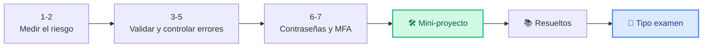

# Unidad 4 · Misión 4: cuánto nos jugamos

| | |
|---|---|
| **Resultado de aprendizaje** | RA4 · Análisis de riesgos, bastionado y autenticación |
| **Trimestre** | 2.º — se evalúa con **examen práctico** (programas corregidos con tests) |
| **Duración / peso** | 12 horas · 15 % del módulo |
| **Necesitas** | Python 3 y `pytest` |

!!! quote "Miércoles, 11:30. Reunión con un gerente."
    El gerente de una gestoría tiene 20.000 € para seguridad y una pregunta: *"¿En qué me lo gasto? ¿Antivirus nuevo, copias en la nube, formación…?"*

    Marta sonríe: *"Eso no se decide a ojo. Se calcula."* Tu misión es construir una herramienta que **ponga nota al riesgo** de cada activo de la empresa y que, de paso, revise si las contraseñas de los empleados son decentes.

    Y aprenderás algo que distingue a un programador junior de uno profesional: **validar los datos** y **controlar los errores** en vez de dejar que el programa explote.

## Cómo vas a trabajar

Cada concepto: 💡 **La idea** → 🐍 **En Python** → 🧪 **Pruébalo tú** → ✅ **Checkpoint**. Después, mini-proyecto guiado, ejercicios resueltos y **ejercicios tipo examen** con sus tests.



## 1 · Poner nota al riesgo

**💡 La idea.** Un **activo** es cualquier cosa de valor para la empresa: la base de datos, el portátil del gerente, la web. Para cada uno se estiman dos números del 1 al 5:

- **Impacto**: ¿cuánto dolería si le pasa algo?
- **Probabilidad**: ¿cómo de fácil es que pase?

Multiplicados dan el **riesgo**, que se lee en una matriz de colores:

| Impacto × probabilidad | Nivel | Qué se hace |
|---|---|---|
| 15 a 25 | 🔴 **ALTO** | Actuar ya |
| 7 a 14 | 🟠 **MEDIO** | Planificar |
| 1 a 6 | 🟢 **BAJO** | Vigilar |

**🐍 En Python.**

```python title="matriz.py"
def nivel_riesgo(impacto: int, probabilidad: int) -> str:
    v = impacto * probabilidad
    if v >= 15:
        return "ALTO"
    if v >= 7:
        return "MEDIO"
    return "BAJO"

print(nivel_riesgo(5, 4))   # base de datos de clientes, servidor sin actualizar
print(nivel_riesgo(2, 2))   # impresora de la oficina
```

```text title="Salida"
ALTO
BAJO
```

**🧪 Pruébalo tú.** Tienes estos activos en una lista de tuplas `(nombre, impacto, probabilidad)`. Muestra el nivel de cada uno:

```python
activos = [("Web", 3, 4), ("Portátil gerente", 4, 2), ("Wifi invitados", 1, 5)]
```

```text title="Salida esperada"
Web: MEDIO
Portátil gerente: MEDIO
Wifi invitados: BAJO
```

<details class="sol"><summary>Solución</summary>

```python
for nombre, imp, prob in activos:
    print(f"{nombre}: {nivel_riesgo(imp, prob)}")
```
</details>

**✅ Checkpoint**

- [ ] Sé calcular el nivel de riesgo con impacto × probabilidad.

## 2 · El riesgo en euros: el ALE

**💡 La idea.** "ALTO" o "BAJO" ayuda, pero el gerente quiere **euros**. Para eso se usan tres cifras:

| Sigla | Qué es | Cómo se calcula |
|---|---|---|
| **SLE** | Lo que pierdes **cada vez** que pasa | valor del activo × % que se pierde |
| **ARO** | Cuántas veces **al año** se espera que pase | una estimación (0,5 = una vez cada 2 años) |
| **ALE** | Lo que pierdes **al año** de media | SLE × ARO |

Y la clave para decidir: **una protección merece la pena si lo que te ahorra al año es mayor que lo que cuesta al año.**

**🐍 En Python.**

```python title="ale.py"
def calcular_ale(valor: float, exposicion: float, aro: float) -> float:
    sle = valor * exposicion
    return round(sle * aro, 2)

ale_sin = calcular_ale(100_000, 0.3, 0.5)    # servidor de 100.000 €, sin protección
ale_con = calcular_ale(100_000, 0.3, 0.1)    # con copias en la nube pasa mucho menos
print(ale_sin, ale_con)
print("Ahorro al año:", ale_sin - ale_con)
```

```text title="Salida"
15000.0 3000.0
Ahorro al año: 12000.0
```

**🧪 Pruébalo tú.** Las copias en la nube cuestan **5.000 € al año**. Escribe `merece_la_pena(ale_sin, ale_con, coste)` y comprueba con los datos de arriba y con un coste de 15.000 €:

```text title="Salida esperada"
True False
```

<details class="sol"><summary>Solución</summary>

```python
def merece_la_pena(ale_sin: float, ale_con: float, coste: float) -> bool:
    return (ale_sin - ale_con) > coste

print(merece_la_pena(ale_sin, ale_con, 5000), merece_la_pena(ale_sin, ale_con, 15000))
```
</details>

**✅ Checkpoint**

- [ ] Sé calcular el ALE y decidir si una protección compensa.

## 3 · Validar los datos: `raise`

**💡 La idea.** ¿Qué pasa si alguien escribe una exposición de `1.5` (un 150 %)? Tu función calcularía una cifra absurda **sin avisar**. En seguridad **nunca** te fías de los datos de entrada: si algo no tiene sentido, lo **rechazas** con `raise`, que detiene la función y lanza un error con un mensaje claro.

**🐍 En Python.**

```python title="validar.py"
def calcular_ale(valor: float, exposicion: float, aro: float) -> float:
    if valor < 0:
        raise ValueError(f"el valor no puede ser negativo: {valor}")
    if not 0 <= exposicion <= 1:
        raise ValueError(f"la exposición debe estar entre 0 y 1: {exposicion}")
    return round(valor * exposicion * aro, 2)

print(calcular_ale(100_000, 0.3, 0.5))
print(calcular_ale(100_000, 1.5, 0.5))    # esta línea lanza el error
```

```text title="Salida"
15000.0
Traceback (most recent call last):
  ...
ValueError: la exposición debe estar entre 0 y 1: 1.5
```

| Error | Cuándo se usa |
|---|---|
| `ValueError` | El valor no tiene sentido (fuera de rango, negativo…) |
| `TypeError` | El tipo no es el esperado (un texto donde va un número) |

**🧪 Pruébalo tú.** Añade a `calcular_ale` una tercera validación: si `aro` es negativo, lanza `ValueError` con el mensaje `"el ARO no puede ser negativo"`.

<details class="sol"><summary>Solución</summary>

La nueva comprobación va junto a las otras dos, **antes** del `return`:

```python
def calcular_ale(valor: float, exposicion: float, aro: float) -> float:
    if valor < 0:
        raise ValueError(f"el valor no puede ser negativo: {valor}")
    if not 0 <= exposicion <= 1:
        raise ValueError(f"la exposición debe estar entre 0 y 1: {exposicion}")
    if aro < 0:
        raise ValueError("el ARO no puede ser negativo")
    return round(valor * exposicion * aro, 2)
```
</details>

**✅ Checkpoint**

- [ ] Sé rechazar datos sin sentido con `raise ValueError`.

## 4 · Controlar los errores: `try` / `except`

**💡 La idea.** `raise` lanza el error; `try`/`except` lo **recoge**. Así tu programa puede procesar 1.000 activos y, si uno está mal, **anotarlo y seguir** en vez de pararse en seco.

**🐍 En Python.** (Usa `calcular_ale` del concepto anterior.)

```python title="try_except.py"
datos = [(100_000, 0.3, 0.5), (50_000, 2.0, 1), (20_000, 0.5, 0.2)]

for valor, expo, aro in datos:
    try:
        print("ALE:", calcular_ale(valor, expo, aro))
    except ValueError as error:                   # (1)!
        print("Dato incorrecto:", error)

print("Fin: el programa no se ha caído")
```

1.  `as error` guarda el error para poder mostrar su mensaje.

```text title="Salida"
ALE: 15000.0
Dato incorrecto: la exposición debe estar entre 0 y 1: 2.0
ALE: 2000.0
Fin: el programa no se ha caído
```

!!! warning "No hagas `except:` a secas"
    Captura el error **concreto** que esperas (`except ValueError`). Un `except:` vacío también se tragaría fallos tuyos (una variable mal escrita, por ejemplo) y nunca te enterarías.

**🧪 Pruébalo tú.** Modifica el bucle para **contar** cuántos datos eran incorrectos y mostrarlo al final.

```text title="Salida esperada (última línea)"
Datos incorrectos: 1
```

<details class="sol"><summary>Solución</summary>

```python
errores = 0
for valor, expo, aro in datos:
    try:
        print("ALE:", calcular_ale(valor, expo, aro))
    except ValueError as error:
        print("Dato incorrecto:", error)
        errores += 1
print("Datos incorrectos:", errores)
```
</details>

**✅ Checkpoint**

- [ ] Sé la diferencia entre `raise` (lanzar) y `try`/`except` (recoger).

## 5 · Tus propios errores

**💡 La idea.** `ValueError` sirve para todo, y por eso a veces no dice bastante. Puedes crear **tu propio tipo de error** heredando de uno que ya existe (herencia, como en la UD3). Así quien use tu código puede capturar **justo** los errores de riesgo.

**🐍 En Python.**

```python title="error_propio.py"
class RiesgoInvalidoError(ValueError):     # un RiesgoInvalidoError ES un ValueError
    pass

def valida_nivel(n: int) -> int:
    if not 1 <= n <= 5:
        raise RiesgoInvalidoError(f"debe estar entre 1 y 5: {n}")
    return n

try:
    valida_nivel(8)
except RiesgoInvalidoError as e:
    print("Error de riesgo:", e)

try:
    valida_nivel(0)
except ValueError as e:                    # también lo captura, porque hereda de ValueError
    print("Capturado como ValueError:", e)
```

```text title="Salida"
Error de riesgo: debe estar entre 1 y 5: 8
Capturado como ValueError: debe estar entre 1 y 5: 0
```

**🧪 Pruébalo tú.** Crea `class ContrasenaDebilError(ValueError)` y una función `exige_longitud(pwd)` que la lance si la contraseña tiene menos de 12 caracteres.

```python
try:
    exige_longitud("corta")
except ContrasenaDebilError as e:
    print(e)
```

```text title="Salida esperada"
5 caracteres: mínimo 12
```

<details class="sol"><summary>Solución</summary>

```python
class ContrasenaDebilError(ValueError):
    pass

def exige_longitud(pwd: str) -> None:
    if len(pwd) < 12:
        raise ContrasenaDebilError(f"{len(pwd)} caracteres: mínimo 12")
```
</details>

**✅ Checkpoint**

- [ ] Sé crear una excepción propia y sé que se captura también como su "madre".

## 6 · Bastionado y contraseñas fuertes

**💡 La idea.** **Bastionar** un sistema es quitarle puntos débiles: cerrar lo que no se usa, dar a cada usuario solo los permisos que necesita (**mínimo privilegio**) y exigir **contraseñas fuertes**. Una política típica: 12 caracteres o más, con mayúscula, dígito y símbolo.

**🐍 En Python.** Comprobar la política y **generar** contraseñas seguras:

```python title="contrasenas.py"
import secrets, string

def fallos_politica(pwd: str) -> list[str]:
    fallos = []
    if len(pwd) < 12: fallos.append("menos de 12 caracteres")
    if not any(c.isupper() for c in pwd): fallos.append("sin mayúscula")
    if not any(c.isdigit() for c in pwd): fallos.append("sin dígito")
    if pwd.isalnum(): fallos.append("sin símbolo")
    return fallos

def genera(n: int = 16) -> str:
    alfabeto = string.ascii_letters + string.digits + "!@#$%*-_"
    return "".join(secrets.choice(alfabeto) for _ in range(n))

print(fallos_politica("1234"))
print(fallos_politica("Caballo-Verde7"))
print(len(genera()), "caracteres generados")
```

```text title="Salida"
['menos de 12 caracteres', 'sin mayúscula', 'sin símbolo']
[]
16 caracteres generados
```

!!! warning "`secrets`, nunca `random`"
    `random` está pensado para juegos y simulaciones: si alguien conoce su estado, puede **predecir** lo que saldrá. `secrets` usa el generador seguro del sistema operativo.

**🧪 Pruébalo tú.** Revisa las contraseñas de estos empleados y muestra solo las que **no** cumplen:

```python
empleados = {"ana": "Caballo-Verde7", "luis": "luis1234", "eva": "Primavera2026!"}
```

```text title="Salida esperada"
luis: ['menos de 12 caracteres', 'sin mayúscula', 'sin símbolo']
```

<details class="sol"><summary>Solución</summary>

```python
for nombre, pwd in empleados.items():
    fallos = fallos_politica(pwd)
    if fallos:
        print(f"{nombre}: {fallos}")
```
</details>

**✅ Checkpoint**

- [ ] Sé comprobar una política de contraseñas y generar una con `secrets`.

## 7 · Autenticación multifactor (MFA)

**💡 La idea.** Una contraseña se puede robar. Por eso se piden **dos factores de tipos distintos**:

| Factor | Ejemplo |
|---|---|
| 🧠 Algo que **sabes** | Contraseña, PIN |
| 📱 Algo que **tienes** | El móvil, una tarjeta |
| 👆 Algo que **eres** | Huella, cara |

Contraseña + PIN **no** es MFA: los dos son "algo que sabes". Contraseña + código del móvil **sí**.

**🐍 En Python.**

```python title="mfa.py"
CATEGORIA = {"contrasena": "saber", "pin": "saber", "movil": "tener",
             "tarjeta": "tener", "huella": "ser", "cara": "ser"}

def es_mfa(factores: list[str]) -> bool:
    return len({CATEGORIA[f] for f in factores}) >= 2     # categorías distintas

print(es_mfa(["contrasena", "movil"]))
print(es_mfa(["contrasena", "pin"]))
```

```text title="Salida"
True
False
```

**🧪 Pruébalo tú.** ¿Qué devuelve `es_mfa(["huella", "cara"])`? Razónalo antes de ejecutarlo.

```text title="Salida esperada"
False
```

<details class="sol"><summary>Solución</summary>

Huella y cara son **la misma categoría** ("algo que eres"): solo hay una categoría distinta, así que no es MFA.
</details>

**✅ Checkpoint**

- [ ] Sé cuándo una combinación de factores es MFA de verdad.

## 🧾 Resumen

| Idea | En una línea |
|---|---|
| Riesgo | Impacto × probabilidad → ALTO (≥15) · MEDIO (≥7) · BAJO |
| ALE | SLE × ARO; una protección compensa si ahorro > coste |
| `raise` | Detiene la función y lanza un error |
| `try` / `except` | Recoge el error y el programa sigue |
| `ValueError` / `TypeError` | Valor sin sentido / tipo equivocado |
| Excepción propia | `class MiError(ValueError)`; se captura también como `ValueError` |
| Bastionar | Quitar puntos débiles, mínimo privilegio |
| `secrets` | Para contraseñas; `random` no |
| MFA | Dos factores de **categorías distintas** |

## 🛠️ Mini-proyecto guiado: el auditor de riesgo y contraseñas

Para el gerente de la gestoría: un programa que lee sus activos y sus usuarios desde ficheros JSON y genera un **informe priorizado**. Junta todo en 4 pasos:

1. **`nivel_riesgo`** con validación y error propio (conceptos 1, 3 y 5).
2. **Cargar y priorizar** los activos, del más peligroso al menos.
3. **Auditar** las contraseñas con la política (concepto 6).
4. **Informe** y órdenes desde la terminal con `argparse`.

```python title="auditor.py"
import argparse, json
from pathlib import Path

class RiesgoInvalidoError(ValueError):
    pass

def nivel_riesgo(impacto: int, probabilidad: int) -> str:
    if not 1 <= impacto <= 5:
        raise RiesgoInvalidoError(f"impacto fuera de [1,5]: {impacto}")
    if not 1 <= probabilidad <= 5:
        raise RiesgoInvalidoError(f"probabilidad fuera de [1,5]: {probabilidad}")
    v = impacto * probabilidad
    return "ALTO" if v >= 15 else "MEDIO" if v >= 7 else "BAJO"

def cargar_activos(ruta: Path) -> list[dict]:
    return json.loads(ruta.read_text(encoding="utf-8"))

def priorizar(activos: list[dict]) -> list[dict]:
    return sorted(activos, key=lambda a: a["impacto"] * a["probabilidad"], reverse=True)

def cumple_politica(pwd: str) -> tuple[bool, list[str]]:
    fallos = []
    if len(pwd) < 12: fallos.append("menos de 12 caracteres")
    if not any(c.isupper() for c in pwd): fallos.append("sin mayúscula")
    if not any(c.isdigit() for c in pwd): fallos.append("sin dígito")
    if all(c.isalnum() for c in pwd): fallos.append("sin símbolo")
    return (not fallos, fallos)

def auditar_usuarios(usuarios: dict[str, str]) -> dict[str, list[str]]:
    return {u: cumple_politica(pwd)[1] for u, pwd in usuarios.items()}

def generar_informe(activos: list[dict], usuarios: dict[str, str]) -> list[str]:
    lineas = ["=== RIESGO DE ACTIVOS ==="]
    for a in priorizar(activos):
        lineas.append(f"[{nivel_riesgo(a['impacto'], a['probabilidad']):6}] {a['nombre']}")
    lineas += ["", "=== CONTRASEÑAS ==="]
    for usuario, fallos in auditar_usuarios(usuarios).items():
        estado = "OK" if not fallos else ", ".join(fallos)
        lineas.append(f"{usuario:12} {estado}")
    return lineas

def main() -> None:
    ap = argparse.ArgumentParser(prog="auditor", description="Auditoría de riesgo y contraseñas")
    ap.add_argument("activos", type=Path)
    ap.add_argument("usuarios", type=Path)
    args = ap.parse_args()
    activos = cargar_activos(args.activos)
    usuarios = json.loads(args.usuarios.read_text(encoding="utf-8"))
    for linea in generar_informe(activos, usuarios):
        print(linea)

if __name__ == "__main__":
    main()
```

**Pruébalo de principio a fin:**

```python title="crear_datos.py"
import json
json.dump([{"nombre": "Servidor BD", "impacto": 5, "probabilidad": 4},
           {"nombre": "Web pública", "impacto": 2, "probabilidad": 2}], open("activos.json", "w"))
json.dump({"ana": "Caballo-Verde7!", "luis": "1234"}, open("usuarios.json", "w"))
```

```bash title="Terminal"
python crear_datos.py
python auditor.py activos.json usuarios.json
```

```text title="Salida"
=== RIESGO DE ACTIVOS ===
[ALTO  ] Servidor BD
[BAJO  ] Web pública

=== CONTRASEÑAS ===
ana          OK
luis         menos de 12 caracteres, sin mayúscula, sin símbolo
```

!!! success "🏅 Misión 4 cumplida"
    El gerente ya sabe dónde invertir: primero proteger el servidor de la base de datos, y de paso obligar a Luis a cambiar su contraseña.

## 📚 Ejercicios prácticos resueltos

> De fácil a difícil: 🟢 · 🟡 · 🟠 · 🔴. Intenta cada uno **antes** de abrir la solución, y ejecútalo para comprobarlo.

**1 · 🟢 Nivel de riesgo** — `nivel(impacto: int, prob: int) -> str`.
<details class="sol"><summary>Solución</summary>

```python
def nivel(impacto: int, prob: int) -> str:
    v = impacto * prob
    return "ALTO" if v >= 15 else "MEDIO" if v >= 7 else "BAJO"
```
</details>

**2 · 🟢 ALE simple** — `ale(sle: float, aro: float) -> float`.
<details class="sol"><summary>Solución</summary>

```python
def ale(sle: float, aro: float) -> float:
    return round(sle * aro, 2)
```
</details>

**3 · 🟢 ¿Cumple longitud mínima?** — `longitud_ok(pwd: str, minimo: int = 12) -> bool`.
<details class="sol"><summary>Solución</summary>

```python
def longitud_ok(pwd: str, minimo: int = 12) -> bool:
    return len(pwd) >= minimo
```
</details>

**4 · 🟢 ¿Tiene símbolo?** — `tiene_simbolo(pwd: str) -> bool`.
<details class="sol"><summary>Solución</summary>

```python
def tiene_simbolo(pwd: str) -> bool:
    return any(not c.isalnum() for c in pwd)
```
</details>

**5 · 🟡 Validar con excepción** — `ale_validado(sle, aro) -> float`, lanza `ValueError` si alguno es negativo.
<details class="sol"><summary>Solución</summary>

```python
def ale_validado(sle: float, aro: float) -> float:
    if sle < 0 or aro < 0:
        raise ValueError("sle y aro no pueden ser negativos")
    return round(sle * aro, 2)
```
</details>

**6 · 🟡 Excepción propia** — `class PoliticaError(ValueError)` y `valida_longitud(pwd, minimo=12)` que la lanza si es corta.
<details class="sol"><summary>Solución</summary>

```python
class PoliticaError(ValueError):
    pass

def valida_longitud(pwd: str, minimo: int = 12) -> None:
    if len(pwd) < minimo:
        raise PoliticaError(f"contraseña de {len(pwd)} caracteres, mínimo {minimo}")
```
</details>

**7 · 🟡 Contraseña segura** — `genera(n=16) -> str` con `secrets`.
<details class="sol"><summary>Solución</summary>

```python
import secrets, string
def genera(n: int = 16) -> str:
    alfabeto = string.ascii_letters + string.digits + "!@#$%*-_"
    return "".join(secrets.choice(alfabeto) for _ in range(n))
```
</details>

**8 · 🟡 Política completa** — `cumple_politica(pwd) -> tuple[bool, list[str]]`.
<details class="sol"><summary>Solución</summary>

```python
def cumple_politica(pwd: str) -> tuple[bool, list[str]]:
    fallos = []
    if len(pwd) < 12: fallos.append("corta")
    if not any(c.isupper() for c in pwd): fallos.append("sin mayúscula")
    if not any(c.isdigit() for c in pwd): fallos.append("sin dígito")
    if all(c.isalnum() for c in pwd): fallos.append("sin símbolo")
    return (not fallos, fallos)
```
</details>

**9 · 🟠 Entropía** — `entropia(pwd: str) -> float` (bits, según alfabeto usado).
<details class="sol"><summary>Solución</summary>

```python
import math
def entropia(pwd: str) -> float:
    alf = 0
    if any(c.islower() for c in pwd): alf += 26
    if any(c.isupper() for c in pwd): alf += 26
    if any(c.isdigit() for c in pwd): alf += 10
    if any(not c.isalnum() for c in pwd): alf += 32
    return round(len(pwd) * math.log2(alf), 1) if alf else 0.0
```
</details>

**10 · 🟠 ¿Es MFA de verdad?** — `es_mfa(factores: list[str]) -> bool` (al menos dos categorías distintas).
<details class="sol"><summary>Solución</summary>

```python
def es_mfa(factores: list[str]) -> bool:
    cat: set[str] = set()
    for f in factores:
        if f in ("contrasena", "pin"): cat.add("saber")
        elif f in ("movil", "token", "tarjeta"): cat.add("tener")
        elif f in ("huella", "cara"): cat.add("ser")
    return len(cat) >= 2
```
</details>

**11 · 🟠 Riesgo medio de un inventario** — `riesgo_medio(valores: list[float]) -> float`, lanza `ValueError` si la lista está vacía.
<details class="sol"><summary>Solución</summary>

```python
def riesgo_medio(valores: list[float]) -> float:
    if not valores:
        raise ValueError("lista de riesgos vacía")
    return round(sum(valores) / len(valores), 2)
```
</details>

**12 · 🟠 Priorizar activos** — `prioriza(activos: list[dict]) -> list[dict]` ordenados por `impacto*probabilidad` descendente.
<details class="sol"><summary>Solución</summary>

```python
def prioriza(activos: list[dict]) -> list[dict]:
    return sorted(activos, key=lambda a: a["impacto"] * a["probabilidad"], reverse=True)
```
</details>

**13 · 🔴 Salvaguarda rentable** — `merece_la_pena(ale_actual, ale_residual, coste_anual) -> bool`: ¿el ahorro supera el coste?
<details class="sol"><summary>Solución</summary>

```python
def merece_la_pena(ale_actual: float, ale_residual: float, coste_anual: float) -> bool:
    ahorro = ale_actual - ale_residual
    return ahorro > coste_anual
```
</details>

**14 · 🔴 Auditoría de un lote de contraseñas** — `audita(usuarios: dict[str,str]) -> dict[str, list[str]]`: usuario → lista de fallos (vacía si cumple).
<details class="sol"><summary>Solución</summary>

```python
def audita(usuarios: dict[str, str]) -> dict[str, list[str]]:
    resultado = {}
    for u, pwd in usuarios.items():
        _, fallos = cumple_politica(pwd)
        resultado[u] = fallos
    return resultado
```
</details>

**15 · 🔴 Cadena de validaciones** — `valida_activo(nombre, valor, prob) -> None`: valida los tres campos y, si todo es correcto, no devuelve nada; si algo falla, lanza la excepción con **el primer** problema encontrado.
<details class="sol"><summary>Solución</summary>

```python
class ActivoInvalidoError(ValueError):
    pass

def valida_activo(nombre: str, valor: float, prob: float) -> None:
    if not nombre.strip():
        raise ActivoInvalidoError("el activo necesita un nombre")
    if valor < 0:
        raise ActivoInvalidoError(f"valor negativo: {valor}")
    if not 0 <= prob <= 1:
        raise ActivoInvalidoError(f"probabilidad fuera de [0,1]: {prob}")
```
</details>

## 🎯 Ejercicios tipo examen

> Así es el examen práctico: te damos el **enunciado** y los **tests**; tú escribes el código hasta que pasen.
> **Tu nota = tests superados ÷ tests totales × 10.**

Para cada ejercicio:

1. Crea el fichero del enunciado (por ejemplo `lista_blanca.py`) con las funciones o clases que se piden.
2. Copia los tests en un fichero `test_....py` **en la misma carpeta**.
3. Ejecuta `pytest` y ve arreglando hasta que todo salga en verde.

```bash title="Terminal"
pip install pytest
pytest -v
```

!!! tip "Cómo atacar un ejercicio de examen"
    Lee **primero los tests**: son la especificación exacta. Cada `assert` te dice qué tiene que devolver tu código, y cada `pytest.raises` qué error tiene que lanzar. Haz pasar los tests de uno en uno.

### Examen tipo 1 · Política de contraseñas

⏱️ 25 minutos · 6 tests

Crea `politica.py` con:

- **`comprobar(pwd)`**, que devuelva la **lista de fallos** de la contraseña, en este orden y con estos textos exactos: `"longitud"` (menos de 12 caracteres), `"mayuscula"`, `"digito"` y `"simbolo"`. Si cumple todo, lista vacía. Si `pwd` no es un texto (`str`), lanza `TypeError`.
- **`es_segura(pwd)`**, que devuelva `True` si no hay ningún fallo.

```python title="test_politica.py"
import pytest
from politica import comprobar, es_segura

def test_contrasena_buena():
    assert comprobar("Caballo-Verde7") == []
    assert es_segura("Caballo-Verde7")

def test_todos_los_fallos_en_orden():
    assert comprobar("abc") == ["longitud", "mayuscula", "digito", "simbolo"]

def test_solo_falta_simbolo():
    assert comprobar("CaballoVerde77") == ["simbolo"]

def test_solo_falta_longitud():
    assert comprobar("Ab1-") == ["longitud"]

def test_no_segura():
    assert not es_segura("password")

def test_tipo_incorrecto():
    with pytest.raises(TypeError):
        comprobar(12345678)
```

### Examen tipo 2 · Calculadora de ALE con validación

⏱️ 30 minutos · 5 tests

Crea `riesgo.py` con:

- Una excepción propia **`RiesgoInvalidoError`** que herede de `ValueError`.
- **`calcular_ale(valor, exposicion, aro)`**, que devuelva `valor × exposicion × aro` **redondeado a 2 decimales**. Lanza `RiesgoInvalidoError` si el valor es negativo, si la exposición no está entre 0 y 1, o si el ARO es negativo.
- **`ahorro_neto(ale_sin, ale_con, coste)`**, que devuelva `ale_sin - ale_con - coste` redondeado a 2 decimales (si sale negativo, la protección no compensa).

```python title="test_riesgo.py"
import pytest
from riesgo import RiesgoInvalidoError, calcular_ale, ahorro_neto

def test_ale_normal():
    assert calcular_ale(100_000, 0.3, 0.5) == 15000.0

def test_ale_redondea_a_dos_decimales():
    assert calcular_ale(1000, 0.333, 1) == 333.0
    assert calcular_ale(10, 0.1234, 1) == 1.23

@pytest.mark.parametrize("valor,expo,aro", [(-1, 0.5, 1), (100, 1.5, 1), (100, -0.1, 1), (100, 0.5, -2)])
def test_datos_invalidos(valor, expo, aro):
    with pytest.raises(RiesgoInvalidoError):
        calcular_ale(valor, expo, aro)

def test_el_error_es_un_value_error():
    with pytest.raises(ValueError):
        calcular_ale(-1, 0.5, 1)

def test_ahorro_neto():
    assert ahorro_neto(15000, 3000, 5000) == 7000
    assert ahorro_neto(15000, 3000, 15000) == -3000
```

### Examen tipo 3 · Los activos más peligrosos

⏱️ 30 minutos · 5 tests

Crea `priorizar.py` con **`top_riesgos(activos, n)`**. Cada activo es un diccionario con `nombre`, `impacto` y `probabilidad`. La función devuelve los **nombres** de los `n` activos con mayor `impacto × probabilidad`, de mayor a menor; si dos empatan, van en **orden alfabético**.

Lanza `ValueError` si `n` es menor que 1 o si algún activo tiene impacto o probabilidad fuera de 1-5.

```python title="test_priorizar.py"
import pytest
from priorizar import top_riesgos

ACTIVOS = [
    {"nombre": "Web", "impacto": 3, "probabilidad": 4},
    {"nombre": "BD", "impacto": 5, "probabilidad": 4},
    {"nombre": "Wifi", "impacto": 1, "probabilidad": 5},
    {"nombre": "Correo", "impacto": 4, "probabilidad": 3},
]

def test_top_2():
    assert top_riesgos(ACTIVOS, 2) == ["BD", "Correo"]

def test_empate_por_nombre():
    # Correo y Web valen 12: se ordenan alfabéticamente
    assert top_riesgos(ACTIVOS, 3) == ["BD", "Correo", "Web"]

def test_n_mayor_que_la_lista():
    assert len(top_riesgos(ACTIVOS, 10)) == 4

def test_n_invalido():
    with pytest.raises(ValueError):
        top_riesgos(ACTIVOS, 0)

def test_valores_fuera_de_rango():
    with pytest.raises(ValueError):
        top_riesgos([{"nombre": "X", "impacto": 7, "probabilidad": 1}], 1)
```

## Cómo se evalúa esta unidad

Las UD3 a UD6 forman el **2.º trimestre** y se evalúan con un **examen práctico**: ejercicios como los de "tipo examen", con sus tests.

!!! tip "La nota, sin sorpresas"
    **Nota = (tests superados ÷ tests totales) × 10.** Se aprueba con un 5.

El corrector también te informa, **sin que cuente para la nota**, de si tu código pasa `mypy` y está documentado: son buenas prácticas que te pedirán en cualquier empresa.
