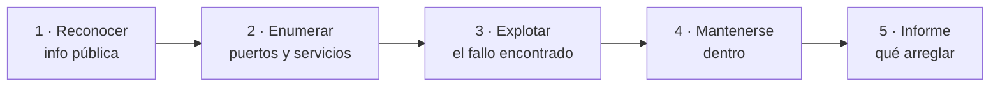

# Unidad 5 · Misión 5: hacker bueno

| | |
|---|---|
| **Resultado de aprendizaje** | RA5 · Hacking ético en laboratorio |
| **Trimestre** | 2.º — se evalúa con **examen práctico** (programas corregidos con tests) |
| **Duración / peso** | 20 horas · 25 % del módulo |
| **Necesitas** | Python 3 y `pytest` |

!!! quote "Jueves, 10:00. Marta te da permiso."
    *"Hasta ahora has defendido. Hoy te toca atacar… pero del lado bueno."* Un cliente **ha firmado un contrato** que autoriza a CiberSegura a intentar entrar en sus servidores para encontrar los agujeros **antes que un delincuente**. Eso es un **hacker ético** (o *pentester*).

    Tu misión: construir un **escáner de puertos** que descubra qué servicios tiene abiertos una máquina. Es lo primero que hace cualquier atacante… y cualquier defensor. La diferencia entre los dos no es la técnica: es el **permiso**.

!!! danger "Lee esto DOS veces"
    Todo lo de esta unidad se ejecuta **solo** contra `127.0.0.1` (tu propio ordenador) o las máquinas del **laboratorio de clase**. Escanear un servidor ajeno sin permiso por escrito es delito (arts. 197 y 264 del Código Penal), **aunque no rompas nada**. Sin contrato firmado, no hay hacking ético: hay delito.

## Cómo vas a trabajar

Cada concepto: 💡 **La idea** → 🐍 **En Python** → 🧪 **Pruébalo tú** → ✅ **Checkpoint**. Después, mini-proyecto, ejercicios resueltos y **ejercicios tipo examen** con tests.


## 1 · Hacker ético: la línea que no se cruza

**💡 La idea.** La misma herramienta sirve para atacar y para defender. Lo que cambia es **quién** la usa y **con qué permiso**:

| Sombrero | Quién es | ¿Legal? |
|---|---|---|
| 🎩 **Blanco** (white hat) | Profesional con **contrato** que busca fallos para arreglarlos | ✅ Sí |
| 🧢 **Gris** (grey hat) | Entra sin permiso, pero "sin querer hacer daño" | ❌ No: sigue siendo delito |
| 🕶️ **Negro** (black hat) | Delincuente | ❌ No |

Antes de tocar nada, un pentester define el **alcance** (*scope*): qué máquinas puede tocar y cuáles no. Salirse del alcance es salirse de la ley.

**🐍 En Python.** Un "guardarraíl" que impide escanear algo que no sea del laboratorio:

```python title="guardarrail.py"
ALCANCE = ("127.0.0.1", "localhost")

def objetivo_permitido(host: str) -> bool:
    return host in ALCANCE or host.startswith("10.0.20.")   # red del laboratorio

print(objetivo_permitido("127.0.0.1"))
print(objetivo_permitido("8.8.8.8"))       # un servidor de Google: prohibido
```

```text title="Salida"
True
False
```

**🧪 Pruébalo tú.** El laboratorio añade una segunda red: `10.0.30.x`. Cámbialo para que también se permita, y comprueba:

```python
print(objetivo_permitido("10.0.30.5"))
```

```text title="Salida esperada"
True
```

<details class="sol"><summary>Solución</summary>

```python
def objetivo_permitido(host: str) -> bool:
    return host in ALCANCE or host.startswith("10.0.20.") or host.startswith("10.0.30.")
```
</details>

**✅ Checkpoint**

- [ ] Sé qué distingue a un hacker de sombrero blanco de uno gris (el **permiso**).

## 2 · Las fases de un ataque

**💡 La idea.** Un pentester (y un atacante real) sigue siempre las mismas fases. Esta unidad se centra en la **segunda**: descubrir qué hay abierto.



Cuando escaneas los puertos de una máquina, estás en la fase de **enumeración**: haces un inventario de puertas para ver cuáles están abiertas.

**✅ Checkpoint**

- [ ] Sé en qué fase del pentest encaja un escáner de puertos.

## 3 · Sockets: llamar a una puerta

**💡 La idea.** Un **socket** es el mecanismo con el que dos programas hablan por la red. Para saber si un puerto está abierto, tu programa **intenta conectarse**: si alguien responde, está abierto; si no, está cerrado o no existe.

Es como llamar a las puertas de un edificio: si abren, hay alguien; si tras un rato nadie contesta (**timeout**), pasas a la siguiente.

**🐍 En Python.** `connect_ex` devuelve `0` si conecta, y otro número si no (sin lanzar error):

```python title="socket_basico.py"
import socket

def puerto_abierto(host: str, puerto: int, timeout: float = 0.5) -> bool:
    with socket.socket(socket.AF_INET, socket.SOCK_STREAM) as s:   # (1)!
        s.settimeout(timeout)                                       # (2)!
        return s.connect_ex((host, puerto)) == 0

print(puerto_abierto("127.0.0.1", 9999))    # casi seguro cerrado
```

1.  `AF_INET` = IPv4, `SOCK_STREAM` = TCP. El `with` cierra el socket solo al terminar.
2.  El **timeout** es imprescindible: sin él, un puerto que no responde dejaría tu programa colgado para siempre.

```text title="Salida"
False
```

!!! tip "Casi todos los puertos están cerrados"
    En tu ordenador, lo normal es que casi todos los puertos den `False`: solo están "abiertos" los que tienen un programa escuchando (un servidor web, una base de datos…). En los ejercicios levantaremos uno de prueba para ver un `True`.

**✅ Checkpoint**

- [ ] Sé por qué un escáner **siempre** pone un timeout.

## 4 · Comprobarlo con un puerto de verdad abierto

**💡 La idea.** Para ver un puerto abierto de verdad, montamos un pequeño servidor en `127.0.0.1` y lo escaneamos. Todo en tu máquina, todo legal.

**🐍 En Python.**

```python title="servidor_prueba.py"
import socket, threading, time

def levantar_servidor(puerto: int) -> None:
    s = socket.socket(socket.AF_INET, socket.SOCK_STREAM)
    s.setsockopt(socket.SOL_SOCKET, socket.SO_REUSEADDR, 1)
    s.bind(("127.0.0.1", puerto))
    s.listen()
    while True:
        conn, _ = s.accept()
        conn.close()

def puerto_abierto(host: str, puerto: int, timeout: float = 0.5) -> bool:
    with socket.socket(socket.AF_INET, socket.SOCK_STREAM) as s:
        s.settimeout(timeout)
        return s.connect_ex((host, puerto)) == 0

threading.Thread(target=levantar_servidor, args=(9091,), daemon=True).start()
time.sleep(0.3)   # darle tiempo a arrancar

print("9091:", puerto_abierto("127.0.0.1", 9091))
print("9092:", puerto_abierto("127.0.0.1", 9092))
```

```text title="Salida"
9091: True
9092: False
```

**🧪 Pruébalo tú.** Con el servidor de arriba levantado en el 9091, escribe un bucle que compruebe los puertos del 9090 al 9093 y diga cuáles están abiertos.

```text title="Salida esperada"
Abierto: 9091
```

<details class="sol"><summary>Solución</summary>

```python
for p in range(9090, 9094):
    if puerto_abierto("127.0.0.1", p, 0.2):
        print("Abierto:", p)
```
</details>

**✅ Checkpoint**

- [ ] Sé montar un servidor de prueba y detectar su puerto abierto.

## 5 · Escanear rápido: muchos puertos a la vez

**💡 La idea.** Escanear 1.000 puertos uno a uno, esperando el timeout de cada uno, tardaría minutos. La solución es hacerlo **en paralelo**: lanzar muchas comprobaciones a la vez. Como cada una casi solo **espera**, se solapan y el escaneo tarda segundos.

`ThreadPoolExecutor` reparte el trabajo entre varios "hilos" a la vez.

**🐍 En Python.** (Usa `puerto_abierto` del concepto anterior.)

```python title="escaneo.py"
from concurrent.futures import ThreadPoolExecutor

def escanear(host: str, puertos: list[int], timeout: float = 0.3) -> list[int]:
    def comprobar(p: int) -> tuple[int, bool]:
        return (p, puerto_abierto(host, p, timeout))
    with ThreadPoolExecutor(max_workers=50) as ex:       # 50 a la vez
        resultados = ex.map(comprobar, puertos)
    return sorted(p for p, abierto in resultados if abierto)

print(escanear("127.0.0.1", list(range(9090, 9094))))
```

```text title="Salida (si el servidor del 9091 sigue levantado)"
[9091]
```

**🧪 Pruébalo tú.** ¿Cuántos puertos comprueba `escanear("127.0.0.1", list(range(1, 1025)))`? (No hace falta ejecutarlo: razona el número.)

<details class="sol"><summary>Solución</summary>

`range(1, 1025)` va del 1 al 1024 → **1024 puertos**. Gracias a la concurrencia, comprobarlos tarda un par de segundos en vez de varios minutos.
</details>

**✅ Checkpoint**

- [ ] Sé por qué el escaneo concurrente es mucho más rápido que el secuencial.

## 6 · No todo puerto abierto es igual de grave

**💡 La idea.** Encontrar un puerto abierto es el principio: hay que **clasificarlo** por peligro. Un 443 (HTTPS) abierto es normal; un 23 (Telnet, que manda las contraseñas **sin cifrar**) es una alarma.

| Severidad | Puertos de ejemplo | Por qué |
|---|---|---|
| 🔴 **INSEGURO** | 21 (FTP), 23 (Telnet), 3389 (Escritorio remoto) | Sin cifrar o muy atacados |
| 🟠 **REVISAR** | 80 (HTTP sin cifrar), 8080 | Mejorables |
| 🟢 **OK** | 443 (HTTPS), 22 (SSH) | Cifrados, bien configurados |

**🐍 En Python.**

```python title="severidad.py"
INSEGUROS = {21, 23, 25, 3389}
REVISAR = {80, 8080, 110, 143}

def severidad(puerto: int) -> str:
    if puerto in INSEGUROS:
        return "INSEGURO"
    if puerto in REVISAR:
        return "REVISAR"
    return "OK"

for p in (23, 80, 443):
    print(p, "->", severidad(p))
```

```text title="Salida"
23 -> INSEGURO
80 -> REVISAR
443 -> OK
```

**🧪 Pruébalo tú.** Dada una lista de puertos abiertos, cuenta cuántos hay de cada severidad usando `Counter` (lo viste en la UD2):

```python
abiertos = [22, 23, 80, 443, 3389]
```

```text title="Salida esperada"
Counter({'OK': 2, 'INSEGURO': 2, 'REVISAR': 1})
```

<details class="sol"><summary>Solución</summary>

```python
from collections import Counter
print(Counter(severidad(p) for p in abiertos))
```
</details>

**✅ Checkpoint**

- [ ] Sé clasificar un puerto abierto por su peligro.

## 7 · Equipos de colores y MITRE ATT&CK

**💡 La idea.** En las empresas grandes la seguridad se organiza por equipos:

| Equipo | Qué hace |
|---|---|
| 🔴 **Rojo** | Ataca (con permiso) para encontrar fallos — lo de esta unidad |
| 🔵 **Azul** | Defiende y detecta — lo de la UD2 |
| 🟣 **Púrpura** | Junta a los dos para que aprendan el uno del otro |

Y para hablar todos el mismo idioma existe **MITRE ATT&CK**: un catálogo público de técnicas de ataque reales, ordenadas por fases. Un escaneo de puertos está catalogado como *"Reconocimiento activo"*.

**✅ Checkpoint**

- [ ] Sé qué hace el equipo rojo, el azul y el púrpura.

## 🧾 Resumen

| Idea | En una línea |
|---|---|
| White / grey / black hat | Con permiso / sin permiso / delincuente |
| Alcance (scope) | Qué máquinas puedo tocar; salirse = delito |
| Fases del pentest | Reconocer · **enumerar** · explotar · mantenerse · informar |
| Socket | Canal de red; `connect_ex` devuelve `0` si el puerto está abierto |
| Timeout | Imprescindible: sin él, el escaneo se cuelga |
| `connect_ex` | Devuelve `0` (abierto) sin lanzar error |
| `ThreadPoolExecutor` | Escanea muchos puertos a la vez → mucho más rápido |
| Severidad | INSEGURO (sin cifrar) · REVISAR · OK |
| Equipos | Rojo ataca · azul defiende · púrpura une |
| MITRE ATT&CK | Catálogo de técnicas de ataque |

## 🛠️ Mini-proyecto guiado: el escáner de puertos

El cliente autorizado quiere saber qué expone su servidor de laboratorio. Tu escáner lo descubre, clasifica cada puerto por peligro y saca un informe — **con el guardarraíl ético metido en el código** para que sea imposible escanear algo fuera del alcance. En 4 pasos:

1. **`objetivo_permitido`**: el guardarraíl (concepto 1).
2. **`puerto_abierto`** con socket y timeout (concepto 3).
3. **`escanear`** concurrente que **rechaza** objetivos fuera del alcance (concepto 5).
4. **Severidad, informe** y órdenes desde la terminal (conceptos 6).

```python title="escaner.py"
import argparse, socket
from concurrent.futures import ThreadPoolExecutor
from pathlib import Path

INSEGUROS = {21, 23, 25, 3389}
REVISAR = {80, 8080, 110, 143}

def objetivo_permitido(host: str) -> bool:
    return host in ("127.0.0.1", "localhost") or host.startswith("10.0.20.")

def puerto_abierto(host: str, puerto: int, timeout: float = 0.5) -> bool:
    with socket.socket(socket.AF_INET, socket.SOCK_STREAM) as s:
        s.settimeout(timeout)
        return s.connect_ex((host, puerto)) == 0

def escanear(host: str, puertos: list[int], timeout: float = 0.3) -> list[int]:
    if not objetivo_permitido(host):
        raise ValueError(f"objetivo no autorizado: {host} (solo laboratorio)")
    def comprobar(p: int) -> tuple[int, bool]:
        return (p, puerto_abierto(host, p, timeout))
    with ThreadPoolExecutor(max_workers=50) as ex:
        resultados = ex.map(comprobar, puertos)
    return sorted(p for p, abierto in resultados if abierto)

def severidad(puerto: int) -> str:
    if puerto in INSEGUROS:
        return "INSEGURO"
    if puerto in REVISAR:
        return "REVISAR"
    return "OK"

def generar_informe(host: str, abiertos: list[int]) -> list[str]:
    orden = {"INSEGURO": 0, "REVISAR": 1, "OK": 2}
    lineas = [f"Informe de {host}"]
    for p in sorted(abiertos, key=lambda p: (orden[severidad(p)], p)):
        lineas.append(f"[{severidad(p):9}] puerto {p}")
    if not abiertos:
        lineas.append("(ningun puerto abierto en el rango escaneado)")
    return lineas

def main() -> None:
    ap = argparse.ArgumentParser(prog="escaner", description="Escaner de puertos de laboratorio")
    ap.add_argument("host")
    ap.add_argument("--desde", type=int, default=1)
    ap.add_argument("--hasta", type=int, default=1024)
    args = ap.parse_args()
    abiertos = escanear(args.host, list(range(args.desde, args.hasta + 1)))
    for linea in generar_informe(args.host, abiertos):
        print(linea)

if __name__ == "__main__":
    main()
```

**Pruébalo de principio a fin.** Levanta un servidor de prueba y escanéalo:

```python title="objetivo_prueba.py"
import socket, threading, time
def servidor(puerto):
    s = socket.socket(socket.AF_INET, socket.SOCK_STREAM)
    s.setsockopt(socket.SOL_SOCKET, socket.SO_REUSEADDR, 1)
    s.bind(("127.0.0.1", puerto)); s.listen()
    while True:
        conn, _ = s.accept(); conn.close()
threading.Thread(target=servidor, args=(8080,), daemon=True).start()
time.sleep(0.3)
import escaner
print(escaner.generar_informe("127.0.0.1", escaner.escanear("127.0.0.1", [22, 80, 8080, 3389])))
```

```text title="Salida"
['Informe de 127.0.0.1', '[REVISAR  ] puerto 8080']
```

(Solo el 8080 está abierto, porque es el único con servidor; se clasifica como REVISAR.)

Y el guardarraíl en acción:

```python title="prohibido.py"
import escaner
escaner.escanear("8.8.8.8", [80])     # objetivo fuera del alcance
```

```text title="Salida"
ValueError: objetivo no autorizado: 8.8.8.8 (solo laboratorio)
```

!!! success "🏅 Misión 5 cumplida"
    Entregas al cliente el informe con el puerto 8080 marcado para revisar (debería usar HTTPS). Has atacado para defender, sin salirte ni un milímetro del alcance.

## 📚 Ejercicios prácticos resueltos

> De fácil a difícil: 🟢 · 🟡 · 🟠 · 🔴. Intenta cada uno **antes** de abrir la solución, y ejecútalo para comprobarlo.

**1 · 🟢 Severidad de un puerto** — `severidad(p: int) -> str`.
<details class="sol"><summary>Solución</summary>

```python
def severidad(p: int) -> str:
    if p in {21, 23, 25, 135, 445, 3389}: return "INSEGURO"
    if p in {80, 8080, 110, 143}: return "REVISAR"
    return "OK"
```
</details>

**2 · 🟢 Rango de puertos válido** — `rango(ini: int, fin: int) -> list[int]`, lanza `ValueError` si `ini > fin`.
<details class="sol"><summary>Solución</summary>

```python
def rango(ini: int, fin: int) -> list[int]:
    if ini > fin:
        raise ValueError("ini > fin")
    return list(range(ini, fin + 1))
```
</details>

**3 · 🟢 Nombre de servicio conocido** — `servicio_de(puerto: int) -> str` para 22/80/443/3389, `"desconocido"` si no.
<details class="sol"><summary>Solución</summary>

```python
def servicio_de(puerto: int) -> str:
    return {22: "SSH", 80: "HTTP", 443: "HTTPS", 3389: "RDP"}.get(puerto, "desconocido")
```
</details>

**4 · 🟢 ¿Puerto abierto?** — `puerto_abierto(host, puerto, timeout=0.5) -> bool` con `socket`.
<details class="sol"><summary>Solución</summary>

```python
import socket
def puerto_abierto(host: str, puerto: int, timeout: float = 0.5) -> bool:
    with socket.socket(socket.AF_INET, socket.SOCK_STREAM) as s:
        s.settimeout(timeout)
        return s.connect_ex((host, puerto)) == 0
```
</details>

**5 · 🟡 Escaneo secuencial** — `escanea_secuencial(host, puertos) -> list[int]`.
<details class="sol"><summary>Solución</summary>

```python
def escanea_secuencial(host: str, puertos: list[int]) -> list[int]:
    return sorted(p for p in puertos if puerto_abierto(host, p, 0.2))
```
</details>

**6 · 🟡 Escaneo concurrente** — `escanea(host, puertos) -> list[int]` con `ThreadPoolExecutor`.
<details class="sol"><summary>Solución</summary>

```python
from concurrent.futures import ThreadPoolExecutor
def escanea(host: str, puertos: list[int]) -> list[int]:
    with ThreadPoolExecutor(max_workers=50) as ex:
        res = ex.map(lambda p: (p, puerto_abierto(host, p, 0.2)), puertos)
    return sorted(p for p, ok in res if ok)
```
</details>

**7 · 🟡 Clasificar abiertos** — `clasificar(abiertos: list[int]) -> dict[int,str]`.
<details class="sol"><summary>Solución</summary>

```python
def clasificar(abiertos: list[int]) -> dict[int, str]:
    return {p: severidad(p) for p in abiertos}
```
</details>

**8 · 🟡 Contar por severidad** — `resumen(clasificado: dict[int,str]) -> dict[str,int]`.
<details class="sol"><summary>Solución</summary>

```python
from collections import Counter
def resumen(clasificado: dict[int, str]) -> dict[str, int]:
    return dict(Counter(clasificado.values()))
```
</details>

**9 · 🟠 Informe ordenado por gravedad** — `informe(clasificado) -> list[str]`, INSEGURO primero.
<details class="sol"><summary>Solución</summary>

```python
def informe(clasificado: dict[int, str]) -> list[str]:
    orden = {"INSEGURO": 0, "REVISAR": 1, "OK": 2}
    return [f"{p}: {s}" for p, s in sorted(clasificado.items(), key=lambda kv: (orden[kv[1]], kv[0]))]
```
</details>

**10 · 🟠 Solo los graves** — `solo_inseguros(clasificado: dict[int,str]) -> list[int]`.
<details class="sol"><summary>Solución</summary>

```python
def solo_inseguros(clasificado: dict[int, str]) -> list[int]:
    return sorted(p for p, s in clasificado.items() if s == "INSEGURO")
```
</details>

**11 · 🟠 Comparar dos escaneos** — `nuevos_puertos(anterior: list[int], actual: list[int]) -> list[int]`: puertos que se han abierto desde el último escaneo (detección de cambios, como el HIDS de la UT1).
<details class="sol"><summary>Solución</summary>

```python
def nuevos_puertos(anterior: list[int], actual: list[int]) -> list[int]:
    return sorted(set(actual) - set(anterior))
```
</details>

**12 · 🔴 Tiempo estimado de un escaneo** — `tiempo_estimado(n_puertos: int, hilos: int, timeout: float) -> float`: cuánto tardaría en el peor caso (todo cerrado).
<details class="sol"><summary>Solución</summary>

```python
import math
def tiempo_estimado(n_puertos: int, hilos: int, timeout: float) -> float:
    tandas = math.ceil(n_puertos / hilos)
    return round(tandas * timeout, 2)
```
</details>

**13 · 🔴 Banner grabbing simplificado** — `intenta_leer_banner(host, puerto, timeout=1.0) -> str`: conecta y lee hasta 100 bytes que el servicio pueda enviar al conectar (sin enviar nada), o `""` si no hay nada.
<details class="sol"><summary>Solución</summary>

```python
import socket
def intenta_leer_banner(host: str, puerto: int, timeout: float = 1.0) -> str:
    try:
        with socket.socket(socket.AF_INET, socket.SOCK_STREAM) as s:
            s.settimeout(timeout)
            s.connect((host, puerto))
            datos = s.recv(100)
            return datos.decode(errors="replace")
    except (socket.timeout, OSError):
        return ""
```
</details>

**14 · 🔴 Validar un objetivo de laboratorio** — `es_objetivo_valido(host: str) -> bool`: solo permite `127.0.0.1`, `localhost` o direcciones que empiecen por `10.0.20.` (tu red de laboratorio).
<details class="sol"><summary>Solución</summary>

```python
def es_objetivo_valido(host: str) -> bool:
    return host in ("127.0.0.1", "localhost") or host.startswith("10.0.20.")
```
</details>

**15 · 🔴 Escaneo con guardarraíl ético** — `escaneo_seguro(host, puertos) -> list[int]`: usa `es_objetivo_valido`; si el host no es válido, lanza `ValueError` en vez de escanear.
<details class="sol"><summary>Solución</summary>

```python
def escaneo_seguro(host: str, puertos: list[int]) -> list[int]:
    if not es_objetivo_valido(host):
        raise ValueError(f"objetivo no autorizado: {host}")
    return escanea(host, puertos)
```
</details>

## 🎯 Ejercicios tipo examen

> Así es el examen práctico: te damos el **enunciado** y los **tests**; tú escribes el código hasta que pasen.
> **Tu nota = tests superados ÷ tests totales × 10.**

Para cada ejercicio:

1. Crea el fichero del enunciado (por ejemplo `lista_blanca.py`) con las funciones o clases que se piden.
2. Copia los tests en un fichero `test_....py` **en la misma carpeta**.
3. Ejecuta `pytest` y ve arreglando hasta que todo salga en verde.

```bash title="Terminal"
pip install pytest
pytest -v
```

!!! tip "Cómo atacar un ejercicio de examen"
    Lee **primero los tests**: son la especificación exacta. Cada `assert` te dice qué tiene que devolver tu código, y cada `pytest.raises` qué error tiene que lanzar. Haz pasar los tests de uno en uno.

### Examen tipo 1 · Clasificador de severidad

⏱️ 25 minutos · 5 tests

Crea `clasificador.py` con:

- **`severidad(puerto)`** → `"INSEGURO"` (21, 23, 25, 3389), `"REVISAR"` (80, 8080, 110, 143) u `"OK"` (el resto). Si el puerto no está entre 1 y 65535, lanza `ValueError`.
- **`resumen(puertos)`** → un diccionario `{"INSEGURO": n, "REVISAR": n, "OK": n}` (las tres claves siempre, aunque valgan 0).
- **`solo_inseguros(puertos)`** → lista **ordenada** de los puertos inseguros.

```python title="test_clasificador.py"
import pytest
from clasificador import severidad, resumen, solo_inseguros

@pytest.mark.parametrize("puerto,esperado", [(23, "INSEGURO"), (3389, "INSEGURO"), (80, "REVISAR"), (443, "OK"), (22, "OK")])
def test_severidad(puerto, esperado):
    assert severidad(puerto) == esperado

@pytest.mark.parametrize("malo", [0, -5, 70000])
def test_puerto_invalido(malo):
    with pytest.raises(ValueError):
        severidad(malo)

def test_resumen():
    assert resumen([22, 23, 80, 443, 3389]) == {"INSEGURO": 2, "REVISAR": 1, "OK": 2}

def test_resumen_vacio():
    assert resumen([]) == {"INSEGURO": 0, "REVISAR": 0, "OK": 0}

def test_solo_inseguros_ordenados():
    assert solo_inseguros([3389, 443, 23, 80]) == [23, 3389]
```

### Examen tipo 2 · Guardarraíl de alcance

⏱️ 25 minutos · 3 tests

Crea `alcance.py` con:

- **`objetivo_permitido(host)`** → `True` solo para `127.0.0.1`, `localhost` y las redes `10.0.20.x` y `10.0.30.x`.
- **`validar_objetivos(hosts)`** → devuelve la lista tal cual si **todos** están permitidos; si hay alguno prohibido, lanza `ValueError`.

```python title="test_alcance.py"
import pytest
from alcance import objetivo_permitido, validar_objetivos

@pytest.mark.parametrize("host,ok", [
    ("127.0.0.1", True), ("localhost", True), ("10.0.20.5", True),
    ("10.0.30.9", True), ("8.8.8.8", False), ("192.168.1.1", False)])
def test_objetivo_permitido(host, ok):
    assert objetivo_permitido(host) is ok

def test_validar_todos_ok():
    assert validar_objetivos(["127.0.0.1", "10.0.20.7"]) == ["127.0.0.1", "10.0.20.7"]

def test_validar_rechaza_uno_malo():
    with pytest.raises(ValueError):
        validar_objetivos(["127.0.0.1", "8.8.8.8"])
```

### Examen tipo 3 · Comparar dos escaneos

⏱️ 30 minutos · 4 tests

Crea `diff_escaneos.py` con:

- **`cambios(antes, ahora)`** → un diccionario `{"nuevos": [...], "cerrados": [...]}` con los puertos que aparecen y los que desaparecen entre dos escaneos (ambas listas ordenadas). *Pista: usa conjuntos.*
- **`hay_alerta(antes, ahora)`** → `True` si hay algún puerto **nuevo** (un puerto que se abre de repente es sospechoso).

```python title="test_diff_escaneos.py"
from diff_escaneos import cambios, hay_alerta

def test_puertos_nuevos_y_cerrados():
    assert cambios([22, 80], [22, 443]) == {"nuevos": [443], "cerrados": [80]}

def test_sin_cambios():
    assert cambios([22, 80], [80, 22]) == {"nuevos": [], "cerrados": []}

def test_alerta_si_hay_nuevos():
    assert hay_alerta([22], [22, 3389])

def test_sin_alerta_si_solo_se_cierran():
    assert not hay_alerta([22, 80], [22])
```

## Cómo se evalúa esta unidad

Las UD3 a UD6 forman el **2.º trimestre** y se evalúan con un **examen práctico**: ejercicios como los de "tipo examen", con sus tests.

!!! tip "La nota, sin sorpresas"
    **Nota = (tests superados ÷ tests totales) × 10.** Se aprueba con un 5.

El corrector también te informa, **sin que cuente para la nota**, de si tu código pasa `mypy` y está documentado: son buenas prácticas que te pedirán en cualquier empresa.
