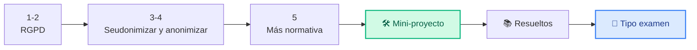

# Unidad 6 · Misión 6: la ley también protege

| | |
|---|---|
| **Resultado de aprendizaje** | RA6 · Normativa y protección de datos |
| **Trimestre** | 2.º — se evalúa con **examen práctico** (programas corregidos con tests) |
| **Duración / peso** | 8 horas · 10 % del módulo |
| **Necesitas** | Python 3 y `pytest` |

!!! quote "Viernes, 9:00. La última misión del curso."
    Vuelve la clínica dental de la Misión 2, ahora con un problema **legal**: quieren usar los datos de sus pacientes para un estudio y mandárselos a una universidad. *"¿Podemos? ¿Y cómo lo hacemos sin meternos en un lío con la ley de protección de datos?"*

    Marta te lo resume: *"La seguridad técnica no sirve de nada si incumples la ley. Y con datos de salud, la multa puede cerrar la empresa."* Tu última misión: una herramienta que **comprueba si un tratamiento de datos cumple el RGPD** y que **anonimiza** la información para poder compartirla. Buena noticia: la vas a construir con hash y expresiones regulares, ¡lo que ya sabes de las misiones 1 y 2!

## Cómo vas a trabajar

Cada concepto: 💡 **La idea** → 🐍 **En Python** → 🧪 **Pruébalo tú** → ✅ **Checkpoint**. Después, mini-proyecto, ejercicios resueltos y **ejercicios tipo examen** con tests.



## 1 · El RGPD en cinco ideas

**💡 La idea.** El **RGPD** es la ley europea que protege los datos personales. No hay que memorizarla entera, pero sí sus principios:

| Principio | En cristiano |
|---|---|
| **Licitud** | Necesitas una razón legal para tratar los datos |
| **Finalidad** | Solo puedes usarlos para lo que dijiste |
| **Minimización** | Pide solo los datos que necesitas, ni uno más |
| **Plazo** | No los guardes para siempre |
| **Seguridad** | Protégelos (¡todo lo del curso!) |

Y la regla de oro: **todo tratamiento necesita una "base de licitud"**. Solo hay **seis** válidas:

`consentimiento`, `contrato`, `obligacion_legal`, `interes_vital`, `interes_publico`, `interes_legitimo`.

**🐍 En Python.**

```python title="base_licitud.py"
BASES_VALIDAS = {"consentimiento", "contrato", "obligacion_legal",
                 "interes_vital", "interes_publico", "interes_legitimo"}

def base_valida(base: str) -> bool:
    return base.strip().lower() in BASES_VALIDAS

print(base_valida("Consentimiento"))    # mayúsculas y espacios dan igual
print(base_valida("porque_me_apetece"))
```

```text title="Salida"
True
False
```

**🧪 Pruébalo tú.** Una tienda quiere guardar tu email para **mandarte la factura** (base `contrato`) y además para **publicidad** sin preguntarte. ¿Qué base necesitaría para lo segundo, y la tiene? Comprueba con `base_valida` la que crees correcta para la publicidad.

<details class="sol"><summary>Solución</summary>

Para la publicidad no solicitada la base correcta sería el `consentimiento` (tienes que decir "sí" expresamente). `base_valida("consentimiento")` → `True`. Sin ese consentimiento, mandarte publicidad es ilegal, aunque la factura sí sea lícita por `contrato`.
</details>

**✅ Checkpoint**

- [ ] Sé que todo tratamiento necesita una de las seis bases de licitud.

## 2 · Datos personales y datos sensibles

**💡 La idea.** Un **dato personal** es cualquier cosa que identifica a alguien: nombre, DNI, email, IP... Algunos son **especialmente sensibles** (salud, religión, ideología) y tienen protección extra. Los de la clínica son datos de **salud**: de los más delicados.

Hay dos formas de reducir el riesgo al trabajar con ellos:

| Técnica | Qué hace | ¿Reversible? |
|---|---|---|
| **Seudonimización** | Sustituye el identificador por un código | Sí, si tienes la "clave" |
| **Anonimización** | Elimina toda posibilidad de identificar | No, nunca |

Un dato **seudonimizado sigue siendo dato personal** (se podría revertir). Solo el **anonimizado** de verdad queda fuera del RGPD.

**✅ Checkpoint**

- [ ] Sé la diferencia entre seudonimizar y anonimizar.

## 3 · Seudonimizar con hash

**💡 La idea.** Para el estudio, la universidad no necesita saber **quién** es cada paciente, solo poder distinguir sus registros. Solución: sustituir el DNI por un **código** calculado con hash (misión 1). El mismo DNI da siempre el mismo código (así se pueden agrupar sus datos), pero del código **no** se puede volver al DNI.

**🐍 En Python.**

```python title="seudonimo.py"
import hashlib

def seudonimo(dni: str, sal: str = "clinica2026") -> str:
    return hashlib.sha256((sal + dni.upper()).encode()).hexdigest()[:12]

print(seudonimo("12345678Z"))
print(seudonimo("12345678z"))    # misma persona, mismo código
print(seudonimo("87654321X"))    # otra persona, otro código
```

```text title="Salida"
79c87e9bb075
79c87e9bb075
31e245deb03f
```

!!! warning "La sal es un secreto"
    La **sal** (ese `"clinica2026"`) evita que alguien con una lista de DNIs vaya probando hasta encontrar el código. Si se filtra la sal, la seudonimización pierde fuerza. Guárdala como una contraseña.

**🧪 Pruébalo tú.** Seudonimiza esta lista de DNIs y muestra un diccionario `{dni: código}`:

```python
dnis = ["11111111H", "22222222J"]
```

<details class="sol"><summary>Solución</summary>

```python
tabla = {dni: seudonimo(dni) for dni in dnis}
print(tabla)
```
</details>

**✅ Checkpoint**

- [ ] Sé por qué el seudónimo debe ser siempre el mismo para el mismo DNI.

## 4 · Anonimizar texto con expresiones regulares

**💡 La idea.** A veces los datos personales están **sueltos dentro de un texto** (un informe, un correo): "el paciente 12345678Z, correo ana@x.es...". Para publicarlo hay que **tapar** esos datos. Es un trabajo perfecto para las expresiones regulares (misión 2): buscas el **patrón** de un DNI o un email y lo sustituyes.

**🐍 En Python.**

```python title="anonimizar.py"
import re

PATRON_DNI = re.compile(r"\b\d{8}[A-Za-z]\b")
PATRON_EMAIL = re.compile(r"\b[\w.+-]+@[\w-]+\.[\w.-]+\b")

def anonimizar(texto: str) -> str:
    texto = PATRON_DNI.sub("[DNI]", texto)
    texto = PATRON_EMAIL.sub("[EMAIL]", texto)
    return texto

print(anonimizar("Paciente 12345678Z, cita confirmada por ana.lopez@clinica.es"))
```

```text title="Salida"
Paciente [DNI], cita confirmada por [EMAIL]
```

A veces no quieres tapar del todo un email, solo **enmascararlo** (que se intuya pero no se lea):

```python title="enmascarar.py"
def enmascarar_email(email: str) -> str:
    usuario, _, dominio = email.partition("@")
    if len(usuario) <= 2:
        return usuario[0] + "*@" + dominio
    return usuario[0] + "*" * (len(usuario) - 2) + usuario[-1] + "@" + dominio

print(enmascarar_email("ana.lopez@clinica.es"))
```

```text title="Salida"
a*******z@clinica.es
```

**🧪 Pruébalo tú.** Un informe también lleva **teléfonos** (9 dígitos seguidos). Añade un tercer patrón a `anonimizar` que los sustituya por `[TEL]`, y pruébalo:

```python
print(anonimizar("Llama al 600112233 o escribe a ana@x.es"))
```

```text title="Salida esperada"
Llama al [TEL] o escribe a [EMAIL]
```

<details class="sol"><summary>Solución</summary>

```python
PATRON_TEL = re.compile(r"\b\d{9}\b")

def anonimizar(texto: str) -> str:
    texto = PATRON_DNI.sub("[DNI]", texto)
    texto = PATRON_TEL.sub("[TEL]", texto)       # antes del email, para no chocar
    texto = PATRON_EMAIL.sub("[EMAIL]", texto)
    return texto
```
</details>

**✅ Checkpoint**

- [ ] Sé anonimizar un texto sustituyendo patrones con `re.sub`.

## 5 · El resto del mapa legal

**💡 La idea.** El RGPD no está solo. Según lo que haga la empresa, aplican otras normas:

| Norma | Para qué |
|---|---|
| **RGPD** / **LOPDGDD** | Datos personales (europea / española) |
| **LSSI-CE** | Comercio electrónico y publicidad por email |
| **ENS** | Seguridad en la Administración pública |
| **ISO 27001** | Certificado de "buena gestión" de la seguridad (voluntario) |

No hay que sabérselas al dedillo, pero sí reconocer **cuál aplica**: si montas una tienda online, te toca la LSSI-CE; si trabajas para un ayuntamiento, el ENS.

**🧪 Pruébalo tú.** Asocia cada situación con su norma (`RGPD`, `LSSI-CE` o `ENS`):

1. Una tienda online manda un boletín de ofertas.
2. Un hospital guarda historiales.
3. La web de un ayuntamiento gestiona instancias.

<details class="sol"><summary>Solución</summary>

1 → LSSI-CE (publicidad electrónica) · 2 → RGPD (datos de salud) · 3 → ENS (administración pública). El RGPD aplica **además** en los tres, porque los tres tratan datos personales.
</details>

**✅ Checkpoint**

- [ ] Sé reconocer qué norma aplica a una situación.

## 🧾 Resumen

| Idea | En una línea |
|---|---|
| RGPD | Ley europea de datos personales |
| Base de licitud | Toda finalidad necesita una de las **seis** |
| Dato sensible | Salud, religión, ideología: protección extra |
| Seudonimizar | Sustituir por un código; **sigue** siendo dato personal |
| Anonimizar | Eliminar identificación; queda fuera del RGPD |
| `seudonimo` | Hash con sal; mismo DNI → mismo código |
| Anonimizar texto | `re.sub` con el patrón del DNI, email, teléfono |
| LSSI-CE / ENS | Comercio electrónico / administración pública |

## 🛠️ Mini-proyecto guiado: verificador de cumplimiento y anonimizador

Para la clínica: un programa con **dos órdenes**. `auditar` revisa si sus tratamientos de datos cumplen el RGPD; `anonimizar` limpia un fichero de texto para poder enviarlo a la universidad. En 4 pasos:

1. **`base_valida`** (concepto 1).
2. **`evaluar_tratamiento`**: comprueba base, finalidad y plazo, y devuelve la lista de fallos.
3. **`anonimizar_texto`** con las expresiones regulares (concepto 4).
4. **Órdenes** desde la terminal con `argparse`.

```python title="cumplimiento.py"
import argparse, json, re
from pathlib import Path

BASES_VALIDAS = {"consentimiento", "contrato", "obligacion_legal",
                 "interes_vital", "interes_publico", "interes_legitimo"}

# PASO 1 y 2 · ¿Cumple el RGPD este tratamiento?
def base_valida(base: str) -> bool:
    return base.strip().lower() in BASES_VALIDAS

def evaluar_tratamiento(t: dict) -> list[str]:
    fallos = []
    if not base_valida(t.get("base", "")):
        fallos.append("base de licitud no válida")
    if not t.get("finalidad", "").strip():
        fallos.append("sin finalidad declarada")
    plazo = t.get("plazo_meses", -1)
    if plazo < 0 or plazo > 60:
        fallos.append("plazo de conservación fuera de rango")
    return fallos

def informe_cumplimiento(tratamientos: list[dict]) -> list[str]:
    lineas = []
    for t in tratamientos:
        fallos = evaluar_tratamiento(t)
        lineas.append(f"{t['nombre']}: {'OK' if not fallos else '; '.join(fallos)}")
    return sorted(lineas, key=lambda l: ": OK" in l)     # los que fallan, primero

# PASO 3 · Anonimizar texto
PATRON_DNI = re.compile(r"\b\d{8}[A-Za-z]\b")
PATRON_EMAIL = re.compile(r"\b[\w.+-]+@[\w-]+\.[\w.-]+\b")

def anonimizar_texto(texto: str) -> str:
    texto = PATRON_DNI.sub("[DNI]", texto)
    texto = PATRON_EMAIL.sub("[EMAIL]", texto)
    return texto

def anonimizar_fichero(texto: str) -> str:
    return "\n".join(anonimizar_texto(linea) for linea in texto.splitlines())

# PASO 4 · Órdenes desde la terminal
def main() -> None:
    ap = argparse.ArgumentParser(prog="cumplimiento", description="Verificador RGPD y anonimizador")
    sub = ap.add_subparsers(dest="accion", required=True)
    p1 = sub.add_parser("auditar")
    p1.add_argument("tratamientos", type=Path)
    p2 = sub.add_parser("anonimizar")
    p2.add_argument("entrada", type=Path)
    p2.add_argument("salida", type=Path)
    args = ap.parse_args()
    if args.accion == "auditar":
        tratamientos = json.loads(args.tratamientos.read_text(encoding="utf-8"))
        for linea in informe_cumplimiento(tratamientos):
            print(linea)
    else:
        limpio = anonimizar_fichero(args.entrada.read_text(encoding="utf-8"))
        args.salida.write_text(limpio, encoding="utf-8")
        print(f"Anonimizado en {args.salida}")

if __name__ == "__main__":
    main()
```

**Pruébalo de principio a fin:**

```python title="crear_datos.py"
import json
json.dump([{"nombre": "Newsletter", "base": "consentimiento", "finalidad": "marketing", "plazo_meses": 24},
           {"nombre": "Logs acceso", "base": "porque_si", "finalidad": "", "plazo_meses": -1}],
          open("tratamientos.json", "w"))
open("tickets.txt", "w").write("Paciente 12345678Z (ana.lopez@clinica.es) pide cita")
```

```bash title="Terminal"
python crear_datos.py
python cumplimiento.py auditar tratamientos.json
python cumplimiento.py anonimizar tickets.txt tickets_limpio.txt
cat tickets_limpio.txt
```

```text title="Salida"
Logs acceso: base de licitud no válida; sin finalidad declarada; plazo de conservación fuera de rango
Newsletter: OK
Anonimizado en tickets_limpio.txt
Paciente [DNI] ([EMAIL]) pide cita
```

!!! success "🏅 Misión 6 cumplida — ¡y curso terminado!"
    La clínica corrige el tratamiento "Logs acceso" y envía a la universidad los datos anonimizados, sin riesgo legal. Has cerrado el círculo: proteger, vigilar, filtrar, medir, atacar del lado bueno y cumplir la ley. **Eso es la ciberseguridad.**

## 📚 Ejercicios prácticos resueltos

> De fácil a difícil: 🟢 · 🟡 · 🟠 · 🔴. Intenta cada uno **antes** de abrir la solución, y ejecútalo para comprobarlo.

**1 · 🟢 ¿Base de licitud válida?** — `base_valida(base: str) -> bool`.
<details class="sol"><summary>Solución</summary>

```python
BASES = {"consentimiento", "contrato", "obligacion_legal", "interes_vital", "interes_publico", "interes_legitimo"}
def base_valida(base: str) -> bool:
    return base.strip().lower() in BASES
```
</details>

**2 · 🟢 Seudonimizar un DNI** — `seudonimo(dni: str, sal: str = "cmo314") -> str`.
<details class="sol"><summary>Solución</summary>

```python
import hashlib
def seudonimo(dni: str, sal: str = "cmo314") -> str:
    return hashlib.sha256((sal + dni.upper()).encode()).hexdigest()[:12]
```
</details>

**3 · 🟢 Enmascarar un email** — `enmascarar_email(email: str) -> str`.
<details class="sol"><summary>Solución</summary>

```python
def enmascarar_email(email: str) -> str:
    u, _, d = email.partition("@")
    if len(u) <= 2:
        return u[0] + "*@" + d
    return u[0] + "*"*(len(u)-2) + u[-1] + "@" + d
```
</details>

**4 · 🟢 ¿Plazo razonable?** — `plazo_ok(meses: int) -> bool`, lanza `ValueError` si es negativo.
<details class="sol"><summary>Solución</summary>

```python
def plazo_ok(meses: int) -> bool:
    if meses < 0:
        raise ValueError("plazo negativo")
    return 1 <= meses <= 60
```
</details>

**5 · 🟡 Detectar un DNI en texto** — `contiene_dni(texto: str) -> bool` con `re`.
<details class="sol"><summary>Solución</summary>

```python
import re
def contiene_dni(texto: str) -> bool:
    return bool(re.search(r"\b\d{8}[A-Za-z]\b", texto))
```
</details>

**6 · 🟡 Anonimizar DNIs de un texto** — `anonimizar_dni(texto: str) -> str`.
<details class="sol"><summary>Solución</summary>

```python
import re
def anonimizar_dni(texto: str) -> str:
    return re.sub(r"\b\d{8}[A-Za-z]\b", "[DNI]", texto)
```
</details>

**7 · 🟡 Anonimizar emails de un texto** — `anonimizar_email(texto: str) -> str`.
<details class="sol"><summary>Solución</summary>

```python
import re
def anonimizar_email(texto: str) -> str:
    return re.sub(r"\b[\w.+-]+@[\w-]+\.[\w.-]+\b", "[EMAIL]", texto)
```
</details>

**8 · 🟡 Anonimización completa** — `anonimizar_texto(texto: str) -> str`, DNI y email a la vez.
<details class="sol"><summary>Solución</summary>

```python
import re
def anonimizar_texto(texto: str) -> str:
    texto = re.sub(r"\b\d{8}[A-Za-z]\b", "[DNI]", texto)
    texto = re.sub(r"\b[\w.+-]+@[\w-]+\.[\w.-]+\b", "[EMAIL]", texto)
    return texto
```
</details>

**9 · 🟠 Evaluar un tratamiento** — `evaluar_tratamiento(t: dict) -> list[str]`: lista de incumplimientos (base inválida, plazo fuera de rango, sin finalidad declarada).
<details class="sol"><summary>Solución</summary>

```python
def evaluar_tratamiento(t: dict) -> list[str]:
    fallos = []
    if not base_valida(t.get("base", "")):
        fallos.append("base de licitud no válida")
    if not t.get("finalidad", "").strip():
        fallos.append("sin finalidad declarada")
    plazo = t.get("plazo_meses", -1)
    if plazo < 0 or plazo > 60:
        fallos.append("plazo de conservación fuera de rango")
    return fallos
```
</details>

**10 · 🟠 ¿Cumple?** — `cumple(t: dict) -> bool` (usa el ejercicio 9).
<details class="sol"><summary>Solución</summary>

```python
def cumple(t: dict) -> bool:
    return not evaluar_tratamiento(t)
```
</details>

**11 · 🟠 Seudonimizar un lote** — `seudonimizar_lote(dnis: list[str], sal: str) -> dict[str,str]`: DNI original → seudónimo.
<details class="sol"><summary>Solución</summary>

```python
def seudonimizar_lote(dnis: list[str], sal: str) -> dict[str, str]:
    return {dni: seudonimo(dni, sal) for dni in dnis}
```
</details>

**12 · 🔴 Detectar re-identificación por sal repetida** — `sal_reutilizada(mapa1: dict[str,str], mapa2: dict[str,str]) -> list[str]`: seudónimos que coinciden entre dos sistemas (indicio de sal compartida).
<details class="sol"><summary>Solución</summary>

```python
def sal_reutilizada(mapa1: dict[str, str], mapa2: dict[str, str]) -> list[str]:
    return sorted(set(mapa1.values()) & set(mapa2.values()))
```
</details>

**13 · 🔴 Anonimizar un CSV completo** — `anonimizar_csv(texto_csv: str, columnas: list[str]) -> str`: sustituye el valor de esas columnas por `seudonimo(valor)`, conservando el resto (usa `csv.DictReader`/`DictWriter`).
<details class="sol"><summary>Solución</summary>

```python
import csv, io
def anonimizar_csv(texto_csv: str, columnas: list[str]) -> str:
    lector = csv.DictReader(io.StringIO(texto_csv))
    filas = []
    for fila in lector:
        for col in columnas:
            if col in fila:
                fila[col] = seudonimo(fila[col])
        filas.append(fila)
    salida = io.StringIO()
    escritor = csv.DictWriter(salida, fieldnames=lector.fieldnames or [])
    escritor.writeheader()
    escritor.writerows(filas)
    return salida.getvalue()
```
</details>

**14 · 🔴 Auditoría de un lote de tratamientos** — `auditar_tratamientos(tratamientos: list[dict]) -> dict[str, list[str]]`: nombre del tratamiento → sus incumplimientos.
<details class="sol"><summary>Solución</summary>

```python
def auditar_tratamientos(tratamientos: list[dict]) -> dict[str, list[str]]:
    return {t["nombre"]: evaluar_tratamiento(t) for t in tratamientos}
```
</details>

**15 · 🔴 Informe final** — `informe_cumplimiento(tratamientos: list[dict]) -> list[str]`: una línea por tratamiento, `"OK"` o los fallos, ordenado con los incumplidos primero.
<details class="sol"><summary>Solución</summary>

```python
def informe_cumplimiento(tratamientos: list[dict]) -> list[str]:
    aud = auditar_tratamientos(tratamientos)
    lineas = [f"{n}: {'OK' if not f else ', '.join(f)}" for n, f in aud.items()]
    return sorted(lineas, key=lambda l: ": OK" in l)
```
</details>

## 🎯 Ejercicios tipo examen

> Así es el examen práctico: te damos el **enunciado** y los **tests**; tú escribes el código hasta que pasen.
> **Tu nota = tests superados ÷ tests totales × 10.**

Para cada ejercicio:

1. Crea el fichero del enunciado (por ejemplo `lista_blanca.py`) con las funciones o clases que se piden.
2. Copia los tests en un fichero `test_....py` **en la misma carpeta**.
3. Ejecuta `pytest` y ve arreglando hasta que todo salga en verde.

```bash title="Terminal"
pip install pytest
pytest -v
```

!!! tip "Cómo atacar un ejercicio de examen"
    Lee **primero los tests**: son la especificación exacta. Cada `assert` te dice qué tiene que devolver tu código, y cada `pytest.raises` qué error tiene que lanzar. Haz pasar los tests de uno en uno.

### Examen tipo 1 · ¿Cumple el RGPD?

⏱️ 30 minutos · 5 tests

Crea `rgpd.py` con:

- **`base_valida(base)`** → `True` si la base (ignorando mayúsculas y espacios) es una de las seis válidas.
- **`evaluar(tratamiento)`** → lista de fallos de un diccionario con `base`, `finalidad` y `plazo_meses`: `"base"` (no válida), `"finalidad"` (vacía o ausente), `"plazo"` (fuera de 0-60 o ausente), en ese orden.
- **`cumple(tratamiento)`** → `True` si no hay fallos.

```python title="test_rgpd.py"
import pytest
from rgpd import base_valida, evaluar, cumple

@pytest.mark.parametrize("base,ok", [("consentimiento", True), ("  CONTRATO ", True), ("porque_si", False), ("", False)])
def test_base_valida(base, ok):
    assert base_valida(base) is ok

def test_tratamiento_correcto():
    assert evaluar({"base": "contrato", "finalidad": "facturar", "plazo_meses": 24}) == []
    assert cumple({"base": "contrato", "finalidad": "facturar", "plazo_meses": 24})

def test_todos_los_fallos():
    assert evaluar({"base": "mala", "finalidad": "", "plazo_meses": -1}) == ["base", "finalidad", "plazo"]

def test_plazo_limite():
    assert evaluar({"base": "contrato", "finalidad": "x", "plazo_meses": 60}) == []
    assert evaluar({"base": "contrato", "finalidad": "x", "plazo_meses": 61}) == ["plazo"]

def test_falta_la_clave_plazo():
    assert "plazo" in evaluar({"base": "contrato", "finalidad": "x"})
```

### Examen tipo 2 · Seudonimizar pacientes

⏱️ 30 minutos · 5 tests

Crea `seudo.py` con:

- **`seudonimo(dni, sal)`** → los 12 primeros caracteres del SHA-256 de `sal + dni` (en mayúsculas). Si la sal está vacía, lanza `ValueError`.
- **`tabla_seudonimos(dnis, sal)`** → diccionario `{dni: seudónimo}`.
- **`mismo_paciente(dni_a, dni_b, sal)`** → `True` si los dos DNIs dan el mismo seudónimo.

```python title="test_seudo.py"
import pytest
from seudo import seudonimo, tabla_seudonimos, mismo_paciente

def test_longitud_y_estabilidad():
    a = seudonimo("12345678Z", "sal1")
    assert len(a) == 12
    assert a == seudonimo("12345678z", "sal1")   # no distingue mayúsculas

def test_sal_distinta_codigo_distinto():
    assert seudonimo("12345678Z", "sal1") != seudonimo("12345678Z", "sal2")

def test_sal_vacia():
    with pytest.raises(ValueError):
        seudonimo("12345678Z", "")

def test_tabla():
    t = tabla_seudonimos(["11111111H", "22222222J"], "sal")
    assert len(t) == 2 and all(len(v) == 12 for v in t.values())

def test_mismo_paciente():
    assert mismo_paciente("12345678Z", "12345678z", "sal")
    assert not mismo_paciente("12345678Z", "87654321X", "sal")
```

### Examen tipo 3 · Anonimizador de informes

⏱️ 25 minutos · 4 tests

Crea `anon.py` con:

- **`anonimizar(texto)`** → sustituye DNIs por `[DNI]`, teléfonos (9 dígitos) por `[TEL]` y emails por `[EMAIL]`.
- **`cuenta_datos(texto)`** → diccionario `{"dni": n, "tel": n, "email": n}` con cuántos hay de cada tipo.

```python title="test_anon.py"
from anon import anonimizar, cuenta_datos

def test_anonimiza_los_tres():
    t = "Paciente 12345678Z, tel 600112233, correo ana@x.es"
    assert anonimizar(t) == "Paciente [DNI], tel [TEL], correo [EMAIL]"

def test_texto_sin_datos():
    assert anonimizar("cita el lunes") == "cita el lunes"

def test_cuenta_datos():
    t = "11111111H y 22222222J, tel 600112233, a@b.es y c@d.es"
    assert cuenta_datos(t) == {"dni": 2, "tel": 1, "email": 2}

def test_cuenta_vacio():
    assert cuenta_datos("hola") == {"dni": 0, "tel": 0, "email": 0}
```

## Cómo se evalúa esta unidad

Las UD3 a UD6 forman el **2.º trimestre** y se evalúan con un **examen práctico**: ejercicios como los de "tipo examen", con sus tests.

!!! tip "La nota, sin sorpresas"
    **Nota = (tests superados ÷ tests totales) × 10.** Se aprueba con un 5.

El corrector también te informa, **sin que cuente para la nota**, de si tu código pasa `mypy` y está documentado: son buenas prácticas que te pedirán en cualquier empresa.
